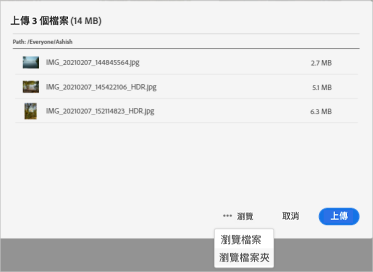
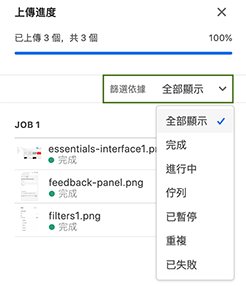
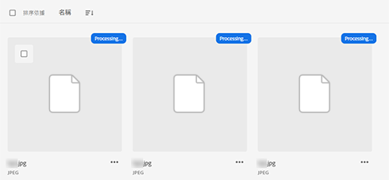
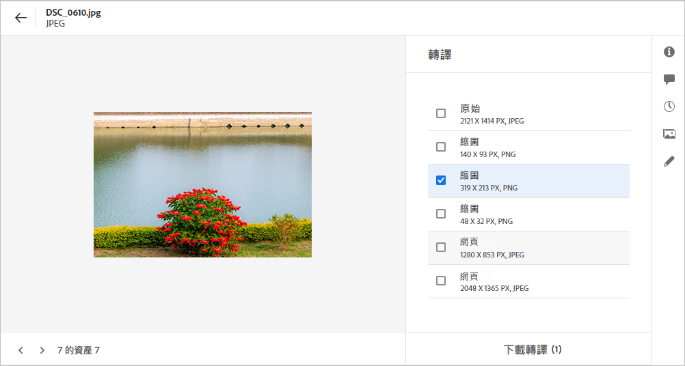
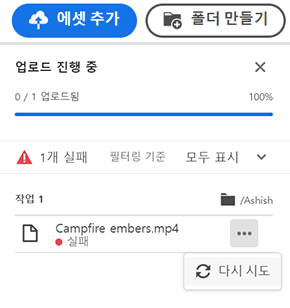
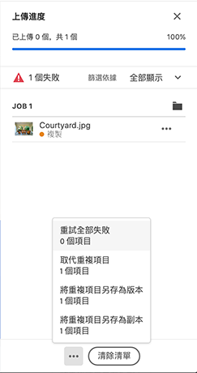

# 上傳資產{#add-assets}

若要新增可搭配使用的新資產，請從本機檔案系統上傳一些資產。<!-- TBD: Many of the [common file formats are supported](/help/supported-file-formats.md). -->

您可以使用下列方法來上傳一或多個資產或包含資產的資料夾：

* 在使用者介面上拖曳資產或資料夾，並依照畫面上的指示操作。
* 按一下工具列中的&#x200B;**[!UICONTROL Add Assets]**&#x200B;選項，然後將一些檔案新增至上傳對話方塊。

<!-- TBD: Update this GIF
 -->

建立資料夾後，您可以使用其中任何一種方法上傳資產。 要建立空資料夾，請按一下工具欄中的&#x200B;**[!UICONTROL Create Folder]**。 雖然[!DNL Assets Essentials]提供強大的全文搜尋功能，您也可以使用資料夾來更妥善地組織資產。

選取檔案後，您會看到確認對話方塊以新增更多檔案或移除已選取的檔案。 要向選定內容添加更多檔案，請按一下&#x200B;**[!UICONTROL Browse]**，然後選擇&#x200B;**[!UICONTROL Browse files]**&#x200B;或&#x200B;**[!UICONTROL Browse folders]**。 從相同資料夾或從不同資料夾新增更多檔案或資料夾。

在所有檔案排入佇列後，按一下&#x200B;**[!UICONTROL Upload]**。

*圖：上傳選取的資產之前，您可以先從佇列新增或移除資產。*

## 查看上載進度和狀態{#upload-progress}

當您將許多資產或巢狀資料夾上傳至[!DNL Assets Essentials]時，有些資產可能會因多種原因而無法上傳，例如資產重複和網路問題。

若要追蹤上傳進度，請按一下工具列上的&#x200B;**[!UICONTROL Upload Progress]**&#x200B;選項。 面板會顯示所有資產的上傳進度。

若要根據上傳進度或狀態檢視資產子集，請使用&#x200B;**[!UICONTROL Upload Progress]**&#x200B;側邊欄中的篩選器。 各種篩選器可顯示所有資產、已完成上傳、進行中上傳、要上傳的佇列資產、暫停上傳、重複資產，以及無法上傳的資產。

*圖：根據資產的上傳狀態或上傳進度，篩選您嘗試上傳的資產。*

上傳資產後，Assets Essentials會立即處理資產以產生縮圖並處理中繼資料。 對於許多資產，處理需要一些時間。 如果沒有看見縮圖，且在預留位置縮圖上看到處理訊息，請在幾分鐘後再次檢查資料夾。

## 資產轉譯 {#renditions}

Assets Essentials會以近乎即時的方式處理上傳的資產，且針對許多支援的檔案類型，會產生轉譯。 為影像建立，轉譯會是已上傳影像的調整大小版本。 您不僅可以下載資產，也可以下載轉譯，以使用適當的版本。 當您[預覽資產](/help/navigate-view.md#preview-assets)時，可以檢視資產的所有轉譯。

## 管理失敗的上載{#resolve-upload-fails}

如果上傳支援的資產因故失敗，請按一下[!UICONTROL Upload Progress]窗格中的&#x200B;**[!UICONTROL Retry]** 。

*圖：如果受支援的檔案因故無法上傳，則重試。*

如果您嘗試上傳重複的資產，除非您明確確認上傳，否則不會上傳資產。 起初，重複資產會標示為上傳失敗。 若要解決問題，您只需建立版本、刪除和取代現有資產，或重新命名資產以建立重複副本即可。 您可以一次解決一個資產的這類故障，或一次針對所有失敗重複項目大量解決。

*圖：針對預設無法上傳的重複資產，一次解決一個資產的問題。*

*圖：針對預設無法上傳的重複資產，一次解決所有資產的問題。*

>[!TIP]
>
>您可以直接從[!DNL Creative Cloud]案頭應用程式將資產上傳至DAM存放庫。 請參閱[[!DNL Assets Essentials] 如何與 [!DNL Adobe Asset Link]](/help/integration.md)整合。

## 刪除資產或資料夾{#delete-assets}

使用者可以刪除不再需要的個別資產或資料夾。 若要刪除資產或資料夾，請執行下列其中一項操作：

* 使用資產或資料夾縮圖上可用的選項。

   

* 選取資產或資料夾，然後按一下工具列中的&#x200B;**[!UICONTROL Delete]** 。
