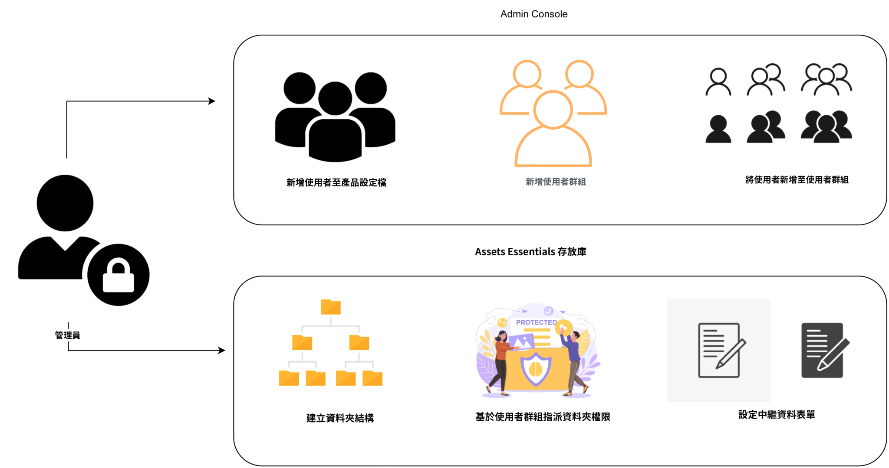
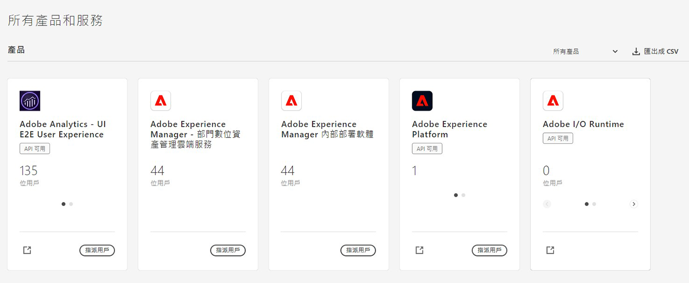
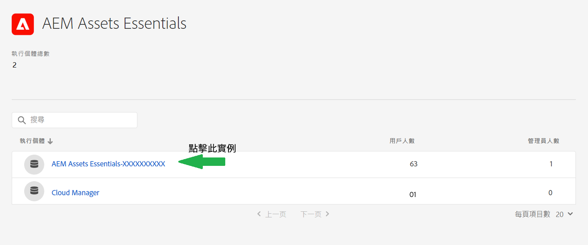
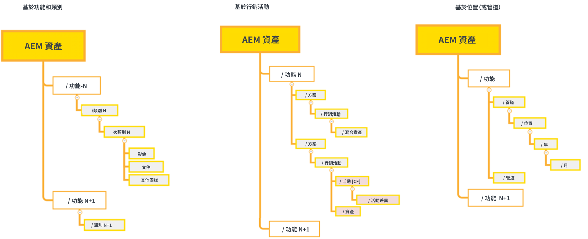

# 管理Experience Manager Assets軟體包 {#administer-assets-essentials}

## 目標

* **觀眾**:Assets Essentials管理員

* **目標**:使用Admin Console配置對Assets Essentials應用程式的訪問，然後管理登錄到Assets Essentials應用程式後可以執行的任務。

## 概覽 {#overview}

[!DNL Adobe Experience Manager Assets Essentials] 由 Adobe 為其客戶佈建。佈建作業的一部分為在 [!DNL Adobe Admin Console] 中將 [!DNL Assets Essentials] 新增到客戶的組織。管理員使用 [!DNL Admin Console] 要管理用戶權利 [!DNL Assets Essentials] 解決方案，並分配應用程式管理員以在 [!DNL Assets Essentials]。

以下資料流圖說明了管理員配置和管理Assets Essentials必須執行的任務順序：

## 訪問Admin Console {#access-admin-console}

佈建 Assets Essentials 解決方案後，管理員便會從 Adobe 接收電子郵件。電子郵件包含歡迎訊息和開始使用的連結。此外，Adobe 會自動開始部署 Assets Essentials 的程序。部署程序需要一小時的時間完成。

從電子郵件中的連結，存取和登入 [Admin Console](https://adminconsole.adobe.com)。如果您對多個組織帳戶具有管理員訪問權限，則選擇相應的組織或使用 [組織選擇器](https://helpx.adobe.com/tw/enterprise/using/admin-console.html)。 自動部署程序完成後，[!DNL AEM Assets Essentials] 的產品卡會在 [!DNL Admin Console] 中顯示。

## 管理Admin Console任務 {#manage-admin-console-tasks}

在Admin Console中執行以下任務：

* [將用戶添加到產品配置檔案](#add-users-to-product-profiles)

* [新增使用者群組](#add-user-groups)

* [新增使用者至群組](#add-users-to-user-groups)

### 將用戶添加到產品配置檔案 {#add-users-to-product-profiles}

將用戶添加到產品配置檔案中，以便他們能夠訪問Assets Essentials應用程式。

要將用戶添加到產品配置檔案：

1. 訪問 [Admin Console](https://adminconsole.adobe.com) 對於您的組織，按一下 **[!UICONTROL 產品]** 按一下 **[!UICONTROL AEM Assets精華]**，然後按一下 [!DNL Assets Essentials]。 實例的名稱可能與下面螢幕截圖中的名稱不同。
   >[!NOTE]
   >
   >[!DNL Cloud Manager] 實例僅用於特殊的管理員用途，如檢查服務狀態和獲取對服務日誌的訪問權限，不能用於向產品添加用戶。 有關詳細資訊，請參見 [管理員指南](deploy-administer.md#view-service-status-and-access-logs-view-logs)。

   

    [!DNL Assets Essentials] 擁有三種產品設定檔，代表管理員、一般和消費者使用者的存取權。

   

1. 要向產品添加用戶，請按一下三個Assets Essentials產品配置檔案之一，選擇 **[!UICONTROL 添加用戶]**，提供用戶詳細資訊，然後按一下 **[!UICONTROL 保存]**。

   

   新增使用者時，使用者會收到開始使用的電子郵件邀請。您可以在 [!DNL Admin Console] 中的產品設定檔設定中關閉電子郵件邀請。

1. 若要從群組移除使用者，請按一下該群組、選取現有使用者，然後選取&#x200B;**[!UICONTROL 移除使用者]**。

   >[!NOTE]
   >
   >您必須將用戶添加到Admin Console中的管理員Assets Essentials產品配置檔案，以便他們在Assets Essentials應用程式中執行管理任務。 這些任務包括 [建立資料夾結構](#create-folder-structure)。 [管理資料夾的權限](#manage-permissions-for-folders), [設定元資料Forms](#metadata-forms)。

### 新增使用者群組 {#add-user-groups}

建立用戶組，然後將用戶分配給用戶組。 這些用戶組將在Assets Essentials應用程式中用於設定資料夾權限。

您可以將使用者新增到使用者群組 (1) 以及[將使用者新增到 Assets Essentials 產品設定檔 (2)](#add-admin-users)。但您無法將使用者群組直接新增到 Assets Essentials 產品設定檔 (3)。

如需有關如何管理使用者群組的資訊，請參閱 `Create user groups` 和 `Edit user groups` (可在[管理使用者群組](https://helpx.adobe.com/tw/enterprise/using/user-groups.html)中取得)。

>[!NOTE]
>
>如果您的 Admin Console 設定為利用外部系統來管理使用者/群組分配，例如 Azure 或 Google 連接器、使用者同步工具或 User Management Rest API，則您的群組和使用者指派會自動設定。如需詳細資訊，請參閱 [Adobe Admin Console 使用者](https://helpx.adobe.com/tw/enterprise/using/users.html)。

### 新增使用者至群組 {#add-users-to-user-groups}

建立使用者群組後，您可以開始將使用者新增至使用者群組。

如需有關如何管理新增使用者至使用者群組的資訊，請參閱 `Add users to groups` (可在[管理使用者群組](https://helpx.adobe.com/tw/enterprise/using/user-groups.html#add-users-to-groups)中取得)。

## 管理Assets Essentials管理任務 {#manage-assets-essentials-tasks}

執行Admin Console任務後，您現在可以在Assets Essentials應用程式中執行以下管理任務：

* [建立檔案夾結構](#create-folder-structure)

* [管理檔案夾的權限](#manage-permissions-for-folders)

* [設定元資料Forms](#metadata-forms)

>[!NOTE]
>
>要能夠管理這些任務，特別是管理權限，您的用戶必須具有應用程式管理權限 — 需要將其添加到 [管理員Assets Essentials產品配置檔案](#add-users-to-product-profiles)。

### 建立檔案夾結構 {#create-folder-structure}

您可以使用下列方法在 Assets Essentials 存放庫中建立檔案夾結構：

* 按一下工具列中的&#x200B;**[!UICONTROL 建立檔案夾]**&#x200B;選項，即可建立空的檔案夾。

* 按一下工具列中的&#x200B;**[!UICONTROL 新增資產]**&#x200B;選項，即可[上傳本機中現有的檔案夾結構](add-delete.md)。

建立一個適合組織業務目標的檔案夾結構。如果您要將現有的檔案夾結構上傳到 Assets Essentials 存放庫，則應查看該結構。如需詳細資訊，請參閱[有效權限管理的最佳實務](permission-management-best-practices.md)。

當您開始計畫在 Assets Essentials 存放庫中建立檔案夾結構時，請考慮以下幾點：

* 未來的控管：由管理員控管的檔案夾以及[將擁有者權限委派給其他使用者的檔案夾](manage-permissions.md##manage-permissions-folders)。

* 可擴充性：檔案夾結構應符合您組織的未來需求，並且應易於擴充。

* 大小：一個檔案夾不能包含太多資產。這可能會導致可用性問題並可能變得難以管理。

* 直覺性：檔案夾結構應易於瀏覽，並且一般使用者能以直覺的方式操作。使用者應該能夠輕鬆識別在檔案夾結構中上傳新資產的位置。

您可以為您的組織使用多種可能的檔案夾結構類型。以下是一些典型的檔案夾結構範例：

### 管理檔案夾的權限 {#manage-permissions-for-folders}

Assets Essentials 可讓管理員管理存放庫中檔案夾的存取層級。 身為管理員，您可建立使用者群組並指派權限給這些群組，以管理存取層級。您還可以將權限管理權限委託給資料夾級別的用戶組。

>[!VIDEO](https://video.tv.adobe.com/v/341104)

有關詳細資訊，請參見 [管理資料夾的權限](manage-permissions.md)。

### 設定元資料Forms {#metadata-forms}

Assets Essentials 預設為提供許多標準中繼資料欄位。組織擁有其他中繼資料需求，並需要更多中繼資料欄位以新增特定企業中繼資料。中繼資料表單可讓企業將自訂中繼資料欄位新增到資產的[!UICONTROL 詳細資訊]頁面。特定企業中繼資料能夠改善其資產的控管和探索。您可以從頭開始建立表單，或改變現有表單的用途。

您可以為不同的資產類型 (不同的 MIME 類型) 設定中繼資料表單。使用與檔案的 MIME 類型相同的表單名稱。Essentials會自動將上載的資產MIME類型與表單名稱匹配，並基於表單欄位更新上載資產的元資料。

例如，如果元資料表單的名稱 `PDF` 或 `pdf` 存在，然後上載的PDF文檔包含在表單中定義的元資料欄位。

Assets Essentials使用以下序列搜索現有元資料表單名稱，以將元資料欄位應用於特定類型的上載資產：

MIME子類型> MIME類型> `default` 窗體>現成窗體

例如，如果存在名稱為 `PDF` 或 `pdf` 的中繼資料表單，上傳的 PDF 文件則包含如表單中定義的中繼資料欄位。如果元資料表單的名稱 `PDF` 或 `pdf` 不存在，如果有元資料表單的名稱，則Assets Essentials匹配 `application`。 如果有元資料表單的名稱 `application`，上載的PDF文檔包含在表單中定義的元資料欄位。 如果Assets Essentials仍未找到匹配的元資料表單，則會搜索 `default` 元資料表單，用於將表單中定義的元資料欄位應用於上載的PDF文檔。 如果這些步驟都不起作用，Assets Essentials將現成的表單中定義的元資料欄位應用於所有上載的PDF文檔。

>[!IMPORTANT]
>
>特定檔案類型的新中繼資料表單會完成取代 [!DNL Assets Essentials] 所提供的預設中繼資料表單。如果您刪除或重新命名中繼資料表單，新資產便可再次使用預設中繼資料欄位。

>[!VIDEO](https://video.tv.adobe.com/v/341275)

有關元資料Forms的詳細資訊，請參見 [元資料Forms在Assets Essentials](metadata.md#metadata-forms)。

## 下一步是什麼

現在您已配置和管理了Assets Essentials應用程式， [將Creative Cloud應用程式與Experience Manager AssetsEssentials應用程式整合](integrate-assets-essentials-creative-cloud.md)。

