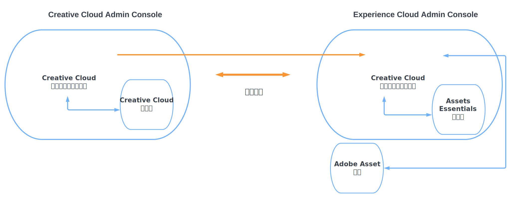

# Assets EssentialsCreative Cloud專業工作管理解決方案 {#creative-cloud-enterprise-user-journeys}

## 簡介 {#introduction}

Creative Cloud面向企業的Pro與工作管理解決方案整合了創意、內容和工作管理工具，以提高您製作創意內容並快速實現業務目標的能力。 解決方案包括以下元件：

* Creative CloudPro

* Adobe Workfront

* Experience Manager Assets精華

本教程介紹了管理員的學習過程，使Assets Essentials應用程式能夠與Creative Cloud案頭應用程式和Adobe Workfront應用程式整合。 Creative Cloud案頭應用程式套件括Adobe Photoshop、Adobe Illustrator、Adobe InDesign和Adobe XD。

## 部署類型 {#deployment-types}

由於解決方案包括來自Creative Cloud和Adobe Experience Cloud的應用程式和服務，因此可能會在您公司的一兩個AdobeAdmin Console中部署它們。

在部署到兩個Admin Console時，需要另外一個配置步驟：

* Creative Cloud服務和應用程式(企業專業Creative Cloud和可選模組)在 [Adobe Admin Console，您的Creative Cloud部署](https://chl-author-preview.corp.adobe.com/content/help/en/enterprise/admin-guide.html)。

* Adobe Workfront和Adobe Experience Manager Assets Essentials均受管 [Adobe Admin ConsoleExperience Cloud解決方案](https://experienceleague.adobe.com/docs/core-services/interface/administration/admin-getting-started.html)。

要整合Creative Cloud和Assets Essentials應用程式，必須使Admin Console中可用於Creative Cloud的用戶以Admin Console進行Experience Cloud。 要使用戶在Experience CloudAdmin Console中可用，請建立一個目錄以建立 [目錄信任](https://helpx.adobe.com/enterprise/using/set-up-identity.html#directory-trusting) 兩個管理控制台之間。

如圖所示，Creative Cloud用戶將基於兩個控制台之間的信任關係自動在Experience CloudAdmin Console中可用。 然後，可以將用戶添加到Assets Essentials產品配置檔案。 因此，Creative Cloud用戶可以訪問可與Assets Essentials儲存庫交互的Adobe資產連結應用程式。 有關詳細資訊，請參見 [將Assets Essentials與Creative Cloud應用程式整合](integrate-assets-essentials-creative-cloud.md)。

## Experience Manager文檔旅程 {#documentation-journeys}

A Documentation Journey將許多不同或可能複雜的主題和功能聯繫在一起，它提供一種敘事，幫助讀者從頭到尾理解並解決業務問題，同時假定事先主題或Assets Essentials知識最少。

文檔旅程是圍繞最佳做法原則設計的，這些原則由Adobe的最新研究、Adobe顧問的經驗證的實施經驗和客戶項目的反饋所指導。

## 必備條件

* [訪問Adobe Admin Console以獲得Experience Cloud解決方案](https://experienceleague.adobe.com/docs/core-services/interface/administration/admin-getting-started.html)

* [訪問Adobe Admin Console以Creative Cloud企業部署](https://helpx.adobe.com/enterprise/admin-guide.html)

## 管理Experience Manager Assets軟體包 {#administer-assets-essentials}

Adobe Experience Manager Assets Essentials是Adobe Experience Manager資產的新版本。 Assets Essentials公司提供統一的資產管理和協作，並提供簡化且一致的用戶介面。 使用方便，因此可讓更多創意和行銷團隊儲存、探索和散發數位資產。

Adobe Experience Manager Assets Essentials由Adobe為其客戶提供。 作為資源調配的一部分，Assets Essentials將添加到Adobe Admin Console的客戶組織。

管理員使用Admin Console管理Assets Essentials產品的用戶權利：

* 新增使用者群組

* 將用戶添加到用戶組

* 將用戶添加到Assets Essentials產品配置檔案

在Admin Console中管理用戶權利後，管理員可以使用Assets Essentials應用程式執行以下操作：

* 建立資料夾結構以最好地支援組織的需要

* 管理對資料夾結構的權限

* 設定元資料表單

## 將Creative Cloud應用程式與Experience Manager Assets軟體包整合 {#administer-creative-cloud-applications}

[Adobe資產連結應用內面板](https://www.adobe.com/tw/creativecloud/business/enterprise/adobe-asset-link.html) 讓創意專業人員 [!DNL Assets Essentials] 支援的儲存庫 [!DNL Adobe Creative Cloud] 案頭應用。 面板可供 [!DNL Adobe Photoshop]、[!DNL Adobe Illustrator]、[!DNL Adobe InDesign] 和 [!DNL Adobe XD] 使用。 它會簡化資產的存取，進而提高內容速度。

本教程指導您整合 [!DNL Adobe Photoshop]。 [!DNL Adobe Illustrator]。 [!DNL Adobe InDesign], [!DNL Adobe XD] 應用程式。

目標：

* 建立Creative Cloud和Experience CloudAdmin Console之間的目錄信任

* 將Creative Cloud用戶添加到Assets Essentials產品配置檔案

* 安裝Adobe資產連結

* 使用Adobe資產連結

## 將Adobe Workfront與Experience Manager Assets軟體包整合 {#administer-adobe-workfront}

[[!DNL Adobe Workfront]](https://www.workfront.com/) 是一種工作管理應用程式，可幫助您在一個位置管理整個工作生命週期。 本機整合 [!DNL Adobe Workfront] 和 [!DNL Assets Essentials] 使公司能夠通過將工作和資產管理內在地聯繫起來，提高內容的速度和上市時間。 就管理其工作而言，使用者可以存取在同一解決方案中的所需文件和影像。

本教程指導您管理Adobe Workfront，然後將其與Experience Manager Assets軟體包整合。

目標：

* 將用戶添加到Workfront產品配置檔案

* 將用戶添加到Assets Essentials產品配置檔案

* 配置Experience Manager Assets軟體包整合

