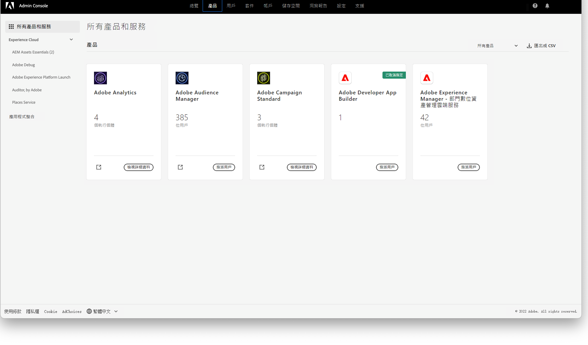

# 管理員[!DNL Assets Essentials]和新增使用者 {#administer}

[!DNL Adobe Experience Manager Assets Essentials] 由 Adobe 為其客戶佈建。佈建作業的一部分為在 [!DNL Adobe Admin Console] 中將 [!DNL Assets Essentials] 新增到客戶的組織。管理員將使用 [!DNL Admin Console] 來管理 [!DNL Assets Essentials] 解決方案的使用者權益，並指派應用程式管理員，以便在 [!DNL Assets Essentials] 中設定權限和中繼資料表單。

如需管理 Assets Essentials 的歷程型體驗，請按一下此[連結](adminster-aem-assets-essentials.md)。

## 自動部署 Assets Essentials {#automatic-deployment-assets-essentials}

佈建 Assets Essentials 解決方案後，管理員便會從 Adobe 接收電子郵件。電子郵件包含歡迎訊息和開始使用的連結。此外，Adobe 會自動開始部署 Assets Essentials 的程序。部署程序需要一小時的時間完成。

從電子郵件中的連結，存取和登入 [Admin Console](https://adminconsole.adobe.com)。如果您擁有一個以上的組織帳戶的管理員存取權，請選取合適的組織，或使用頂列的切換器切換至該組織。自動部署程序完成後，[!DNL AEM Assets Essentials] 的產品卡會在 [!DNL Admin Console] 中顯示。

成功部署 Assets Essentials 解決方案後，管理員需要執行下列任務：

* [為該解決方案設定使用者群組、檔案夾結構並指派權限](manage-permissions.md)。遵循[最佳實務](permission-management-best-practices.md)以確保簡單有效的權限設定。
* [管理](#add-users-to-essentials) [!DNL Assets Essentials] 的組織成員的使用者存取權。
* 或者[檢視服務狀態和記錄檔](#view-logs)。

>[!NOTE]
>
>如果在 2022 年 1 月 6 日前佈建 Assets Essentials，在管理組織成員的使用者存取權前，請[在 Cloud Manager 中執行部署步驟](#deploy-essentials)。

## User management {#add-users-to-essentials}

管理員負責管理哪些使用者擁有 [!DNL Assets Essentials] 的存取權。管理員會使用 [!DNL Adobe Admin Console] 新增或移除使用者存取權。[!DNL Assets Essentials] 擁有以下兩種可用的使用者存取權類型。

* **[!DNL Assets Essentials]管理員**&#x200B;具備該應用程式的管理存取權。除了所有一般使用者功能外，該群組中的應用程式管理員還可以管理整個應用程式存放庫中任何檔案夾和群組/使用者的權限。
* **[!DNL Assets Essentials]使用者**&#x200B;擁有完整使用者介面的存取權。這些使用者可以上傳、組織、標記和尋找數位資產。
* **[!DNL Assets Essentials]消費者使用者**：擁有在 [!DNL Adobe Journey Optimizer] 電子郵件範本編輯器中內嵌式資產選擇體驗的存取權。如需詳細資訊，請參閱[使用 [!DNL Assets Essentials] (在 [!DNL Journey Optimizer]](https://experienceleague.adobe.com/docs/journey-optimizer/using/create-messages/assets-essentials.html?lang=zh-Hant)中)

在 [!DNL Admin Console] 中，這三種存取權類型會以三種[!UICONTROL 產品設定檔]表示。若要新增和移除組織成員到兩種設定檔中任一個，請依照這些步驟進行：

1. 存取您組織的 [!DNL Admin Console]、按一下頂列中的「**[!UICONTROL 產品]**」、按一下 **[!UICONTROL AEM Assets Essentials]**，然後按一下 [!DNL Assets Essentials] 環境。 [!DNL Assets Essentials] 擁有三種產品設定檔，代表管理員、一般和消費者使用者的存取權。

   
   <!-- Need to update screenshot to include 3 profiles -->

   *圖：兩種設定檔可用於新增三種使用者類型。*

1. 若要新增使用者到群組，請按一下群組、選取「**[!UICONTROL 新增使用者]**」、提供使用者詳細資訊，然後按一下「**[!UICONTROL 儲存]**」。新增使用者時，使用者會收到開始使用的電子郵件邀請。您可以在 [!DNL Admin Console] 中的產品設定檔設定中關閉電子郵件邀請。

   ![新增使用者到[!DNL Assets Essentials]](assets/adminconsole-add-user.png)

   *圖：從 [!DNL Admin Console]* 新增使用者到 [!DNL Assets Essentials]。

1. 若要從群組移除使用者，請按一下該群組、選取現有使用者，然後選取「**[!UICONTROL 移除使用者]**」。

>[!TIP]
>
>在 [!DNL Admin Console] 中，您可以使用 CSV 檔案大量管理使用者。若要了解更多，請參閱[[!DNL Admin Console] 文件](https://helpx.adobe.com/tw/enterprise/using/accounts.html)。

## 檢視服務狀態和存取記錄檔 {#view-logs}

佈建後，管理員只會部署 [!DNL Assets Essentials] 一次。最初部署後，Adobe 會進行服務維護和更新。管理員可以使用 [!DNL Cloud Manager] 使用者介面來查看服務狀態並下載最近的存取記錄檔。

1. 使用者回報問題，請查看&#x200B;**[!UICONTROL 方案概觀]**&#x200B;介面中 [!DNL Assets Essentials] 的服務狀態。在解決方案的正常運作中，狀態為 `Running`。如果 [!DNL Cloud Manager] 顯示任何其他狀態，請在 [!DNL Admin Console] 支援區段中建立支援服務單。

   ![在 [!DNL Cloud Manager]](assets/cloudmanager-manage-access-essentials.png) 中的 [!DNL Assets Essentials] 狀態

   *圖：[!DNL Assets Essentials] 在 [!DNL Cloud Manager] 的正常狀態為 `Running`。*

1. 若要下載最近的存取記錄檔，請按一下、選取「**[!UICONTROL 下載記錄檔]**」，然後依照螢幕上的指示進行。您可以使用記錄檔稽核 HTTPS 存取請求。

   

   *圖：下載存取記錄檔的選項。*

## 部署 [!DNL Assets Essentials] {#deploy-essentials}

>[!NOTE]
>
>如果 Assets Essentials 在 2022 年 1 月 6 日前佈建，請僅執行這些步驟。

佈建後，[!DNL Assets Essentials] 權益便會在 [!DNL Admin Console] 中新增到您的組織。使用者可以使用解決方案前，組織管理員必須部署該解決方案。管理員會使用 [!DNL Cloud Manager] 使用者介面進行一次性部署。最初部署後，Adobe 會進行服務維護和更新。佈建解決方案解決方案後，管理員便會從 Adobe 接收電子郵件。電子郵件包含歡迎訊息和開始使用的連結。請依照下列步驟進行部署：

1. 從電子郵件中的連結，存取和登入 [Admin Console](https://adminconsole.adobe.com)。如果您擁有一個以上的組織帳戶的管理員存取權，請選取合適的組織，或使用頂列的切換器切換至該組織。[!DNL Assets Essentials] 的產品卡會在 [!DNL Admin Console] 中顯示。

   ![[!DNL Assets Essentials] 卡在 [!DNL Admin Console]](assets/essentials-in-admin-console.png) 中

   *圖：[!DNL Assets Essentials] 卡在 [!DNL Admin Console] 中。*

   >[!NOTE]
   >
   >如果您可以在產品區段中檢視 **[!UICONTROL AEM Assets Essentials]** 卡，而非 **[!UICONTROL AEM Assets Essentials - Cloud Manager]** 卡，則表示 Assets Essentials 的部署已經完成。您可以略過其餘步驟。

1. 請在 [!DNL Admin Console] 中，將您新增為 `AEM Assets Essentials - Cloud Manager` 產品設定檔的管理員。除了您自己之外，您也可以新增組織的另一位成員，或新增一位以上的管理員。

1. 按一下，以[!UICONTROL 選取產品設定檔]，然後選取 [!UICONTROL Deployment Manager - Assets Essentials] 作為&#x200B;**[!UICONTROL 產品設定檔]**。在此步驟中新增的使用者會收到來自 Adobe 的電子郵件 (包含 [!DNL Cloud Manager] 的存取權) 並可以進行部署。

   ![新增管理員並選取 [!DNL Admin Console]](assets/adminconsole-user1.png) 中的產品設定檔

   *圖：新增管理員並選取 [!DNL Admin Console].* 中的產品設定檔

1. 若要存取 [!DNL Cloud Manager]，請按一下包含 [!DNL Cloud Manager] 存取權的電子郵件中的連結。或者，存取瀏覽器中的 [https://experience.adobe.com/#/cloud-manager/](https://experience.adobe.com/#/cloud-manager/)。

1. 在 Cloud Manager 使用者介面中，請從右上角按一下「**[!UICONTROL 新增程式]**」。

1. 提供您選擇的名稱，並選擇上傳影像 (代表 [!DNL Cloud Manager] 中的程式)，然後按一下「**[!UICONTROL 建立]**」。[!DNL Cloud Manager] 會花費數分鐘的時間設定程式。

1. 程序就緒時，請將指標暫留在圖磚上，然後按一下。

1. 若要新增 [!DNL Assets Essentials] 服務到您的組織，請按一下 **[!UICONTROL 新增環境]**、選取名稱和部署區域，然後按一下「**[!UICONTROL 儲存]**」。您稍後無法變更部署區域。請嘗試將 [!DNL Assets Essentials] 的部署區域配對您要使用 [!DNL Assets Essentials] 的其他解決方案的部署區域。此配對即可確保最快速網路存取數位資產和最低可能的延遲。

   ![在 [!DNL Cloud Manager]](assets/cloudmanager-add-environment-for-essentials.png) 新增環境

   *圖：在 [!DNL Cloud Manager] 中新增環境，以開始使用 [!DNL Assets Essentials]。*

1. 數分鐘後，成功建立環境時，您可以存取 [!DNL Admin Console] 並新增組織的使用者到 [!DNL Assets Essentials] 解決方案。按一下 然後選取「**[!UICONTROL 管理存取權]**」選項。

   ![在 [!DNL Cloud Manager]](assets/cloudmanager-manage-access-essentials.png) 中的就緒環境

   *圖：在 [!DNL Cloud Manager] 中已準備好使用的環境。*

## 後續步驟 {#next-steps}

* [觀看視頻部署Assets Essentials](https://experienceleague.adobe.com/docs/experience-manager-learn/assets-essentials/provisioning.html?lang=en)

* 使用 [!UICONTROL 反饋] 選項在Assets Essentials用戶介面上提供

* 使用 [!UICONTROL 編輯此頁]  或 [!UICONTROL 記錄問題]  右側欄上提供

* 聯繫人 [客戶服務](https://experienceleague.adobe.com/?support-solution=General#support)

>[!MORELIKETHIS]
>
>* [[!DNL Admin Console] 說明](https://helpx.adobe.com/tw/enterprise/using/admin-console.html)
>* [[!DNL Cloud Manager] 說明](https://experienceleague.adobe.com/docs/experience-manager-cloud-manager/using/introduction-to-cloud-manager.html?lang=zh-Hant)
>* [Adobe Journey Optimizer 文件](https://experienceleague.adobe.com/docs/journey-optimizer/using/ajo-home.html?lang=zh-Hant)
>* [發行說明](release-notes.md)
>* [開始使用 [!DNL Assets Essentials]](get-started.md)

