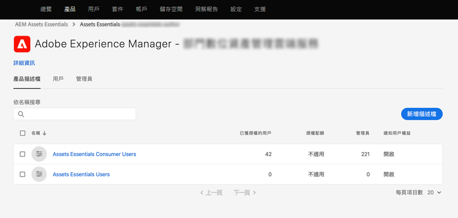
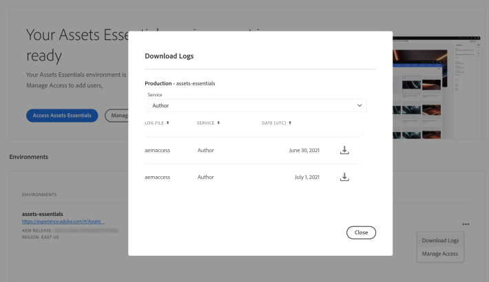

# 部署[!DNL Assets Essentials]並添加用戶 {#administer}

[!DNL Adobe Experience Manager Assets Essentials] 由Adobe為其客戶布建。作為布建的一部分，[!DNL Assets Essentials]會新增至[!DNL Adobe Admin Console]中的客戶組織。 客戶還可以存取[!DNL Experience Manager Cloud Manager]作為部署工具和[!DNL Admin Console]以管理[!DNL Assets Essentials]解決方案的用戶權限。

管理員執行下列工作：

* [ [!DNL Assets Essentials]](#deploy-essentials) 為其組織部署。
* [管理組織成](#add-users-to-essentials) 員對的用戶訪 [!DNL Assets Essentials]問。
* （可選）[查看服務狀態和日誌](#view-logs)。

## 部署[!DNL Assets Essentials] {#deploy-essentials}

布建後，[!DNL Assets Essentials]權利會新增至您的組織（位於[!DNL Admin Console]中）。 組織管理員必須先部署解決方案，才能將其提供給使用者使用。 管理員使用[!DNL Cloud Manager]用戶介面執行一次性部署。 初始部署後，Adobe會執行服務維護和更新。 布建解決方案後，管理員會收到來自Adobe的電子郵件。 電子郵件包含歡迎訊息和要開始的連結。 要部署，請執行以下步驟：

1. 從電子郵件中的連結，存取並登入[Admin Console](https://adminconsole.adobe.com)。 如果您有多個組織帳戶的管理員存取權，請選取適當的組織，或使用頂端列的切換器切換至該組織。 [!DNL Assets Essentials]的產品卡顯示在[!DNL Admin Console]中。

   ![[!DNL Assets Essentials] 卡片  [!DNL Admin Console]](assets/essentials-in-admin-console.png)

   *圖： [!DNL Assets Essentials] 卡 [!DNL Admin Console]。*

1. 將自己新增為[!DNL Admin Console]中`AEM Assets Essentials - Cloud Manager`產品設定檔的管理員。 您可以新增組織的其他成員，也可以新增多個管理員，而不是您自己。

1. 按一下添加到[!UICONTROL Select product profiles]，然後選擇[!UICONTROL Deployment Manager - Assets Essentials]作為&#x200B;**[!UICONTROL product profile]**。 此步驟中新增的使用者會收到來自具有[!DNL Cloud Manager]存取權的Adobe的電子郵件，並可執行部署。

   ![新增管理員並選取產品設定檔，位於  [!DNL Admin Console]](assets/adminconsole-user1.png)

   *圖：新增管理員並在中選取產品設定 [!DNL Admin Console]檔。*

1. 若要存取[!DNL Cloud Manager]，請按一下電子郵件中可存取[!DNL Cloud Manager]的連結。 或者，您也可以在瀏覽器中存取[https://experience.adobe.com/#/cloud-manager/](https://experience.adobe.com/#/cloud-manager/)。

1. 在Cloud Manager使用者介面中，按一下右上角的&#x200B;**[!UICONTROL Add Program]**。

1. 提供您選擇的名稱，並選擇性地上傳影像（它代表[!DNL Cloud Manager]中的程式），然後按一下&#x200B;**[!UICONTROL Create]**。 [!DNL Cloud Manager] 設定程式需要幾分鐘的時間。

1. 當程式準備就緒時，將游標暫留在圖磚上，然後按一下。

1. 要向組織添加[!DNL Assets Essentials]服務，請按一下&#x200B;**[!UICONTROL Add Environment]**，選擇名稱和部署區域，然後按一下&#x200B;**[!UICONTROL Save]**。 以後無法更改部署區域。 嘗試將[!DNL Assets Essentials]的部署區域與您要使用[!DNL Assets Essentials]的其他解決方案的部署區域匹配。 配對的目的是確保以最快的速度網路存取數位資產，並盡可能縮短延遲時間。

   ![在中新增環境  [!DNL Cloud Manager]](assets/cloudmanager-add-environment-for-essentials.png)

   *圖：在中新增環 [!DNL Cloud Manager] 境以開始使 [!DNL Assets Essentials]用。*

1. 幾分鐘後，當環境成功建立時，您可以存取[!DNL Admin Console]並將組織的使用者新增至[!DNL Assets Essentials]解決方案。 按一下並選擇&#x200B;**[!UICONTROL Manage Access]**&#x200B;選項。

   ![中的就緒環境  [!DNL Cloud Manager]](assets/cloudmanager-manage-access-essentials.png)

   *圖：可供使 [!DNL Cloud Manager] 用的環境。*

## 使用者管理 {#add-users-to-essentials}

管理員管理哪些用戶有權訪問[!DNL Assets Essentials]。 管理員使用[!DNL Adobe Admin Console]來添加或刪除用戶訪問權。 [!DNL Assets Essentials] 有下列兩種可用的使用者存取。

* **[!DNL Assets Essentials]** 使用者可存取完整的使用者介面。這些使用者可以上傳、組織、標籤及尋找數位資產。
* **[!DNL Assets Essentials]消費者使用者**:可存取電子郵件範本編輯器中的內嵌資 [!DNL Adobe Journey Optimizer] 產選取體驗。如需詳細資訊，請參閱[在 [!DNL Journey Optimizer]](https://experienceleague.adobe.com/docs/journey-optimizer/using/create-messages/assets-essentials.html)中使用 [!DNL Assets Essentials] 。

在[!DNL Admin Console]中，這兩種訪問類型由兩個[!UICONTROL Product Profiles]表示。 若要將組織的成員新增及移除至這兩個設定檔中的任何一個，請遵循下列步驟：

1. 存取組織的[!DNL Admin Console]，按一下頂端列的&#x200B;**[!UICONTROL Products]**，按一下&#x200B;**[!UICONTROL AEM Assets Essentials]**，然後按一下[!DNL Assets Essentials]環境。 [!DNL Assets Essentials] 有兩個產品設定檔，代表一般和消費者使用者的存取權。

   

   *圖：有兩種設定檔可供新增兩種使用者。*

1. 若要將用戶添加到組，請按一下該組，選擇&#x200B;**[!UICONTROL Add User]**，提供用戶詳細資訊，然後按一下&#x200B;**[!UICONTROL Save]**。 新增使用者時，使用者會收到開始使用的電子郵件邀請。 您可以在[!DNL Admin Console]中的產品設定檔設定中關閉電子郵件邀請。

   ![新增使用者至  [!DNL Assets Essentials]](assets/adminconsole-add-user.png)

   *圖：從新增使用 [!DNL Assets Essentials] 者 [!DNL Admin Console]。*

1. 要從組中刪除用戶，請按一下該組，選擇現有用戶，然後選擇&#x200B;**[!UICONTROL Remove User]**。

>[!TIP]
>
>在[!DNL Admin Console]中，您可以使用CSV檔案大量管理使用者。 如需詳細資訊，請參閱[[!DNL Admin Console] 檔案](https://helpx.adobe.com/enterprise/using/accounts.html)。

## 查看服務狀態和訪問日誌 {#view-logs}

布建後，管理員只部署[!DNL Assets Essentials]一次。 初始部署後，Adobe會執行服務維護和更新。 管理員可以使用[!DNL Cloud Manager]用戶介面來檢查服務狀態並下載最近的訪問日誌。

1. 當使用者回報問題時，請檢查&#x200B;**[!UICONTROL Program Overview]**&#x200B;介面中[!DNL Assets Essentials]的服務狀態。 在正常工作時，狀態為`Running`。 如果[!DNL Cloud Manager]顯示任何其他狀態，請在[!DNL Admin Console]支援部分中建立支援票證。

   ![中的狀 [!DNL Assets Essentials] 態  [!DNL Cloud Manager]](assets/cloudmanager-manage-access-essentials.png)

   *圖：中的正常 [!DNL Assets Essentials] 狀 [!DNL Cloud Manager] 態 `Running`為。*

1. 若要下載最近的訪問日誌，請按一下，選擇&#x200B;**[!UICONTROL Download Logs]**，然後按照螢幕上的說明進行操作。 您可以使用記錄檔稽核HTTPS存取請求。

   

   *圖：下載存取記錄檔的選項。*

>[!MORELIKETHIS]
>
>* [[!DNL Admin Console] 說明](https://helpx.adobe.com/enterprise/using/admin-console.html)
>* [[!DNL Cloud Manager] 說明](https://experienceleague.adobe.com/docs/experience-manager-cloud-manager/using/introduction-to-cloud-manager.html?lang=zh-Hant)
>* [Adobe Journey Optimizer檔案](https://experienceleague.adobe.com/docs/journey-optimizer/using/ajo-home.html)
>* [發行說明](release-notes.md)
* [開始使用 [!DNL Assets Essentials]](get-started.md)

