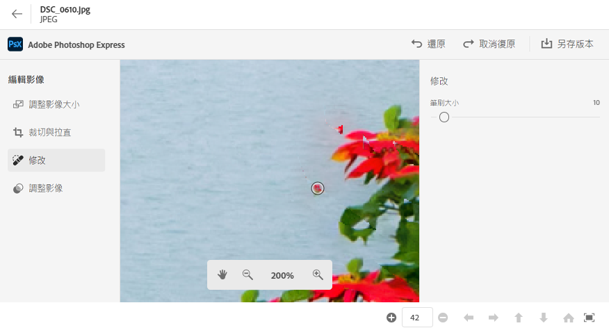
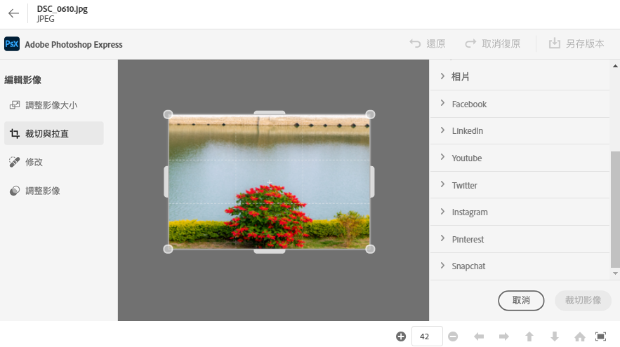
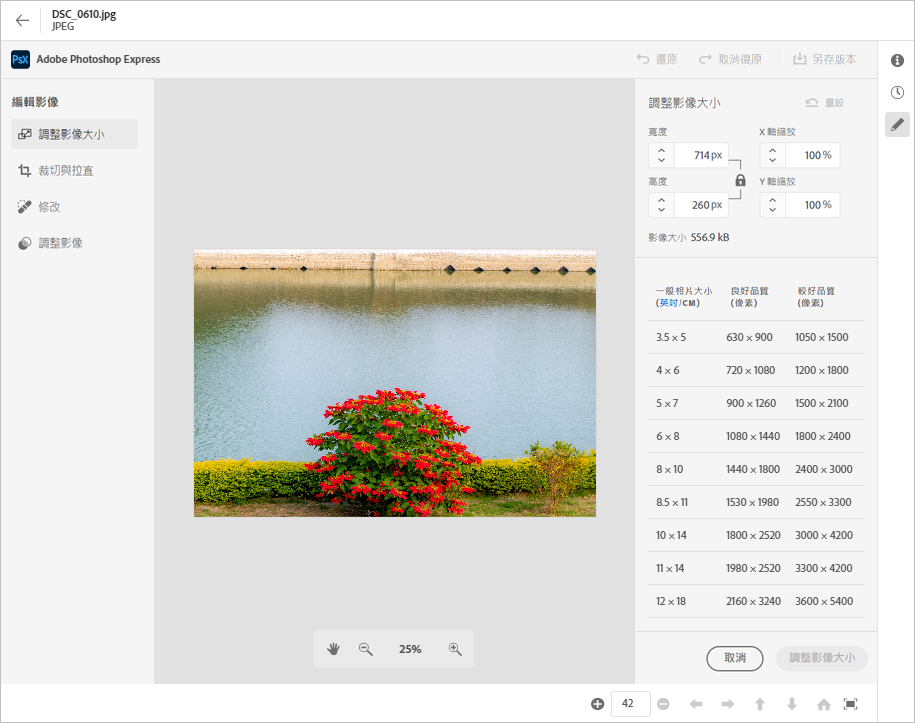
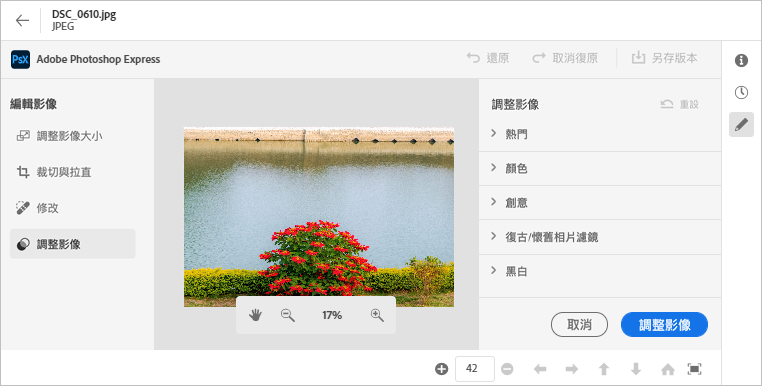

# 在[!DNL Assets Essentials] {#edit-images}中編輯影像

[!DNL Assets Essentials] 提供由提供技術支援的易記編輯選 [!DNL Adobe Photoshop Express]項。可用的編輯動作有「污點修復」、「裁切並拉直」、「調整影像大小」和「調整影像」。

編輯影像後，您可以將新影像儲存為新版本。 如果需要，版本設定可協助您稍後回復原始資產。 若要編輯影像，請[開啟其預覽](/help/navigate-view.md#preview-assets)，然後從右側的邊欄按一下&#x200B;**[!UICONTROL Edit Image]** 。

*圖：編輯影像的選項由提供 [!DNL Adobe Photoshop Express]。*

## 斑點修復影像{#spot-heal-images}

如果影像上有次要點或小物件，則可以使用Adobe Photoshop提供的點修復功能來編輯和移除點。

刷子對被修飾的區域進行採樣，並使修復的像素無縫地混合到影像的其餘部分中。 使用的筆刷大小僅比要修復的位置稍大。

<!-- TBD: See if we should give backlinks to PS docs for these concepts.
For more information about how Spot Healing works in Photoshop, see [retouching and repairing photos](https://helpx.adobe.com/photoshop/using/retouching-repairing-images.html). -->

## 裁切和拉直影像{#crop-straighten-images}

使用裁切和拉直選項，您可以進行基本裁切、旋轉影像、水準或垂直翻轉影像，以及將影像裁切至適合熱門社交媒體網站的維度。

若要儲存編輯內容，請按一下&#x200B;**[!UICONTROL Crop Image]**。 編輯後，您可以將新影像儲存為版本。

許多預設選項可讓您將影像裁切為符合各種社交媒體設定檔和貼文的最佳比例。

## 調整影像大小{#resize-image}

將影像調整為特定大小是常見的使用案例。 [!DNL Assets Essentials] 可讓您針對特定像片大小提供預先計算的新解析度，快速調整影像大小以符合一般像片大小。您可以檢視公分或英吋的常見像片大小，以了解尺寸。 依預設，調整大小方法會保留長寬比。 要手動覆蓋外觀比例，請按一下。

輸入尺寸並按一下&#x200B;**[!UICONTROL Resize Image]**&#x200B;調整影像大小。 在將更改另存為版本之前，可以通過按一下[!UICONTROL Undo]撤消在保存之前完成的所有更改，也可以通過按一下[!UICONTROL Revert]來更改編輯過程中的特定步驟。

## 調整影像{#adjust-image}

[!DNL Assets Essentials] 可讓您只需按幾下，即可調整顏色、色調、對比等。在編輯窗口中按一下&#x200B;**[!UICONTROL Adjust image]**。 右側邊欄提供下列選項：

* **熱門**: [!UICONTROL High Contrast & Detail]、  [!UICONTROL Desaturated Contrast]、  [!UICONTROL Aged Photo]、  [!UICONTROL B&W Soft]和 [!UICONTROL B&W Sepia Tone]。
* **顏色**: [!UICONTROL Natural]、  [!UICONTROL Bright]、  [!UICONTROL High Contrast]、  [!UICONTROL High Contrast & Detail]、  [!UICONTROL Vivid]和 [!UICONTROL Matte]。
* **創意**: [!UICONTROL Desaturated Contrast]、  [!UICONTROL Cool Light]、  [!UICONTROL Turquoise & Red]、  [!UICONTROL Soft Mist]、  [!UICONTROL Vintage Instant]、  [!UICONTROL Warm Contrast]、  [!UICONTROL Flat & Green]、  [!UICONTROL Red Lift Matte]、  [!UICONTROL Warm Shadows]和 [!UICONTROL Aged Photo]。
* **B&amp;W**: [!UICONTROL B&W Landscape]、  [!UICONTROL B&W High Contrast]、  [!UICONTROL B&W Punch]、  [!UICONTROL B&W Low Contrast]、  [!UICONTROL B&W Flat]、  [!UICONTROL B&W Soft]、  [!UICONTROL B&W Infrared]、  [!UICONTROL B&W Selenium Tone]、  [!UICONTROL B&W Sepia Tone]和 [!UICONTROL B&W Split Tone]。
* **漸暈**: [!UICONTROL None]、  [!UICONTROL Light]、  [!UICONTROL Medium]和 [!UICONTROL Heavy]。

<!--
TBD: Insert a video of the available social media options.
-->

>[!MORELIKETHIS]
>
>* [檢視資產的版本記錄](/help/navigate-view.md)

