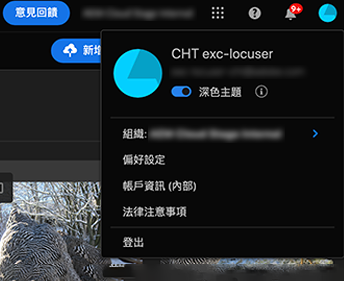
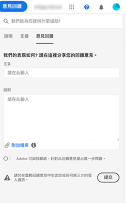

# 開始使用[!DNL Experience Manager Assets Essentials] {#assets-essentials-get-started}

<!-- TBD: Make links for these steps. -->

使用[!DNL Assets Essentials]管理數位資產只需要三個簡單步驟：

* **步驟1**:  上傳和檢  視資產。
* **步驟2**:  Search和下  載資產。
* **步驟3**: [管理及](/help/manage-organize.md) 組織資產。

若要使用[!DNL Assets Essentials]，請登入[https://experience.adobe.com/#/assets](https://experience.adobe.com/#/assets)。 登入時，請選取`Company or School Account`。 若要接收存取權，請聯絡貴組織的管理員。

此外，更多有助於了解用戶介面](/help/navigate-view.md)、[使用案例清單](#use-cases)、<!-- TBD: [supported file types](/help/supported-file-formats.md), -->和[已知問題](/help/release-notes.md#known-issues)的參考資訊。[

## 接收[!DNL Assets Essentials]的訪問 {#get-access}

Adobe會設定解決方案，並將貴組織的指定人員新增為管理員。 管理員可使用[[!DNL Admin Console]](https://helpx.adobe.com/enterprise/admin-guide.html/enterprise/using/welcome.ug.html)提供對組織中各種使用者的存取。 如需與您的存取權限相關的請求，請聯絡貴組織的管理員。

## 設定 [!DNL Assets Essentials] {#configuration}

若要開啟偏好設定，請按一下使用者介面右上角的頭像。 您可以在解決方案偏好設定中的明暗主題之間切換。

如果您是不同組織的一員，您也可以變更組織並存取不同組織的帳戶。

要更改[!UICONTROL Experience Cloud preferences]，請按一下[!UICONTROL Preferences]。

<!-- TBD: What can admins configure? What more can users configure? Any doc that describes Exp Cloud preferences? 
Metadata forms is out of the scope of 6/17 GA. When the functionality is added, link to it from here. It is about configuring metadata UI. -->

<!-- TBD: This section contains beta-specific video that will be updated post-GA.

## Login experience {#login-experience}

When logging in, after providing the credentials, you can be prompted to select an account. In this case, select `Company or School Account` to proceed.

-->

## [!DNL Assets Essentials] 使用案例 {#use-cases}

您可使用[!DNL Assets Essentials]完成的各種數位資產管理(DAM)工作如下。

| 使用者工作 | 功能和操作說明資訊 |
|-----|------|
| 如何新增資產？ | <ul> <li> [上傳資產](/help/add-delete.md) </li> <li> [轉譯](/help/add-delete.md#renditions) </li> </ul> |
| 如何更新資產或相關資訊？ | <ul> <li>變更現有資產</li> <li>[建立](/help/manage-organize.md#create-versions) 版本 [和檢視版本](/help/manage-organize.md#view-versions)</li> <li>[編輯影像](/help/edit-images.md)</li> </ul> |
| 如何探索資產？ | <ul> <li>[瀏覽儲存庫](/help/navigate-view.md#view-assets-and-details) </li> <li> [預覽](/help/navigate-view.md#preview-assets) 資產 [並下載資產](/help/manage-organize.md#download) </li> <li>[搜尋資產](/help/search.md)</li></ul> |
| 如何在存放庫中編輯資產？ | <ul> <li>[使用Adobe Photoshop Express在瀏覽器內編輯](/help/edit-images.md)</li> <li>[裁切社交媒體設定檔](/help/edit-images.md#crop-straighten-images)</li> <li>[檢視及管理版本](/help/manage-organize.md#view-versions)</li> <li>使用[Adobe資產連結](/help/integration.md#integrations)</ul></ul> |
| 如何在存放庫中搜尋資產？ | <ul> <li>[在特定資料夾中搜尋](/help/search.md#refine-search-results)</li> <li>[已儲存的搜尋](/help/search.md#saved-search)</li> <li>[搜尋最近查看的資產](/help/search.md)</li> <li>[全文檢索搜尋](/help/search.md) |
| 如何新增資產？ | <ul> <li>[上傳新資產和資料夾](/help/add-delete.md#add-assets)</li> <li>[監視上載進度並管理上載](/help/add-delete.md#upload-progress)</li> <li>[解決重複項目](/help/add-delete.md#resolve-upload-fails)</li> </ul> |
| 中繼資料操作 | <ul> <li>[檢視詳細中繼資料](/help/metadata.md) </li> <li> [建立新的中繼資料表單](/help/metadata.md#metadata-forms) </li> </ul> |
| [!DNL Assets Essentials]可以與其他解決方案整合嗎？ | <ul> <li>[在中使用資產選取器 [!DNL Adobe Journey Optimizer]](/help/integration.md)</li> <li>[[!DNL Adobe Asset Link] 的 [!DNL Creative Cloud]](/help/integration.md)</li> <li>與[!DNL Creative Cloud Team]程式庫整合</li> </ul> |

<!--TBD: Merge in above table when these use cases are documented/available.
| How do I delete assets? | <ul> <li>[Delete assets](/help/manage-organize.md)</li> <li>Recover deleted assets</li> <li>Permanently delete assets</li> </ul> |
| How do I share assets or find shared assets? | <ul> <li>Shared by me</li> <li>Shared with me</li> <li>Share for comments and review</li> <li>Unshare assets</li> </ul> |
| How do I collaborate with others and get my assets reviewed | <ul> <li>Share for review</li> <li>Provide comments. Resolve and filter comments</li> <li>Annotations on images</li> <li>Assign tasks to specific users and prioritize</li> </ul> |
-->

##  圖示提供產品意見 {#provide-feedback}

Adobe歡迎對解決方案的意見反應。 要在不切換工作應用程式的情況下提供反饋，請使用用戶介面中的[!UICONTROL Feedback]選項。 它也允許附加檔案，例如問題的螢幕擷取畫面或視訊記錄。

若要提供檔案的意見，請按一下右側邊欄中的[!UICONTROL Edit this page] 或[!UICONTROL Log an issue] 。 您可以執行下列其中一項操作：

* 進行內容更新並提交GitHub提取請求。
* 在GitHub中建立問題或票證。 建立問題時，請保留自動填入的文章名稱。

>[!MORELIKETHIS]
>
>* [了解使用者介面](/help/navigate-view.md)。
>* [發行說明和已知問題](/help/release-notes.md)。

<!-- TBD: 
>* [Supported file types](/help/supported-file-formats.md).
-->
