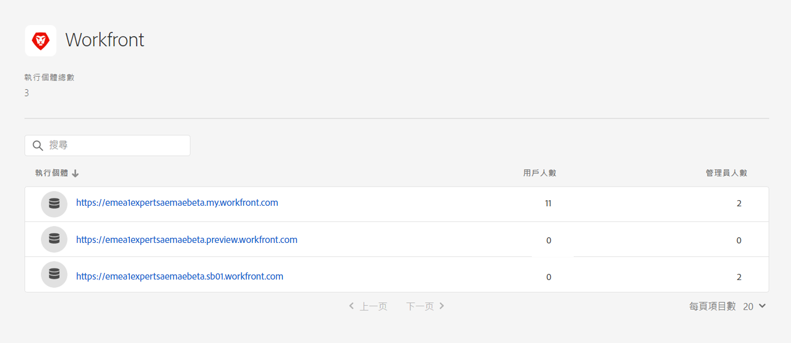
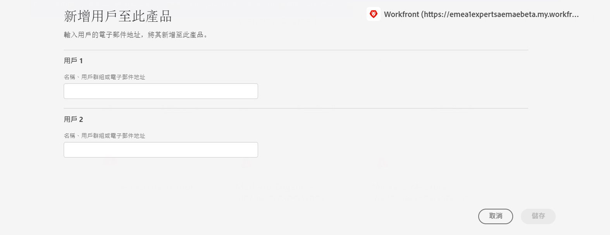

# 將 Assets Essentials 與 Adobe Workfront 整合 {#integrate-assets-essentials-workfront}

[[!DNL Adobe Workfront]](https://www.workfront.com/) 是工作管理應用程式，協助您在一個地方管理整個工作生命週期。[!DNL Adobe Workfront] 與 [!DNL Assets Essentials] 的原生整合可讓組織在本質上連接工作和資產管理，藉以改善內容速度和上市時間。就管理其工作而言，使用者可以存取在同一解決方案中的所需文件和影像。

執行以下工作，將 Workfront 與 Experience Manager Assets Essentials 整合：

* [將使用者新增至 Workfront 產品設定檔](#add-users-to-product-profiles)

* [將使用者新增到 Assets Essentials 產品設定檔](#add-workfront-users-assets-essentials-product-profiles)

* [設定 Experience Manager Assets Essentials 整合](#configure-assets-essentials-integration)

## 將使用者新增至 Workfront 產品設定檔 {#add-users-to-product-profiles}

若要將使用者新增至 Workfront 產品設定檔：

1. 存取您組織的 [Admin Console](https://adminconsole.adobe.com)，按一下頂端列中的&#x200B;**[!UICONTROL 產品]**，按一下 **[!UICONTROL Workfront]**，然後按一下清單中的第一個執行個體。請勿按清單中的第二個和第三個執行個體。

   

   Admin Console 會顯示唯一可用的產品設定檔。

1. 若要新增使用者到產品設定檔，請按一下設定檔、按一下「**[!UICONTROL 新增使用者]**」、提供使用者詳細資訊，然後按一下「**[!UICONTROL 儲存]**」。

   

   新增使用者時，使用者會收到開始使用的電子郵件邀請。您可以在 [!DNL Admin Console] 中的產品設定檔設定中關閉電子郵件邀請。

1. 若要從群組移除使用者，請按一下該群組、選取現有使用者，然後選取&#x200B;**[!UICONTROL 移除使用者]**。

如需如何使用 Adobe Admin Console 在 Workfront 中建立使用者和系統管理員的更多資訊，請參閱[在 Adobe Admin Console 中管理使用者](https://one.workfront.com/s/document-item?bundleId=the-new-workfront-experience&amp;topicId=Content%2FAdministration_and_Setup%2FAdd_users%2FCreate_and_manage_users%2Fadmin-console.htm&amp;_LANG=enus)。

## 將使用者新增到 Assets Essentials 產品設定檔 {#add-workfront-users-assets-essentials-product-profiles}

將 Workfront 使用者指派給以下 Assets Essentials 產品設定檔之一：

* **[!DNL Assets Essentials]使用者**&#x200B;擁有 Assets Essentials 使用者介面的完整存取權。這些使用者可以在 Assets Essentials 應用程式中上傳、組織、標記和尋找數位資產。此外，使用者還可以存取 [!DNL Adobe Workfront] 應用程式中的內嵌式資產選擇體驗。
* **[!DNL Assets Essentials]取用者使用者**：可以存取 [!DNL Adobe Workfront] 應用程式中的內嵌式資產選擇體驗。

此外還有 **[!DNL Assets Essentials]管理員**&#x200B;產品設定檔，可提供應用程式的管理存取權。

如需如何將使用者指派到 Assets Essentials 產品設定檔的更多資訊，請參閱[將使用者指派到 Assets Essentials 產品設定檔](deploy-administer.md#add-users-to-product-profiles)。

## 設定 Experience Manager Assets Essentials 整合 {#configure-assets-essentials-integration}

使用 Admin Console 將使用者新增到 Workfront 和 Assets Essentials 產品設定檔後，您可以[設定 Experience Manager Assets Essentials 與 Adobe Workfront 整合](https://one.workfront.com/s/document-item?bundleId=the-new-workfront-experience&amp;topicId=Content%2FDocuments%2FAdobe_Workfront_for_Experience_Manager_Assets_Essentials%2F_workfront-for-aem-asset-essentials.htm)。

設定整合後，您可以：

* [從 Experience Manager Assets Essentials 連結資產和檔案夾](https://one.workfront.com/s/document-item?bundleId=the-new-workfront-experience&amp;topicId=Content%2FDocuments%2FAdobe_Workfront_for_Experience_Manager_Assets_Essentials%2Flink-to-aem.htm&amp;_LANG=enus)

* [傳送文件至 Experience Manager Assets Essentials](https://one.workfront.com/s/document-item?bundleId=the-new-workfront-experience&amp;topicId=Content%2FDocuments%2FAdobe_Workfront_for_Experience_Manager_Assets_Essentials%2Fsend-to-aem.htm&amp;_LANG=enus)

* [校訂 Experience Manager Assets Essentials 的連結資產](https://one.workfront.com/s/document-item?bundleId=the-new-workfront-experience&amp;topicId=Content%2FDocuments%2FAdobe_Workfront_for_Experience_Manager_Assets_Essentials%2Fproof-linked-asset-aem.htm)

* [從 Experience Manager Assets Essentials 檢視或下載連結的資產](https://one.workfront.com/s/document-item?bundleId=the-new-workfront-experience&amp;topicId=Content%2FDocuments%2FAdobe_Workfront_for_Experience_Manager_Assets_Essentials%2Fview-download-asset.htm)
