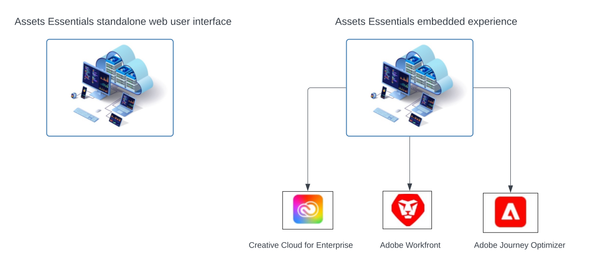

# [!DNL Adobe Experience Manager Assets Essentials] 概覽 {#assets-essentials}

<!-- TBD: Update this banner to remove Beta label. 

-->

Adobe提供強大的數字資產管理(DAM)解決方案，讓您能夠充分利用數字資產。 Adobe Experience Manager Assets Essentials是Adobe公司的輕量級資產管理解決方案，用於儲存、管理、發現和使用數字資產。

## 什麼是Assets Essentials? {#assets-essemtials-overview}

Experience Manager Assets軟體包是輕量版的Adobe Experience Manager資產Cloud Service。 Assets Essentials通過簡化的現代用戶介面提供統一的資產管理和協作。 該易於使用的解決方案使更具創意和營銷團隊能夠儲存、發現和分發數字資產。

Assets Essentials使您能夠：

* 在中央位置管理、組織和管理資產。

* 跨團隊協作開發內容。

* 訪問、搜索和查找最終批准的資產。

* 共用和下載下游交付的資產。

## 怎麼去Assets Essentials? {#access-options}

Assets Essentials為最終用戶和管理員提供獨立的web用戶介面，使他們能夠訪問解決方案的所有功能。 其他Adobe解決方案的用戶還可以通過嵌入式體驗訪問和使用Assets Essentials的資產，該體驗可用於企業、Adobe Journey Optimizer和Adobe Workfront應用程式的Creative Cloud。

## 為什麼是Assets Essentials? {#assets-essentials-features}

Assets Essentials提供了關鍵優勢，讓您能夠：

* **快速開始** 配備現成的資產管理工具。

* 將對資產的訪問擴展到更多團隊，以提供一致的客戶體驗 **簡化的資產管理**。

* 將內容生命週期與本機 **整合到其他Adobe解決方案**。

* 利用 **雲平台**、安全並隨時隨地擴展。

* 從基本的DAM功能開始， **成長** 企業DAM。

**快速開始**

Assets Essentials解決方案通過Adobe提供給客戶，在配置過程完成後提供。 管理員可以訪問Adobe Admin Console的產品，並可以立即啟動系統配置和用戶登錄。

瞭解有關Assets Essentials的更多資訊 [管理和用戶登錄](deploy-administer.md)。

**簡化的資產管理**

Assets Essentials簡化的用戶介面使您能夠輕鬆管理、發現和分發數字資產。 來自不同職能（包括創意、營銷和業務線團隊）的廣泛用戶可以就資產進行協作，並在需要時和地點訪問適當且已批准的資產。

有關詳細資訊，請參見 [開始使用Assets Essentials](get-started.md)。

**與其他Adobe應用程式整合**

Assets Essentials公司與支援的Adobe解決方案整合，並在這些應用程式的介面內提供嵌入式體驗。 它使用戶能夠直接訪問其應用程式中需要的資產。 所有用戶都可以在他們熟悉的工具和應用程式中使用相同的集中管理資產。

嵌入式Assets Essentials體驗可用於企業、Adobe Journey Optimizer和Adobe Workfront應用程式的Creative Cloud。

如需詳細資訊，請參閱「[與其他 Adobe 解決方案的整合](integration.md)」。

**基於雲的平台**

基於Adobe雲基礎架構，Assets Essentials使組織能夠將業務需求集中在建立、管理和分發數字資產上。 此外，Adobe還通過頻繁的更新向用戶無縫地提供產品創新，確保解決方案可用、安全、可擴展且始終保持最新。

**隨您而增長的能力**

快速與Assets Essentials聯手啟動並運行，以利用各個團隊的關鍵數字資產管理功能。

當您的業務需要增長，並且您需要對高級數字資產管理要求(如定制、擴展性和整合、自動化、Dynamic Media和Brand Portal)的支援時，Adobe還提供了 [Adobe Experience Manager資產as a Cloud Service](https://experienceleague.adobe.com/docs/experience-manager-cloud-service/content/assets/home.html?lang=en)。

## 後續步驟 {#next-steps}

* 使用 Assets Essentials 使用者介面中所提供的[!UICONTROL 意見回饋]選項提供產品意見回饋

* 若要提供文件意見回饋，請使用右側邊欄提供的[!UICONTROL 編輯此頁面]或[!UICONTROL 記錄問題]

* 連絡[客戶服務](https://experienceleague.adobe.com/?support-solution=General#support)

>[!MORELIKETHIS]
>
>* [[!DNL Assets Essentials] 教程頁](https://experienceleague.adobe.com/docs/experience-manager-learn/assets-essentials/overview.html?lang=en)

