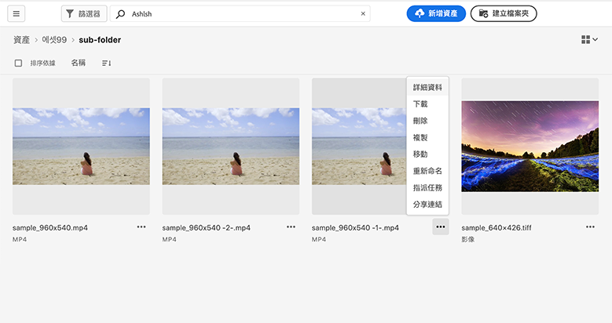
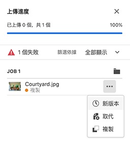
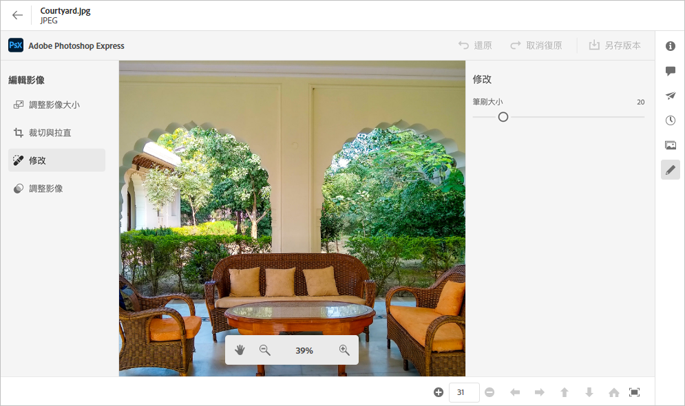

# 管理資產 {#manage-assets}

您可以使用 [!DNL Assets Essentials] 的人性化界面，輕鬆進行各種數位資產管理 (DAM) 任務。新增資產後，即可搜尋、下載、移動、複製、重新命名、刪除、更新和編輯您的資產。

使用 [!DNL Assets Essentials] 完成下列資產管理任務。選取資產時，下列選項會在頂部的工具列中顯示。

*圖：在選取影像的工具列中可用的選項。*

*  取消選取。
*  按一下以預覽資產和檢視詳細的中繼資料。預覽時，您可以檢視版本和編輯影像。
*  將選取的資產下載到您的本機檔案系統。
*  刪除選取的資產或檔案夾。
*  簽出選取的資產。
*  複製選取的檔案或資料夾。
*  將選取的資產或資料夾移至存放庫階層中不同的位置。
*  重新命名選取的資產或資料夾。請使用唯一名稱，否則重新命名動作會失敗並出現警告。您可以使用新的名稱再試。
*  指派任務給其他使用者，以在資產上共同作業。

您可以在資產縮圖上檢視相同選項。

[!DNL Assets Essentials] 只會在工具列中根據選取的資產類型，顯示相關的選項。

*圖：在選取資料夾的工具列中可用的選項。*

*圖：在選取 PDF 檔案的工具列中可用的選項。*

## 下載和散發資產 {#download}

您可以選取一個或更多資產或資料夾或兩者的組合，然後將選取項目下載到您的本機檔案系統。您可以再次編輯資產和上傳或在 [!DNL Assets Essentials] 外部散發資產。 您也可以[下載資產的轉譯](/help/add-delete.md#renditions)。

## 資產版本設定 {#versions-of-assets}

<!-- 
TBD: query for engineering: How many versions are maintained. What happens when we reach that limit? Are old versions automatically removed? -->

再次上傳已上傳或編輯的資產時，[!DNL Assets Essentials] 便會對資產進行版本設定。您可以檢視版本記錄、先前的版本，並可以將資產先前的版本還原成最新版本 (必要時回復至先前的版本)。資產版本會在以下情況中建立：

* 上傳新資產時，新資產的檔案名稱跟現有的資產相同，以及所在的資料夾跟現有的資產相同。[!DNL Assets Essentials] 會提示覆寫先前的資產，或將新資產另存新版本。請參閱[上傳重複資產](/help/add-delete.md#resolve-upload-fails)。

   

   *圖：上傳名稱與現有資產名稱相同的資產時，您可以建立該資產的版本。*

* 編輯影像然後按一下「**[!UICONTROL 另存新版本]**」。請參閱[編輯影像](/help/edit-images.md)。

   

   *圖：將編輯的影像另存新版本。*

* 開啟現有資產的版本。按一下「**[!UICONTROL 新版本]**」，然後上傳存放庫中較新版本的資產。

   

### 檢視資產的版本 {#view-versions}

上傳資產的重複複本或修改的複本時，您可以建立其版本。版本設定功能可讓您檢閱歷史資產並在必要時恢復成先前的版本。

若要檢視版本，請開啟資產的預覽，然後從右側邊欄按一下「**[!UICONTROL 版本]**」 。若要預覽特定版本，請選取該版本。若要恢復至該版本，請按一下「**[!UICONTROL 製作最新]**」。

您也可以從版本時間表建立版本。選取最新的版本、按一下「**[!UICONTROL 新版本]**」，然後從您的本機檔案系統上傳該資產的新複本。

*圖：檢視資產的版本、恢復成先前的版本，或上傳另一個新版本。*

## 管理資產狀態 {#manage-asset-status}

**所需權限：**  `Can Edit`。 `Owner`或資產的管理員權限。

Assets Essentials允許您設定儲存庫中可用資產的狀態。 設定資產狀態以更好地管理和管理數字資產的下游消耗。

您可以設定以下資產狀態：

* 已批准

* 已拒絕

* 無狀態

### 設定資產狀態 {#set-asset-status}

要設定資產狀態：

1. 選擇資產，然後按一下 **[!UICONTROL 詳細資訊]** 的子菜單。

1. 在 **[!UICONTROL 基本]** 頁籤 **[!UICONTROL 狀態]** 下拉清單。 可能的值包括「已批准」、「已拒絕」和「無狀態」（預設值）。

   >[!VIDEO](https://video.tv.adobe.com/v/342495)

<!--

### Set asset expiration date {#set-asset-expiration-date}

To set asset expiration date:

1. Select the asset, and click **[!UICONTROL Details]** in the toolbar.

1. In the **[!UICONTROL Basic]** tab, set the expiration date for the asset using the  **[!UICONTROL Expiration date]** field.

The `Expired` asset card indicator overrides the `Approved` or `Rejected` indicator set for an asset.

-->

您還可以根據資產狀態篩選資產，有關詳細資訊，請參閱 [搜索Assets Essentials資產](search.md)。

## 自定義元資料表單以包括資產狀態欄位 {#customize-asset-status-metadata-form}

**所需權限：** 管理員

Assets Essentials 預設為提供許多標準中繼資料欄位。組織擁有其他中繼資料需求，並需要更多中繼資料欄位以新增特定企業中繼資料。中繼資料表單可讓企業將自訂中繼資料欄位新增到資產的[!UICONTROL 詳細資訊]頁面。特定企業中繼資料能夠改善其資產的控管和探索。

有關如何將其他元資料欄位添加到元資料表單的詳細資訊，請參見 [元資料Forms](metadata.md##metadata-forms)。

**將「資產狀態」元資料欄位添加到窗體**

要將「資產狀態」元資料欄位添加到窗體，請拖動 **[!UICONTROL 資產狀態]** 從左滑軌到窗體的元件。 自動預填充映射屬性。 保存表單以確認更改。

<!--

**Add Expiration Date metadata field to the form**

To add Expiration Date metadata field to the form,  drag **[!UICONTROL Date]** component from the left rail to the form. Specify **Expiration Date** as the label and `pur:expirationDate` as the mapping property. Save the form to confirm the changes.

-->

