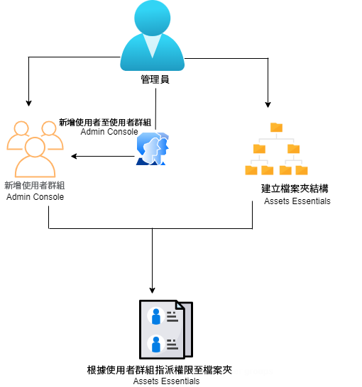
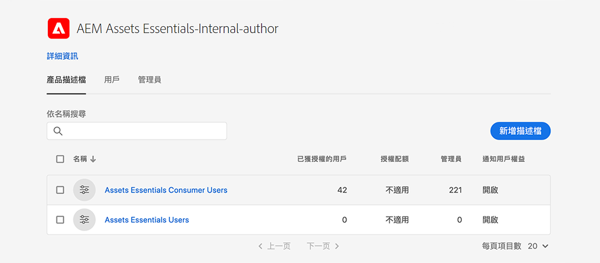
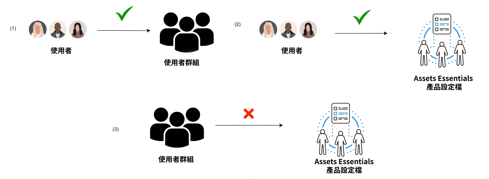
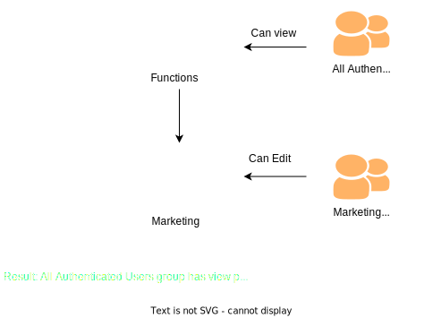
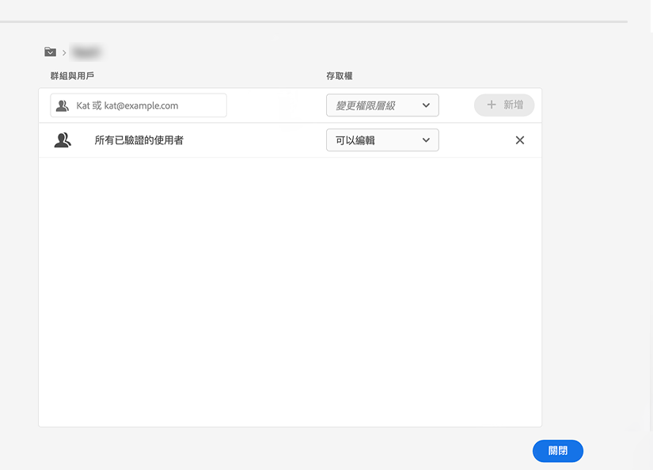
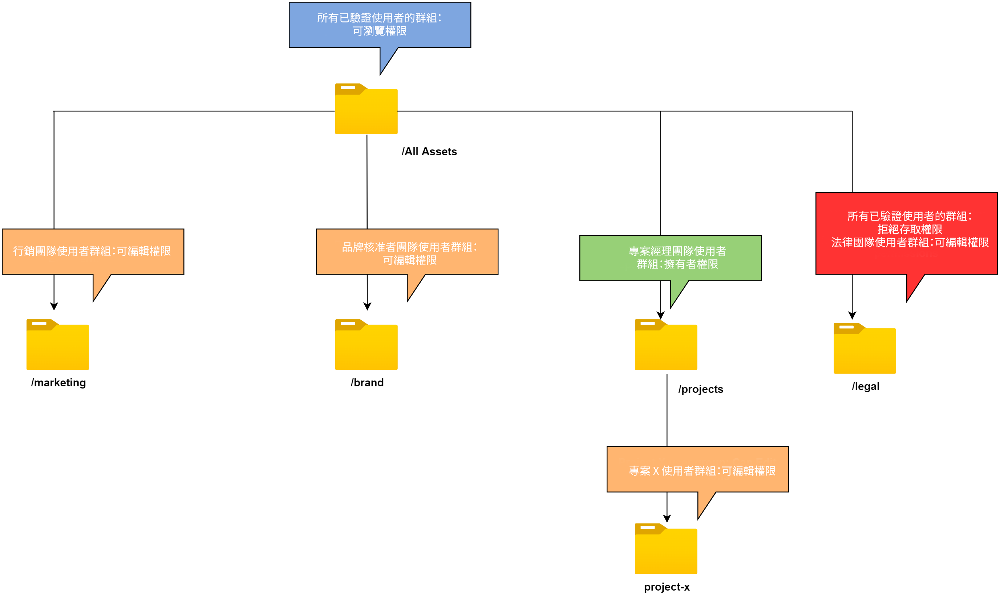

# 管理檔案夾的權限 {#manage-permissions}

>[!CONTEXTUALHELP]
>id="assets_permissions_folders"
>title="管理權限"
>abstract="[!DNL Assets Essentials] 可讓管理員管理存放庫中檔案夾的存取層級。 身為管理員，您可建立使用者群組並指派權限給這些群組，以管理存取層級。您還可以將權限管理權委派給檔案夾層級的使用者群組。"

Assets Essentials 可讓管理員管理存放庫中檔案夾的存取層級。 身為管理員，您可建立使用者群組並指派權限給這些群組，以管理存取層級。您還可以將權限管理權委派給檔案夾層級的使用者群組。

以下資料流程圖說明了您為設定和管理 Assets Essentials 存放庫中可用檔案夾的權限所執行的工作順序：

## 管理檔案夾的權限之前 {#before-managing-permissions}

在開始管理 Assets Essentials 存放庫中檔案夾的權限之前，您必須進行特定工作，例如新增能夠建立邏輯檔案夾結構、建立使用者群組和管理各種使用者群組的檔案夾權限的管理員。

### 新增管理員 {#add-admin-users}

為 Assets Essentials 應用程式新增管理員，以便他們可以管理其他使用者群組的檔案夾權限。

若要新增管理員：

1. 存取您組織的 [Admin Console](https://adminconsole.adobe.com)，按一下頂端列中的&#x200B;**[!UICONTROL 產品]**，按一下 **[!UICONTROL AEM Assets Essentials]**，然後按一下 [!DNL Assets Essentials] 環境。 [!DNL Assets Essentials] 擁有三種產品設定檔，代表管理員、一般和消費者使用者的存取權。

   

1. 若要新增使用者到群組，請按一下 Assets Essentials 管理員群組、選取&#x200B;**[!UICONTROL 新增使用者]**、提供使用者詳細資訊，然後按一下&#x200B;**[!UICONTROL 儲存]**。

   

   新增使用者時，使用者會收到開始使用的電子郵件邀請。您可以在 [!DNL Admin Console] 中的產品設定檔設定中關閉電子郵件邀請。

1. 若要從群組移除使用者，請按一下該群組、選取現有使用者，然後選取&#x200B;**[!UICONTROL 移除使用者]**。

### 新增使用者群組 {#add-user-groups}

建立使用者群組並指派權限給這些群組，以管理 Assets Essentials 存放庫中的檔案夾存取層級。您接著可將使用者指派給使用者群組。

您可以將使用者新增到使用者群組 (1) 以及[將使用者新增到 Assets Essentials 產品設定檔 (2)](#add-admin-users)。但您無法將使用者群組直接新增到 Assets Essentials 產品設定檔 (3)。

如需有關如何管理使用者群組的資訊，請參閱 `Create user groups` 和 `Edit user groups` (可在[管理使用者群組](https://helpx.adobe.com/enterprise/using/user-groups.html)中取得)。

>[!NOTE]
>
>如果您的 Admin Console 設定為利用外部系統來管理使用者/群組分配，例如 Azure 或 Google 連接器、使用者同步工具或 User Management Rest API，則您的群組和使用者指派會自動設定。如需詳細資訊，請參閱 [Adobe Admin Console 使用者](https://helpx.adobe.com/tw/enterprise/using/users.html)。

### 新增使用者至群組 {#add-users-to-uesr-groups}

建立使用者群組後，您可以開始將使用者新增至使用者群組。

如需有關如何管理新增使用者至使用者群組的資訊，請參閱 `Add users to groups` (可在[管理使用者群組](https://helpx.adobe.com/in/enterprise/using/user-groups.html#add-users-to-groups)中取得)。

### 建立檔案夾結構 {#create-folder-structure}

您可以使用下列方法在 Assets Essentials 存放庫中建立檔案夾結構：

* 按一下工具列中的&#x200B;**[!UICONTROL 建立檔案夾]**&#x200B;選項，即可建立空的檔案夾。

* 按一下工具列中的&#x200B;**[!UICONTROL 新增資產]**&#x200B;選項，即可[上傳本機中現有的檔案夾結構](add-delete.md)。

建立一個適合組織業務目標的檔案夾結構。如果您要將現有的檔案夾結構上傳到 Assets Essentials 存放庫，則應查看該結構。如需詳細資訊，請參閱[有效權限管理的最佳實務](permission-management-best-practices.md)。

## 管理有關檔案夾的權限 {#manage-permissions-on-folders}

您可以將以下權限指派給使用者群組或使用者。Adobe 不建議將權限指派給使用者。

| 權限名稱 | 說明 |
|-----|------|
| 可檢視 | <ul><li>檢視和瀏覽檔案夾的讀取權限 </li><li>預覽資產</li><li>下載資產</li><li>複製資產</li><li>共用資產的連結</li><ul> |
| 可以編輯 | <ul><li>所有權限都適用於「可以檢視」 </li><li>建立檔案夾</li><li>移除檔案夾</li><li>重新命名檔案夾</li><li>建立資產</li><li>更新資產</li><li>移除資產</li><li>移動資產</li><li>為資產重新命名</li><ul> |
| 擁有者 | <ul><li>所有權限都適用於「可以編輯」</li><li>管理檔案夾及其子檔案夾的權限</li>此權限可讓管理員將檔案夾及其子檔案夾的管理員權限委派給其他人。<ul> |
| 拒絕存取 | 移除檔案夾及其子檔案夾的「可以檢視」、「可以編輯」以及「擁有者」權限。 |

**預設權限**

所有已驗證身份並可以登入 Assets Essentials 應用程式的使用者最初都擁有對 Assets Essentials 存放庫的「`Can Edit`」權限。管理員可以透過[編輯整個 Assets Essentials 存放庫的權限](#edit-permissions-entire-repository)調整變更預設權限。

**指派檔案夾權限給使用者群組的順序**

建立指派檔案夾權限給使用者群組的規則。您用於為檔案夾指派權限的順序很重要，這會決定使用者群組以及最終使用者可使用的存取權。

例如，如果您指派檔案夾的「`Can View`」權限給一個超級群組，然後又指派「`Can Edit`」權限給其子群組，則只有子群組的成員才有該檔案夾的編輯權限。超級群組使用者則有該檔案夾的檢視存取權。

如果您需要提供組織行銷部門僅限「`Marketing`」檔案夾的編輯權限，並提供其他人檢視權限，指派「`Can View`」權限給超級群組「`All Authenticated Users`」以及「`Can Edit`」權限給其子群組「`Marketing`」。

**權限繼承**

Assets Essentials 使用權限繼承，這使您可以在子檔案夾中繼承為父檔案夾設定的權限。例如，如果父檔案夾擁有適用於「`All Authenticated Users`」群組的「`Can View`」權限，而子檔案夾擁有適用於「`Marketing`」使用者群組的「`Can Edit`」權限，這可讓所有已驗證身分的使用者擁有子檔案夾的檢視權限以及「`Marketing`」使用者群組擁有子檔案夾的編輯權限。該「`Marketing`」使用者群組擁有在子檔案夾：行銷 (Marketing) 下更上層檔案夾的編輯權限。

>[!NOTE]
>
> 為群組設定的權限為對較高層級檔案夾「`Deny Access`」，如此即不支援恢復該群組或其成員的存取權 (`Can view`, `Can edit` 或 `Owner`)。謹慎使用「`Deny Access`」。

### 對使用者群組新增權限 {#add-permissions}

若要指派檔案夾的群組權限：

1. 請選取檔案夾並按一下&#x200B;**[!UICONTROL 管理權限]**。

1. 在&#x200B;**[!UICONTROL 管理權限]**&#x200B;對話中，在&#x200B;**[!UICONTROL 群組和使用者]**&#x200B;欄位中指定群組或使用者姓名。

1. 選取[存取層級](#manage-permissions-folders) (從&#x200B;**[!UICONTROL 存取]**&#x200B;下拉式清單)。

1. 按一下&#x200B;**[!UICONTROL 新增]**，即可立即變更使用者或使用者群組的權限。

1. 重複步驟 1 至 3，即可對&#x200B;**[!UICONTROL 管理權限]**&#x200B;對話新增更多規則。

   

   >[!NOTE]
   >
   > 您用於為檔案夾指派權限的順序很重要，這會決定使用者群組以及最終新增至群組的使用者可使用的存取權。

   如果您正在管理多個檔案夾的權限，您還可以從左側窗格中選取任何其他檔案夾並開始管理該檔案夾的權限。

1. 按一下&#x200B;**[!UICONTROL 關閉]**。

>[!CAUTION]
>
> 相對於個別使用者，建議管理使用者群組的權限。僅支援對使用者群組設定「`Deny access`」權限，但不支援個別使用者。

### 編輯指派給使用者群組的權限 {#edit-permissions}

若要編輯指派給使用者群組對檔案夾的權限：

1. 請選取檔案夾並按一下&#x200B;**[!UICONTROL 管理權限]**。

1. 在&#x200B;**[!UICONTROL 管理權限]**&#x200B;對話中，編輯[存取層級](#manage-permissions-folders) (從&#x200B;**[!UICONTROL 存取]**&#x200B;下拉式清單)。

1. 如有必要，對現有權限規則[新增更多使用者群組或使用者](#add-permissions)。

1. 按一下「X」即可移除指派給使用者群組的權限。

### 編輯整個 Assets Essentials 存放庫的權限 {#edit-permissions-entire-repository}

應用程式管理員可編輯整個 Assets Essentials 存放庫的權限，從預設的「`Can Edit`」變成任何其他存取層級。

若要編輯整個 Assets Essentials 存放庫的權限：

1. 請選取任一檔案夾並按一下&#x200B;**[!UICONTROL 管理權限]**。

1. 在&#x200B;**[!UICONTROL 管理權限]**&#x200B;對話中，按一下左側攔中的&#x200B;**[!UICONTROL 所有資產]**。

1. [編輯權限](#edit-permissions)並關閉對話。

>[!NOTE]
>
>管理員無法選取整個 Assets Essentials 存放庫的「`Deny Access`」權限來確保使用者至少擁有對應用程式的讀取存取權。同樣地，「`All Authenticated Users`」至少擁有存放庫的讀取權限，即便管理員在[!UICONTROL 管理權限]對話中明確移除「`Can Edit`」權限。

## 有效權限管理的範例 {#example-permission-management}

**使用案例**

* 所有已驗證身分的使用者群組都擁有對存放庫的檢視存取權。
* 特定團隊的使用者群組擁有對其專屬特定功能檔案夾的編輯權限。
* 除法務團隊外，任何已驗證身分的使用者都無法檢視法務檔案夾。

在 Admin Console 中建立下列使用者群組：

* 行銷團隊 

* 品牌核准人團隊

* 專案經理人團隊

* 專案 X 團隊

* 法務團隊

下圖說明了檔案夾階層以及指派給每個使用者群組的權限：

以下是檔案夾階層中所有使用者群組的存取層級：

* /所有資產：管理員會將根層級的權限從預設的「`Can Edit`」修改為「`Can View`」。所有使用者都可以檢視檔案夾和資產，但無法加以編輯。

* /行銷：所有使用者都可以根據權限繼承檢視檔案夾及其子檔案夾，但行銷團隊使用者群組則擁有對檔案夾的編輯權限。

* /品牌：所有使用者都可以根據權限繼承檢視檔案夾及其子檔案夾，但品牌核准人團隊使用者群組則擁有對檔案夾的編輯權限。

* /專案：所有使用者都可以根據權限繼承檢視檔案夾及其子檔案夾。專案經理人團隊使用者群組擁有：

   * 編輯權限

   * 擁有者權限：管理檔案夾及其子檔案夾的權限。

* /專案/project-x：所有使用者都可以檢視檔案夾及其子檔案夾。專案經理人團隊使用者群組擁有編輯權限，並可管理檔案夾及其子檔案夾的權限 (擁有者權限)。專案 X 團隊使用者群組擁有編輯權限。

* /法務：沒有任何一位使用者可根據適用於「`All Authenticated Users`」群組的「`Deny Access`」權限來存取該檔案夾。法務團隊使用者群組擁有編輯權限。

## 後續步驟 {#next-steps}

* [觀看在 Assets Essentials 中管理權限的相關影片](https://experienceleague.adobe.com/docs/experience-manager-learn/assets-essentials/configuring/permissions-management.html)

* 使用 Assets Essentials 使用者介面中所提供的[!UICONTROL 意見回饋]選項提供產品意見回饋

* 若要提供文件意見回饋，請使用右側邊欄提供的[!UICONTROL 編輯此頁面]或[!UICONTROL 記錄問題]

* 聯絡[客戶服務](https://experienceleague.adobe.com/?support-solution=General#support)
