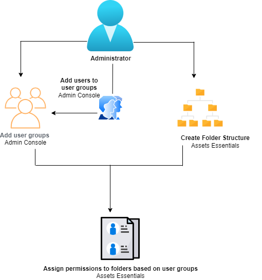
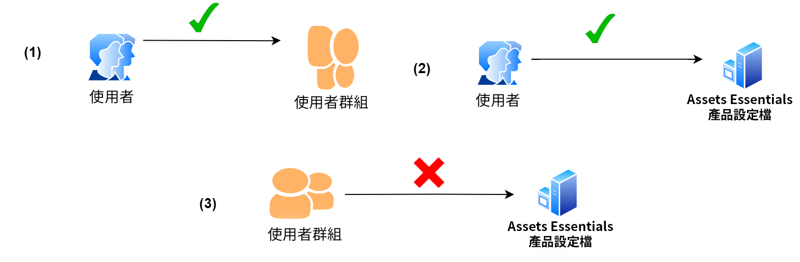
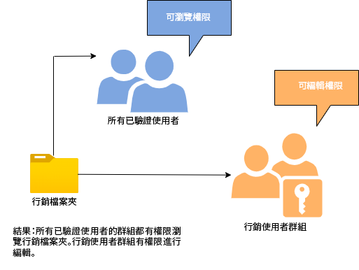
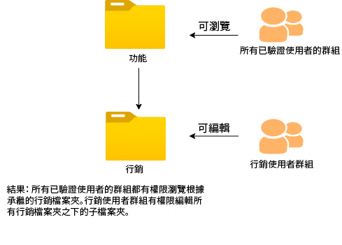
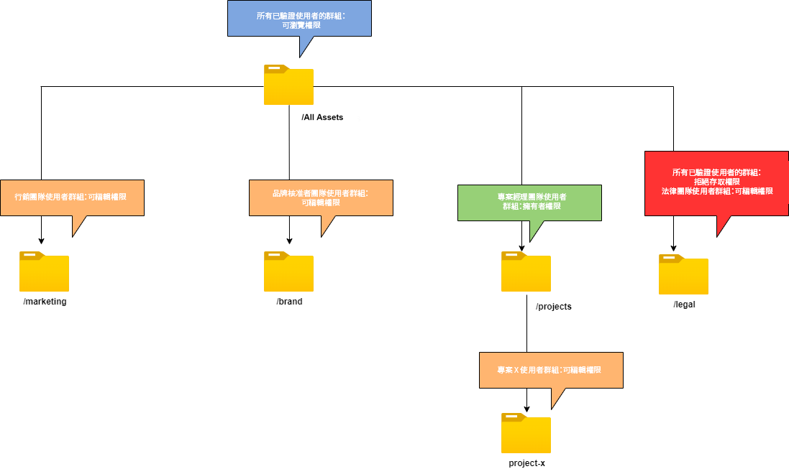

# 管理資料夾的權限

Assets Essentials允許管理員管理儲存庫中可用資料夾的訪問級別。 作為管理員，您可以建立用戶組並將權限分配給這些組以管理訪問級別。 您還可以將權限管理權限委託給資料夾級別的用戶組。

以下資料流圖說明了您為配置和管理Assets Essentials儲存庫中可用資料夾的權限而執行的任務順序：

## 在管理資料夾權限之前 {#before-managing-permissions}

在開始管理Assets Essentials儲存庫中資料夾的權限之前，必須執行某些任務，例如添加可以建立邏輯資料夾結構、建立用戶組和管理各用戶組資料夾權限的管理員。

### 添加管理員 {#add-admin-users}

為Assets Essentials應用程式添加管理員，以便他們可以管理其他用戶組的資料夾權限。

添加管理員：

1. 訪問 [Admin Console](https://adminconsole.adobe.com) 對於您的組織，按一下 **[!UICONTROL 產品]** 按一下 **[!UICONTROL AEM Assets精華]**，然後按一下 [!DNL Assets Essentials] 環境。 [!DNL Assets Essentials] 有三個產品配置檔案，它們代表管理員、普通用戶和消費者用戶的訪問權限。

   

1. 要將用戶添加到組，請按一下「Assets Essentials管理員」組，選擇 **[!UICONTROL 添加用戶]**，提供用戶詳細資訊，然後按一下 **[!UICONTROL 保存]**。

   

   添加用戶時，用戶將收到開始使用的電子郵件邀請。 您可以在中的產品配置檔案設定中關閉電子郵件邀請 [!DNL Admin Console]。

1. 要從組中刪除用戶，請按一下該組，選擇現有用戶，然後選擇 **[!UICONTROL 刪除用戶]**。

### 添加用戶組 {#add-user-groups}

建立用戶組並將權限分配給這些組以管理Assets Essentials儲存庫中的資料夾訪問級別。 然後，您可以將用戶分配給用戶組。

可以將用戶添加到用戶組(1)和 [用戶到Assets Essentials產品配置檔案(2)](#add-admin-users)。 但是，不能將用戶組直接添加到Assets Essentials產品配置檔案(3)。

有關如何管理用戶組的資訊，請參見 `Create user groups` 和 `Edit user groups` 可用 [管理用戶組](https://helpx.adobe.com/enterprise/using/user-groups.html)。

>[!NOTE]
>
>如果將Admin Console設定為利用外部系統來管理用戶/組分配，例如Azure或Google連接器、用戶同步工具或用戶管理余料API，則會自動配置您的組和用戶分配。 有關詳細資訊，請參見 [Adobe Admin Console用戶](https://helpx.adobe.com/enterprise/using/users.html)。

### 將用戶添加到組 {#add-users-to-uesr-groups}

建立用戶組後，可以開始向用戶組添加用戶。

有關如何管理向用戶組添加用戶的資訊，請參見 `Add users to groups` 可用 [管理用戶組](https://helpx.adobe.com/in/enterprise/using/user-groups.html#add-users-to-groups)。

### 建立資料夾結構 {#create-folder-structure}

可以使用以下方法在Assets Essentials儲存庫中建立資料夾結構：

* 按一下 **[!UICONTROL 建立資料夾]** 選項。

* 按一下 **[!UICONTROL 添加資產]** 選項 [上載本地電腦上可用的資料夾結構](add-delete.md)。

建立與組織的業務目標相配合的資料夾結構。 如果要將現有資料夾結構上載到Assets Essentials儲存庫，則應查看該結構。 有關詳細資訊，請參見 [有效權限管理的最佳做法](permission-management-best-practices.md)。

## 管理資料夾的權限 {#manage-permissions-folders}

您可以將以下權限分配給用戶組或用戶。 Adobe不建議將權限分配給用戶。

| 權限名稱 | 說明 |
|-----|------|
| 可查看 | <ul><li>對查看和導航資料夾的讀權限 </li><li>預覽資產</li><li>下載資產</li><li>複製資產</li><li>共用到資產的連結</li><ul> |
| 可編輯 | <ul><li>可用於查看權限的所有權限 </li><li>建立資料夾</li><li>刪除資料夾</li><li>更名資料夾</li><li>建立資產</li><li>更新資產</li><li>刪除資產</li><li>移動資產</li><li>更名資產</li><ul> |
| 所有者 | <ul><li>可編輯權限的所有權限</li><li>管理資料夾及其子資料夾的權限</li>此權限允許管理員將管理員權限委派給其他人，以處理資料夾及其子資料夾。<ul> |
| 拒絕訪問 | 刪除資料夾及其子資料夾的「可查看」、「可編輯」和「所有者」權限。 |

**預設權限**

所有經過身份驗證並可以登錄到Assets Essentials應用程式的用戶 `Can Edit` 對Assets Essentials儲存庫的權限。 管理員可以調整更改預設權限 [編輯整個Assets Essentials儲存庫的權限](#edit-permissions-entire-repository)。

**將資料夾權限分配給用戶組的順序**

建立規則以將資料夾權限分配給用戶組。 用於為資料夾分配權限的順序非常重要，它決定了用戶組以及最終用戶的可用訪問權限。

例如，如果 `Can View` 將資料夾的權限分配給超級組，然後 `Can Edit` 對其子組的權限，只有子組的成員具有對資料夾的編輯權限。 超級組用戶有權查看資料夾。

如果需要為 `Marketing` 資料夾僅用於您組織的市場營銷部門，並查看其他部門的權限，分配 `Can View` 對超級組的權限 `All Authenticated Users` 和 `Can Edit` 對其子組的權限 `Marketing`。

**權限繼承**

Assets Essentials使用權限繼承，這使您能夠繼承子資料夾中父資料夾的權限集。 例如，如果父資料夾 `Can View` 權限 `All Authenticated Users` 組和子資料夾具有 `Can Edit` 權限 `Marketing` 用戶組，它使所有經過身份驗證的用戶都具有查看子資料夾和 `Marketing` 組以具有子資料夾的編輯權限。 的 `Marketing` 用戶組對子資料夾（市場營銷）下的資料夾的其他級別具有編輯權限。

>[!NOTE]
>
> 設定 `Deny Access` 對較高級別資料夾上的組的權限，然後恢復訪問權限(`Can view`。 `Can edit` 或 `Owner`)。 使用 `Deny Access` 少得可憐。

### 向用戶組添加權限 {#add-permissions}

要為資料夾分配組權限：

1. 選擇資料夾並按一下 **[!UICONTROL 管理權限]**。

1. 在 **[!UICONTROL 管理權限]** 對話框中，指定組或用戶的名稱 **[!UICONTROL 組和用戶]** 的子菜單。

1. 選擇 [訪問級別](#manage-permissions-folders) 從 **[!UICONTROL 訪問]** 下拉清單。

1. 按一下 **[!UICONTROL 添加]** 立即更改用戶或用戶組的權限。

1. 重複步驟1-3，向 **[!UICONTROL 管理權限]** 對話框。

   

   >[!NOTE]
   >
   > 您用於為資料夾分配權限的順序非常重要，它決定了用戶組以及最終添加到這些組的用戶的可用訪問權限。

   如果您正在管理多個資料夾的權限，您還可以從左窗格中選擇任何其他資料夾，然後開始管理該資料夾的權限。

1. 按一下 **[!UICONTROL 關閉]**。

>[!CAUTION]
>
> 建議管理用戶組的權限，而不是單個用戶。 設定 `Deny access` 只支援用戶組的權限，但不支援單個用戶。

### 編輯分配給用戶組的權限 {#edit-permissions}

要編輯分配給資料夾上的用戶組的權限：

1. 選擇資料夾並按一下 **[!UICONTROL 管理權限]**。

1. 在 **[!UICONTROL 管理權限]** 對話框，編輯 [訪問級別](#manage-permissions-folders) 從 **[!UICONTROL 訪問]** 下拉清單。

1. [添加更多用戶組或用戶](#add-permissions) 按現有權限規則執行。

1. 按一下X刪除分配給用戶組的權限。

### 編輯整個Assets Essentials儲存庫的權限 {#edit-permissions-entire-repository}

應用程式管理員可以從預設位置編輯整個Assets Essentials儲存庫的權限 `Can Edit` 到其他訪問級別。

編輯整個Assets Essentials儲存庫的權限：

1. 選擇任何資料夾，然後按一下 **[!UICONTROL 管理權限]**。

1. 在 **[!UICONTROL 管理權限]** 對話框，按一下 **[!UICONTROL 所有資產]** 左欄。

1. [編輯權限](#edit-permissions) 並關閉對話框。

>[!NOTE]
>
>管理員無法選擇 `Deny Access` 整個Assets Essentials儲存庫的權限級別，以確保用戶至少具有對應用程式的讀權限。 同樣， `All Authenticated Users` 至少對儲存庫具有讀取權限，即使管理員明確刪除 `Can Edit` 權限 [!UICONTROL 管理權限] 對話框。

## 有效權限管理示例 {#example-permission-management}

**用例**

* 所有已驗證的用戶組都有權查看儲存庫的訪問權限。
* 特定於團隊的用戶組對其自己的特定於功能的資料夾具有編輯權限。
* 除法律團隊外，法律資料夾不可用於查看任何經過身份驗證的用戶。

在Admin Console中建立以下用戶組：

* 營銷團隊

* 品牌批准者團隊

* 項目經理小組

* 項目X團隊

* 法律團隊

下圖說明了資料夾層次結構以及分配給每個用戶組的權限：

以下是資料夾層次結構中所有用戶組的訪問級別：

* /所有資產：管理員將根級別的權限從預設 `Can Edit` 至 `Can View`。 所有用戶都可以查看資料夾和資產，但無法編輯它們。

* /marketing:所有用戶都可以根據權限繼承來查看資料夾及其子資料夾，但是，Marketing Team用戶組對該資料夾具有編輯權限。

* /brand:所有用戶都可以根據權限繼承來查看資料夾及其子資料夾，但是，「品牌批准者團隊」用戶組對該資料夾具有編輯權限。

* /projects:所有用戶都可以根據權限繼承查看資料夾及其子資料夾。 項目經理團隊用戶組具有：

   * 編輯權限

   * 所有者權限：管理資料夾及其子資料夾的權限。

* /projects/project-x:所有用戶都可以查看資料夾及其子資料夾。 項目經理團隊用戶組具有編輯權限，並且可以管理資料夾及其子資料夾的權限（所有者權限）。 項目X團隊用戶組具有編輯權限。

* /legal:任何用戶都不能基於 `Deny Access` 權限 `All Authenticated Users` 組。 法律團隊用戶組具有編輯權限。
