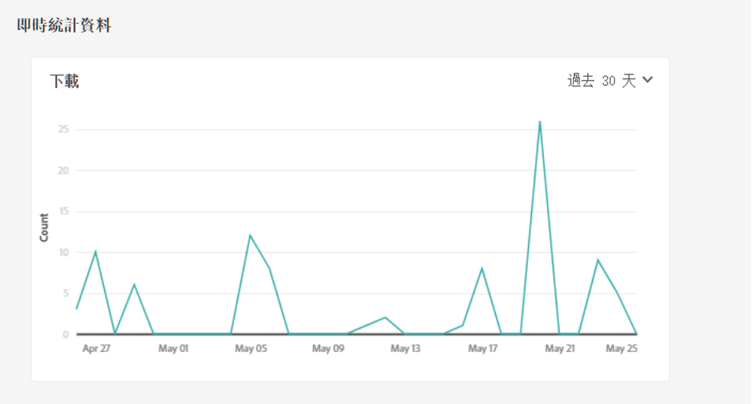

# 管理報告 {#manage-reports}

資產報告使管理員能夠查看Adobe Experience Manager Assets Essentials環境的活動。 此資料提供有關用戶如何與內容和產品交互的有用資訊。

## 訪問報告 {#access-reports}

分配給 [Assets Essentials管理員產品配置檔案](deploy-administer.md) 可以訪問「即時統計」控制面板並在Assets Essentials建立用戶定義的報告。

## 查看即時統計資訊 {#view-live-statistics}

Assets Essentials使您能夠使用「即時統計」控制板查看Assets Essentials環境的即時資料。 您可以查看過去30天或過去12個月的即時事件度量。

導航到 **[!UICONTROL 設定]** > **[!UICONTROL 即時統計]** 查看自動生成的下載資料。

## 建立報告 {#create-report}

要建立報表：

1. 導航到 **[!UICONTROL 設定]** > **[!UICONTROL 報告]** 按一下 **[!UICONTROL 建立報告]**。

1. 在 [!UICONTROL 配置] 頁籤，為報表指定標題和可選說明。

1. 使用 **[!UICONTROL 選擇資料夾路徑]** 的子菜單。

1. 選擇報表的日期間隔。

1. 在 [!UICONTROL 列] 頁籤，選擇需要在報告中顯示的列名。

1. 按一下&#x200B;**[!UICONTROL 建立]**。

   

下表說明了可添加到報表的所有列的使用：

<table>
    <tbody>
     <tr>
      <th><strong>列名</strong></th>
      <th><strong>說明</strong></th>
     </tr>
     <tr>
      <td>標題</td>
      <td>資產的標題。</td>
     </tr>
     <tr>
      <td>路徑</td>
      <td>資產在Assets Essentials可用的資料夾路徑。</td>
     </tr>
     <tr>
      <td>類型</td>
      <td>資產的MIME類型。</td>
     </tr>
     <tr>
      <td>大小</td>
      <td>資產的大小。</td>
     </tr>
     <tr>
      <td>下載者</td>
      <td>下載資產的用戶的電子郵件ID。</td>
     </tr>
     <tr>
      <td>下載日期</td>
      <td>執行資產下載操作的日期。</td>
     </tr>
     <tr>
      <td>作者</td>
      <td>資產的作者。</td>
     </tr>
     <tr>
      <td>建立日期</td>
      <td>資產上載到Assets Essentials的日期。</td>
     </tr>
     <tr>
      <td>修改日期</td>
      <td>上次修改資產的日期。</td>
     </tr>
     <tr>
      <td>過期</td>
      <td>資產的到期狀態。</td>
     </tr>
     <tr>
      <td>按用戶名下載</td>
      <td>下載資產的用戶的名稱。</td>
     </tr>           
    </tbody>
   </table>

## 查看現有報告 {#view-report-list}

之後 [建立報表](#create-report)，您可以查看現有報告的清單並選擇以CSV格式下載或刪除它們。

要查看報表清單，請導航至 **[!UICONTROL 設定]** > **[!UICONTROL 報告]**。

對於每個報表，您都可以查看報表標題、報表類型、建立報表時指定的說明、報表狀態、建立報表的作者的電子郵件ID以及報表建立日期。

`Completed ` 報告的狀態表示報告已準備好下載。

## 下載CSV報告 {#download-csv-report}

要下載CSV格式的報告：

1. 導航到 **[!UICONTROL 設定]** > **[!UICONTROL 報告]**。

1. 選擇報告並按一下 **[!UICONTROL 下載CSV]**。

所選報告以CSV格式下載。 CSV報告中顯示的列取決於您在選擇時選擇的列 [建立報表](#create-report)。

## 刪除報表 {#delete-report}

要刪除報表：

1. 導航到 **[!UICONTROL 設定]** > **[!UICONTROL 報告]**。

1. 選擇報告並按一下 **[!UICONTROL 刪除]**。
