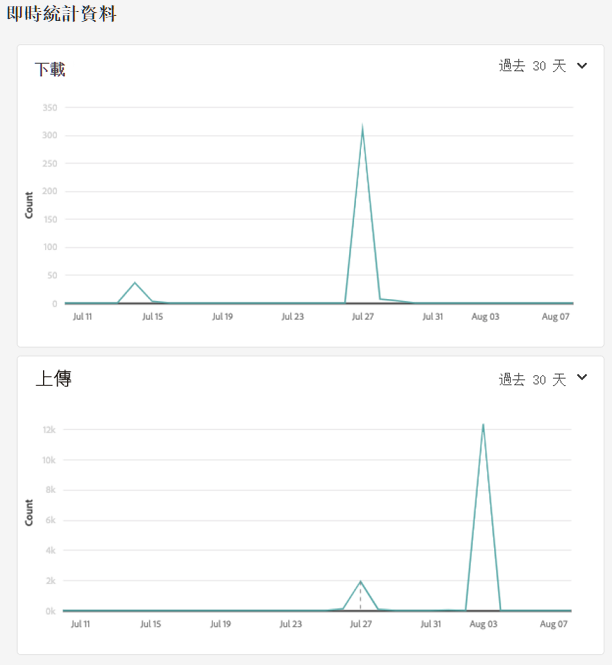
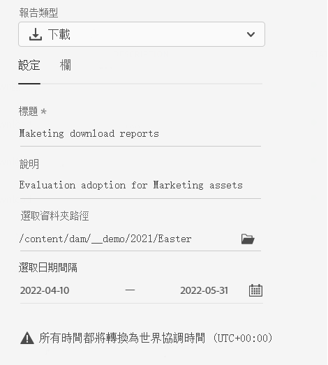
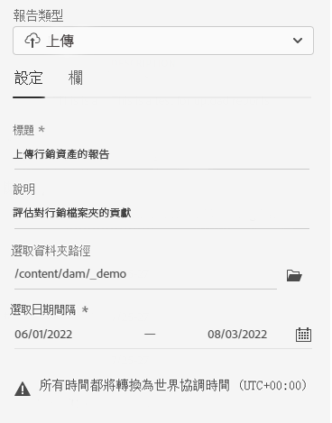
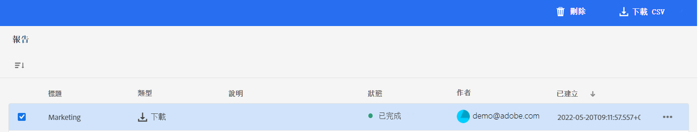

# 管理報告 {#manage-reports}

資產報告使管理員能夠查看 Adobe Experience Manager Assets Essentials 環境的活動。 此資料提供有關用戶如何與內容和產品互動的有用資訊。

## 訪問報告 {#access-reports}

分配給 [Assets Essentials 管理員產品設定檔](deploy-administer.md)的所有使用者可以存取「即時統計」儀表板或在 Assets Essentials 中建立使用者定義的報告。

## 查看即時統計資訊 {#view-live-statistics}

Assets Essentials 使您能夠使用「即時統計」控制板查看 Assets Essentials 環境的即時資料。 您可以查看過去 30 天或過去 12 個月的即時事件度量。

按一下左側導覽窗格中可用的&#x200B;**[!UICONTROL 即時統計]**&#x200B;以檢視以下自動產生的圖表：

* **下載**：使用折線圖表示過去 30 天或 12 個月內從 Assets Essentials 環境下載的資產數量。

* **上傳**：使用折線圖表示過去 30 天或 12 個月內上傳到 Assets Essentials 環境的資產數量。

<!--

* **Storage usage**: The storage usage, in gigabytes (GB), for the Assets Essentials environment, for the last 30 days or 12 months represented using a bar chart.

-->

## 建立下載報告 {#create-download-report}

若要建立下載報告：

1. 瀏覽到 **[!UICONTROL 設定]** > **[!UICONTROL 報告]** 按一下 **[!UICONTROL 建立報告]**。

1. 在[!UICONTROL 配置]頁籤，將報表類型指定為&#x200B;**[!UICONTROL 下載]**。

1. 指定報告的標題和說明 (選用)。

1. 使用 **[!UICONTROL 選擇資料夾路徑]** 的子選單。

1. 選擇報告的日期間隔。
   >[!NOTE]
   >
   > Assets Essentials 會將所有本地時區轉換為世界協調時間 (UTC)。

1. 在 [!UICONTROL 列] 頁籤，選擇需要在報告中顯示的列名。

1. 按一下&#x200B;**[!UICONTROL 建立]**。

   

下表說明了可添加到報告的所有列的使用：

<table>
    <tbody>
     <tr>
      <th><strong>資料行名稱</strong></th>
      <th><strong>說明</strong></th>
     </tr>
     <tr>
      <td>標題</td>
      <td>輸入資產的標題。</td>
     </tr>
     <tr>
      <td>路徑</td>
      <td>資產在 Assets Essentials 可用的資料夾路徑。</td>
     </tr>
     <tr>
      <td>MIME 類型</td>
      <td>資產的 MIME 類型。</td>
     </tr>
     <tr>
      <td>大小</td>
      <td>資產位元組的大小。</td>
     </tr>
     <tr>
      <td>下載者</td>
      <td>下載資產的用戶的電子郵件ID。</td>
     </tr>
     <tr>
      <td>下載日期</td>
      <td>執行資產下載操作的日期。</td>
     </tr>
     <tr>
      <td>作者</td>
      <td>資產的作者。</td>
     </tr>
     <tr>
      <td>建立日期</td>
      <td>資產上載到 Assets Essentials 的日期。</td>
     </tr>
     <tr>
      <td>修改日期</td>
      <td>上次修改資產的日期。</td>
     </tr>
     <tr>
      <td>過期</td>
      <td>資產的到期狀態。</td>
     </tr>
     <tr>
      <td>按用戶名下載</td>
      <td>下載資產的用戶的名稱。</td>
     </tr>           
    </tbody>
   </table>

## 建立上傳報告 {#create-upload-report}

若要建立上傳報告：

1. 瀏覽到 **[!UICONTROL 設定]** > **[!UICONTROL 報告]** 按一下 **[!UICONTROL 建立報告]**。

1. 在[!UICONTROL 配置]頁籤，將報表類型指定為&#x200B;**[!UICONTROL 上傳]**。

1. 指定報告的標題和說明 (選用)。

1. 使用 **[!UICONTROL 選擇資料夾路徑]** 的子選單。

1. 選擇報告的日期間隔。

1. 在 [!UICONTROL 列] 頁籤，選擇需要在報告中顯示的列名。

1. 按一下&#x200B;**[!UICONTROL 建立]**。

   

下表說明了可添加到報告的所有列的使用：

<table>
    <tbody>
     <tr>
      <th><strong>資料行名稱</strong></th>
      <th><strong>說明</strong></th>
     </tr>
     <tr>
      <td>標題</td>
      <td>輸入資產的標題。</td>
     </tr>
     <tr>
      <td>路徑</td>
      <td>資產在 Assets Essentials 可用的資料夾路徑。</td>
     </tr>
     <tr>
      <td>MIME 類型</td>
      <td>資產的 MIME 類型。</td>
     </tr>
     <tr>
      <td>大小</td>
      <td>資產的大小。</td>
     </tr>
     <tr>
      <td>作者</td>
      <td>資產的作者。</td>
     </tr>
     <tr>
      <td>建立日期</td>
      <td>資產上載到 Assets Essentials 的日期。</td>
     </tr>
     <tr>
      <td>修改日期</td>
      <td>上次修改資產的日期。</td>
     </tr>
     <tr>
      <td>過期</td>
      <td>資產的到期狀態。</td>
     </tr>              
    </tbody>
   </table>

## 查看現有報告 {#view-report-list}

[建立報告](#create-download-report)之後，您可以查看現有報告的清單並選擇以 CSV 格式下載或刪除它們。

要查看報告清單，請瀏覽至 **[!UICONTROL 設定]** > **[!UICONTROL 報告]**。

對於每個報告，您都可以查看報告標題、報告類型、建立報告時指定的說明、報告狀態、建立報告的作者的電子郵件識別碼以及報告建立日期。

`Completed ` 報告的狀態表示報告已準備好下載。

## 下載 CSV 報告 {#download-csv-report}

要以 CSV 格式下載的報告：

1. 瀏覽到 **[!UICONTROL 設定]** > **[!UICONTROL 報告]**。

1. 選擇報告並按一下 **[!UICONTROL 下載 CSV]**。

所選報告以 CSV 格式下載。 CSV 報告中顯示的列取決於您在選擇[建立報告](#create-download-report)時選擇的資料行。

## 刪除報告 {#delete-report}

若要刪除報告：

1. 瀏覽到 **[!UICONTROL 設定]** > **[!UICONTROL 報告]**。

1. 選擇報告並按一下 **[!UICONTROL 刪除]**。

1. 再按一次「**[!UICONTROL 刪除]**」以進行確認。
