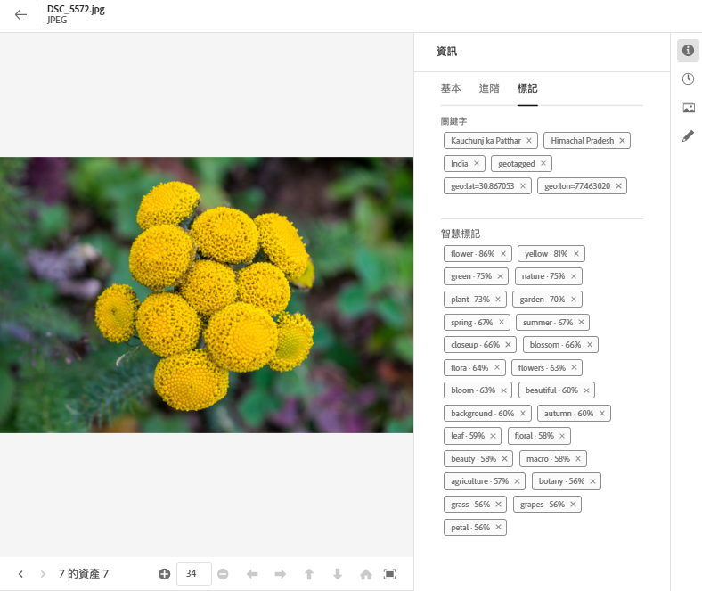
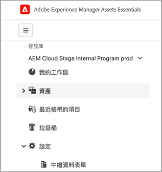
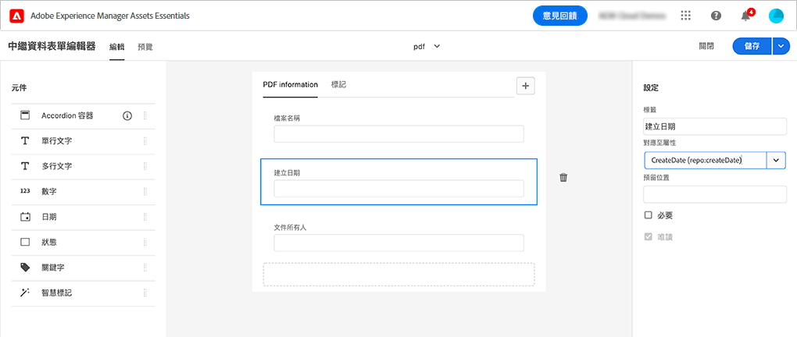

# [!DNL Assets Essentials] 中的中繼資料 {#metadata}

中繼資料為資料或資料相關的說明。例如，作為資產的影像可以包含其所按一下的相機資訊或任何版權資訊。此資訊是影像的中繼資料。中繼資料是進行高效率資產管理的關鍵所在。中繼資料雖然是資產所有可用資料的集合，但並不一定包含在資產內。

中繼資料有助於您進一步將資產分類，而且隨著數位資訊量成長，將相當實用。您可以僅根據檔案名稱、縮圖和記憶體體來管理數百個檔案。然而，此方法並不能調整規模。隨著相關人數和管理的資產數增加，此方法尚嫌不足。

隨著中繼資料增加，數位資產的價值也會成長，這是因為資產會變得

* 更易於存取 - 系統和使用者可以更輕鬆找到資產。
* 更易於管理 - 您可以更容易找到具有同一組屬性的資產，並將變更套用到這些資產。
* 完整 - 資產攜帶更多資訊和包含更多中繼資料的內容。

基於這些原因，Assets 提供建立、管理和交換數位資產的中繼資料的合適方式。

## 檢視中繼資料 {#view-metadata}

若要檢視資產的中繼資料，請瀏覽至資產或搜尋資產、選取資產，然後按一下工具列中的&#x200B;**[!UICONTROL 詳細資訊]**。

*圖：若要檢視資產及其中繼資料，請從工具列按一下&#x200B;**[!UICONTROL 詳細資訊]**或按兩下資產。*

標題、說明和上傳日期之類的基本中繼資料可在[!UICONTROL 基本]標籤中取得。[!UICONTROL 進階]標籤包含更進階的中繼資料，例如相機型號、鏡頭詳細資訊和地理標籤。[!UICONTROL 標記]標籤會根據影像內容包含自動套用的標記。

## 更新中繼資料 {#update-metadata}

您可以手動更新一些中繼資料欄位。這些欄位包含[!UICONTROL 標題]、[!UICONTROL 說明]、[!UICONTROL 作者]以及[!UICONTROL 關鍵字]

## 標記 {#tags}

[!DNL Assets Essentials] 使用 [Adobe Sensei](https://www.adobe.com/tw/sensei.html) 所提供的人工智慧，自動將相關標記套用至您所有上傳的資產。這些標記名為智慧型標記，有助於您快速尋找相關資產，提高專案的內容速度。智慧型標記即是不含在影像內的中繼資料範例。

智慧型標記近乎即時套用，並根據影像內容產生。上傳資產時，使用者介面會在資產縮圖上顯示[!UICONTROL 處理]一段時間。待處理完成後，即可[檢視中繼資料](#view-metadata)和智慧型標記。

*圖：若要檢視智慧型標記，請從工具列按一下&#x200B;**[!UICONTROL 詳細資訊]**或按兩下資產。*

智慧型標記也包含信賴分數 (以百分比呈現)。這表示與套用標記相關的信賴度。您可以審核自動套用的智慧型標記。

## 新增或更新標記 {#manually-tag}

除了使用 [!DNL Adobe Sensei] 智慧型服務自動新增的智慧型標記之外，您還可新增更多標記到您的資產。開啟要預覽的資產，按一下[!UICONTROL 標記]，然後在[!UICONTROL 關鍵字]欄位中輸入所需的關鍵字。若要新增標記，請按一下「Return」。[!DNL Assets Essentials] 會近乎即時地編製關鍵字的索引，因此您的團隊很快就能使用新的關鍵字搜尋更新的資產。

您也可以從[!UICONTROL 智慧標記]區段移除由 [!DNL Assets Essentials] 自動新增到所有上傳資產的標記。

## 中繼資料表單 {#metadata-forms}

Assets Essentials 預設為提供許多標準中繼資料欄位。組織擁有其他中繼資料需求，並需要更多中繼資料欄位以新增特定企業中繼資料。中繼資料表單可讓企業將自訂中繼資料欄位新增到資產的[!UICONTROL 詳細資訊]頁面。特定企業中繼資料能夠改善其資產的控管和探索。

您可以為不同的資產類型 (不同的 MIME 類型) 設定中繼資料表單。使用與檔案的 MIME 類型相同的表單名稱。Essentials 會自動將上傳的資產與表單的名稱配對。例如，如果存在名稱為 `PDF` 或 `pdf` 的中繼資料表單，上傳的 PDF 文件則包含如表單中定義的中繼資料欄位。您可以從頭開始建立表單，或改變現有表單的用途。

>[!IMPORTANT]
>
>特定檔案類型的新中繼資料表單會完成取代 [!DNL Assets Essentials] 所提供的預設中繼資料表單。如果您刪除或重新命名中繼資料表單，新資產便可再次使用預設中繼資料欄位。

若要建立中繼資料表單，請依照下列步驟：

1. 在左側欄中按一下&#x200B;**[!UICONTROL 設定]** > **[!UICONTROL 中繼資料表單]**。

   

1. 按一下使用者介面右上角區域中的&#x200B;**[!UICONTROL 建立]**。
1. 為表單命名，然後按一下&#x200B;**[!UICONTROL 建立]**。
1. 為右側欄中&#x200B;**[!UICONTROL 設定]**&#x200B;中的標籤命名。
1. 從左側欄中可用的&#x200B;**[!UICONTROL 元件]**&#x200B;拖曳表單中標籤上所需的元件。依照所需的序列拖曳元件。

   

   *圖：中繼資料表單建立介面，其中包含新增元件的選項和預覽表單的選項。*

1. 對每個元件，在右側欄中的&#x200B;**[!UICONTROL 設定]**&#x200B;中命名，提供支援屬性的對應。
1. 或是對元件選取&#x200B;**[!UICONTROL 必要]**，讓中繼資料欄位成為必要欄位，並選取&#x200B;**[!UICONTROL 唯讀]**&#x200B;讓此欄位在資產[!UICONTROL 詳細資訊]頁面中無法編輯。
1. 或者按一下&#x200B;**[!UICONTROL 預覽]**&#x200B;以預覽您正在建立的表單。
1. 或者在每個標籤中新增更多標籤和所需元件。
1. 表單完成時，按一下&#x200B;**[!UICONTROL 儲存]**。

建立表單後，便會在使用者上傳相符 MIME 類型的資產時自動套用表單。

若要重複使用現有表單來建立新表單，請選取中繼資料表單，從工具列按一下&#x200B;**[!UICONTROL 複製]**、命名，然後按一下&#x200B;**[!UICONTROL 確認]**。您可以編輯中繼資料表單，進行變更。變更表單時，會在變更後用於上傳的資料。不會變更現有資產。

<!-- TBD: Cannot create a form using the second option. Documenting only the first option for now.
To reuse an existing form to create a new form, do one of these:

* Select a metadata form and click **[!UICONTROL Copy]** from the toolbar, provide a name, and click **[!UICONTROL Confirm]**.

* Click **[!UICONTROL Create]**, select **[!UICONTROL Use existing form structure as template]** option, and select an existing form. 
-->

<!-- TBD: Queries for PM and engg.

Can we edit the existing metadata in any form?

How to moderate smart tags?

Allow or deny list for smart tags?

What about Tags displayed just above Smart Tags in the UI?

Is there a detailed metadata tab. Where do the other details of an asset go?

How can one search based strictly on the metadata. Similar to AEM Assets GQL queries.
-->

<!-- TBD: Link to related articles if any.

>[!MORELIKETHIS]
>
>* [Search assets](search.md).
-->
