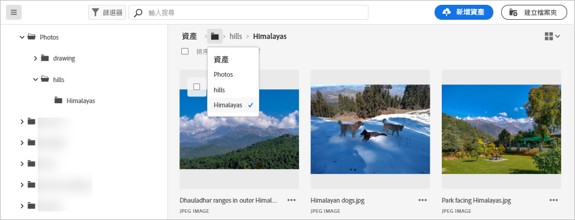
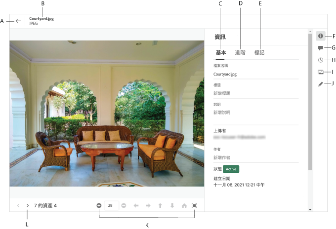

# 導覽至檔案和資料夾並檢視資產 {#view-assets-and-details}

<!-- TBD: Give screenshots of all views with many assets. Zoom out to showcase how the thumbnails/tiles flow on the UI in different views. -->

<!-- TBD: The options in left sidebar may change. Shared with me and Shared by me are missing for now. Update this section as UI is updated. -->

## 了解 [!DNL Assets Essentials] 使用者介面 {#understand-interface-navigation}

[!DNL Assets Essentials] 提供直覺式且方便使用的使用者介面。 簡潔的介面使資產和相關資訊易於查找和記憶。

登入時 [!DNL Assets Essentials]，您會看到下列介面。

<!-- TBD: Update this screenshot. Remove top bar. Remove 2 labels from top bar. -->

![[!DNL Assets Essentials] 使用者介面](assets/essentials-interface1.png)

*圖：首次登錄螢幕和查找顯著特徵的位置。*
    *答：左側邊欄以瀏覽儲存庫，並提供對其他幾個選項的訪問。*
    *B:顯示或折疊左側邊欄以增加資產檢視區域。*
    *C:篩選搜尋結果。*
    *D:搜索框。*
    *E:排序資產的選項。*
    *F:提供產品意見。*
    *G:編輯您的用戶首選項或註銷。*
    *H:在不同檢視之間切換。*

<!-- TBD: Need an embedded video here with narration. It has to be hosted on MPC to be embeddable. -->

## 瀏覽及檢視資產和資料夾 {#browse-repository}

您可以從主用戶介面或從左側邊欄瀏覽資料夾。 瀏覽時，您可以使用介面檢視資產縮圖，以視覺化方式瀏覽存放庫或檢視資產詳細資訊，以快速找到您想要的資產。 左側邊欄中可用的選項有：

* **資產**:樹視圖中您有權訪問的所有資料夾的清單。
* **最近查看**:您最近預覽的資產清單。 [!DNL Assets Essentials] 僅顯示您預覽的資產。 它不會顯示您在瀏覽存放庫檔案或資料夾時卷過的資產。
* **垃圾桶**:

<!-- TBD: Not sure if we want to publish these right now. CC Libs are beta as per Greg.
* **Libraries**: Access to [!DNL Adobe Creative Cloud Team] (CCT) Libraries view. This view is visible only if the user is entitled to CCT Libraries.
-->

<!-- TBD: My Work Space shows task inbox and it is not visible on AEM Cloud Demos as of now. It is the source of truth server hence not documenting My Work Space option for now.
-->

您可以開啟或折疊左側邊欄，以增加可用的資產檢視區域。

在 [!DNL Assets Essentials]，您可以以四種不同的配置類型來檢視資產、資料夾和搜尋結果。

*  [!UICONTROL List View]
*  [!UICONTROL Grid View]
*  [!UICONTROL Gallery View]
*  [!UICONTROL Waterfall View]

若要尋找資產，您可以依下列順序遞增或遞減排序資產： `Name`, `Relevancy`, `Size`, `Modified`，和 `Created`.

若要導覽至資料夾，請連按兩下資料夾的縮圖，或從左側邊欄選取資料夾。 要查看資料夾的詳細資訊，請選擇該資料夾，然後按一下頂部工具欄中的「詳細資訊」。 若要向上或向下導覽階層，請使用左側邊欄，或使用頂端的階層連結。

*圖：若要瀏覽階層，請使用頂端或左側邊欄的階層連結。*

## 預覽資產 {#preview-assets}

使用、共用或下載資產之前，您可以更仔細地檢視資產。 預覽功能不僅可讓您檢視影像，還可供檢視一些其他支援的資產類型。

若要預覽資產，請選取資產，然後按一下 [!UICONTROL Details]  的上界。 您不僅可以檢視資產，還可以檢視其詳細中繼資料並採取其他動作。

*答：返回到儲存庫中的當前資料夾或當前搜索結果。*
*B:您正在預覽的檔案的名稱和格式。*
*C:基本中繼資料。*
*D:進階中繼資料。*
*E:關鍵字和智慧標籤。*
*F:預覽資產並查看中繼資料資訊。*
*G:注釋和注釋。*
*H:檢視及管理版本。*
*I:檢視影像的轉譯。*
*J:編輯影像。*
*K:更近預覽。 縮放、全螢幕和其他選項。*
*L:繼續目前資料夾中的上一個或下一個資產，而不返回資料夾。*

您也可以預覽影片。

如果您明確預覽資產，則 [!DNL Assets Essentials] 將其顯示為最近檢視的資產。

<!-- TBD: Describe the options.

Explicitly previewed assets are displayed as recently viewed assets. Give screenshot of this.
Other use cases after previewing.
-->

>[!MORELIKETHIS]
>
>* [檢視資產版本](/help/manage-organize.md#view-versions).

