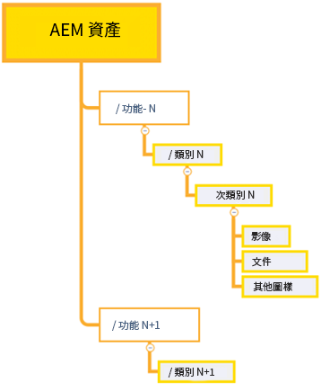
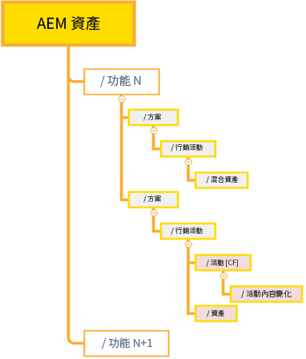
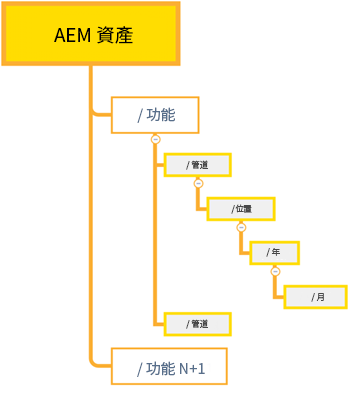

# 有效權限管理的最佳做法 {#best-practices-permissions-management}

作為管理員，在開始管理Assets Essentials儲存庫的資料夾權限之前，您可以實施各種最佳做法，以便在以後管理操作時使基礎架構對管理員和最終用戶具有直觀性。

在以下情況下，您可以合併這些最佳做法：

* [在Admin Console中建立用戶組](#admin-console-best-practices)

* [在Assets Essentials儲存庫中建立資料夾結構](#folder-structure-assets-essentials)

* [管理Assets Essentials儲存庫中的權限](#folder-permissions)

## Admin Console {#admin-console-best-practices}

根據組織中的用戶組確定訪問需求。 為您的組織規劃和建立用戶組，並將用戶添加到這些用戶組。 基於用戶組而不是單個用戶管理資料夾權限更容易。

## Assets Essentials儲存庫的資料夾結構 {#folder-structure-assets-essentials}

開始計畫在Assets Essentials儲存庫中建立資料夾結構時，請考慮以下幾點：

* 未來治理：由管理員管理的資料夾和 [將權限委託給其他用戶作為所有者](manage-permissions.md##manage-permissions-folders)。

* 可擴展：資料夾結構應符合您組織的未來需要，並且應易於擴展。

* 大小：資料夾不能包含太多資產。 它可能會導致可用性問題，並且會變得難以管理。

* 直觀：資料夾結構應易於瀏覽和直觀地反映最終用戶的需求。 用戶應能夠輕鬆地確定在資料夾結構中上載新資產的位置。

您可以為組織使用各種可能的資料夾結構類型。 以下是典型資料夾結構的幾個示例：

* 基於函式和分類

   

* 基於市場活動

   

* 基於提供地點（或渠道）

   

## 資料夾權限 {#folder-permissions}

在為您的組織建立用戶組、向這些用戶組添加用戶以及在Assets Essentials儲存庫中選擇並建立符合您組織需要的資料夾結構後，您可以開始管理組織的資料夾權限。 開始管理資料夾權限時請考慮以下幾點：

* 應用用戶組的權限，而不是單個用戶。 這將導致更簡單、更高效的權限結構。

* 使權限結構盡可能簡單，以提高操作效率。

* 小心使用「拒絕」訪問權限，並希望將正權限（「可編輯」、「可查看」、「所有者」）應用到資料夾結構。

有關如何實現高效且簡單的資料夾結構的示例，請參見 [管理資料夾的權限](manage-permissions.md##manage-permissions-folders)。

