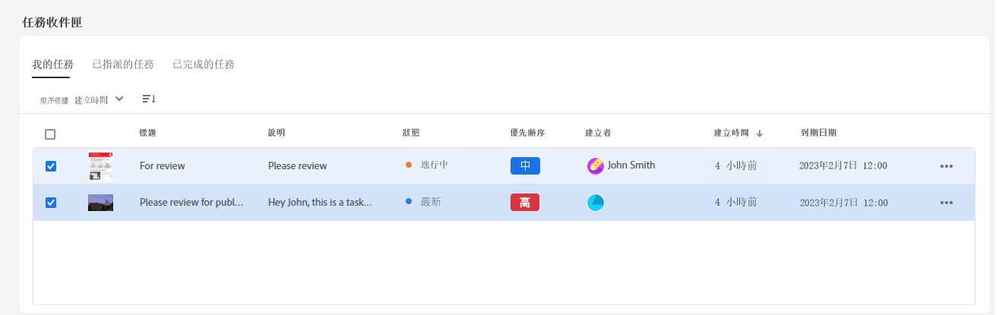
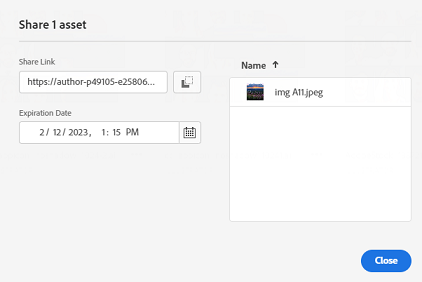

# [!DNL Assets Essentials] 的發行說明 {#release-notes}

目前版本的 Assets Essentials 於 2023 年 1 月 27 日發行。

此版本的功能清單包括：

**我的工作區與可設定的 Widget**

Assets 現在為您提供一個可自訂的工作區，這可用作一站式解決方案，提供 Widget 以方便存取資產使用者介面的關鍵區域以及與您最相關的資訊。更快存取這些選項可以提高您專案的內容速度和效率。

我的工作區包括用於即將推出的新功能、Insights、任務和內容的 Widget。 您可以根據自己的偏好設定這些 Widget 在 Workspace 中的顯示方式。

**專用任務管理 UI**

Assets Essentials 現在能讓您使用左側導覽窗格中可用的全新「**[!UICONTROL 任務]**」選項，在一個集中位置管理目前指派給您、您所建立以及您已完成的任務清單。您還可以選取任務來核准或拒絕它，或開啟任務詳細資訊來核准、拒絕、編輯或刪除它，藉以採取適當的動作。

**自動產生的連結以共用資產**

Assets Essentials 現在會在您選擇使用 Assets Essentials 使用者介面共用資產時，立即自動產生一個連結。即使您變更到期日，產生的連結仍然有效。

**根據客戶回饋意見進行的改進功能**

根據客戶意見回應進行的增強功能和錯誤修正。

## 已知問題 {#known-issues}

[!DNL Assets Essentials] 方案的已知問題清單將持續進行修訂和更新：

<!--

* Assets Essentials does not support creating Private collections.

-->

* 專用集合可供建立者和具有管理員權限的用戶使用。 作為管理員，您無法將訪問集合的權限委派給其他用戶。

如果您遇到任何問題或甚至是增強功能請求，[請向團隊提供意見回饋](#provide-feedback)。

## 舊版本 {#past-releases}

### 2022.11.0 {#november-2022}

11 月版的 [!DNL Assets Essentials]於 2022 年 11 月 17 日發行。

此版本提供：

**使用 Document Cloud 檢視器預覽文件**

Assets Essentials 現在可讓您上傳其他支援格式類型的文件，並使用隨附的 Document Cloud 檢視器進行預覽。支援的格式類型包括 TXT、RTF、DOC、DOCX、PPT、PPTX、XLS 和 XLSX。

<!--

**View Smart Tags moderation reports**

Asset reporting now provides administrators with visibility into the Smart Tags promoted or deleted for an asset. You can specify a folder path and the report lists the Smart Tags promoted or deleted for all assets available at the folder path.

-->

<!--
**Read-only access to large number of users**

Assets Essentials allows administrators to provide read-only access to a large number of users for selected assets or folders in the repository. 
You can easily synchronize the user groups available on the external identity management of an organization with Adobe Admin Console and then manage permissions in Admin Console and Assets Essentials to provide the users with read-only access for selected assets or folders.

-->

**新的儲存中繼資料選項**

Assets Essentials 使用者介面現在提供了新的儲存中繼資料選項，以更好地管理中繼資料。

**根據客戶回饋意見進行的改進功能**

根據客戶意見回應進行的增強功能和錯誤修正。

**Adobe Asset Link 3.3 版**

[Adobe Asset Link](https://helpx.adobe.com/tw/enterprise/using/adobe-asset-link.html) 3.3 版於 2022 年 12 月 13 日發佈，包含以下功能：

* 除了先前支援的[適用於企業的 Creative Cloud](https://www.adobe.com/tw/creativecloud/business/enterprise.html) 之外，還支援[適用於團隊的 Creative Cloud](https://www.adobe.com/tw/creativecloud/business/teams.html)。

* 支援最新的 Adobe InDesign、Photoshop 和 Illustrator 2023 應用程式。

* 支援在具有代理伺服器的環境中使用 Adobe Asset Link CEP 外掛程式。

### 2022.8.0 {#august-2022}

八月版本的 [!DNL Assets Essentials] 於 2022 年 8 月 22 日發行。

此版本提供：

**集合通知**

Assets Essentials 通知可讓您監視對存放庫中可用集合執行的操作。 您需要選擇並訂閱向您傳送通知的集合。 您還可以配置傳送通知的操作，例如在集合上執行的刪除、共用連結、移動、重新命名和更新操作。

**編輯智慧型集合**

Assets Essentials 現在還提供在建立智慧型集合時編輯搜尋條件的功能。儲存新的搜尋條件以動態更新集合內容。

**檢視儲存體帳戶的即時統計資料**

Assets Essentials 現在也可讓您使用「即時統計」儀表板檢視 Assets Essentials 環境的即時儲存體帳戶資料。 您可以檢視過去 30 天或過去 12 個月的即時事件量度。

**查看上傳報告**

現在資產報告可讓管理員查看上傳到 Adobe Experience Manager Assets Essentials 部署的資產。 管理員已經能為從 Assets Essentials 部署下載的資產生成報告。此資料提供有關用戶如何與內容和產品互動的有用資訊。

**根據客戶回饋意見進行的改進功能**

根據客戶意見回應進行的增強功能和錯誤修正。

### 2022.6.0 {#june-2022}

[!DNL Assets Essentials] 的六月版本於 2022 年 7 月 14 日發行。

此版本提供：

**Smart Collection**

將搜索結果另存為 Smart Collection 以動態更新集合內容。 如果向 Assets Essentials 儲存庫添加的資產符合在[建立 Smart Collection](manage-collections.md#create-smart-collection)，Smart Collection 的內容會自動更新。

**通知**

Assets Essentials 通知使您[監視對儲存庫中可用的資產或資料夾執行的操作](manage-notifications.md)。 您需要選擇並訂閱將通知傳送給您的內容。 您還可以配置通知傳送給您的類別。

**報告**

資產報告使管理員能夠評估 Adobe Experience Manager Assets Essentials 內的用戶活動。 報告和即時統計儀表板提供有關用戶如何與部署中可用資產互動的有用資訊。 [使用報告中的資訊](manage-reports.md)取得關鍵成功度量，以衡量企業內和客戶對資產的採用程度。

查看資產下載報告和即時統計儀表板模組，以查看正在下載哪些資產和下載頻率。

### 2022.5.0 {#may-2022}

[!DNL Assets Essentials] 的五月版本於 2022 年 6 月 16 日發行。

此版本提供：

**資產狀態增強功能**

* Assets Essentials 目前讓您可以[設定資產的有效日期](manage-organize.md#set-asset-status)。 此外，您可以根據`Expired`資產狀態和有效日期範圍篩選資產。

* 您現在可以在 Trash 檢視所有可用資產的資產狀態指示器。因此，您可以根據資產狀態來決定恢復資產。

**搜尋篩選增強功能**

* Assets Essentials 目前讓您可以使用`No Status`資產狀態篩選資產。

<!--

* Assets Essentials now supports [using a wildcard operator (*) while using custom filters](search.md#custom-filters) to enable Assets Essentials to display assets in the results that partially match the search criteria.

-->

**收藏集增強功能**

<!--

* Assets Essentials now enables you to [create Private collections](manage-collections.md#create-collection).

-->

* Assets Essentials 現在支援[下載收藏集](manage-collections.md)。

* 您現在可以為收藏集編輯說明中繼資料欄位。

**文件增強功能**

* 目前已推出 [Assets Essentials 概述文件](introduction.md)的全新版本。

**根據客戶回饋意見進行的改進功能**

* 根據客戶意見回應進行的增強功能和錯誤修正。

### 2022.4.0 {#april-2022}

目前版本的 [!DNL Assets Essentials] 於 2022 年 5 月 12 日發行。此版本提供：

* [!DNL Assets Essentials] 現在支援[建立收藏集](manage-collections.md)。收藏集是 Experience Manager Assets Essentials 中的一組資產。使用收藏集在使用者之間共用資產。和檔案夾不同，收藏集可包含來自不同位置的資產。

* Assets Essentials 現在還能讓您[新增自訂篩選器](search.md#custom-filters)到使用者介面。然後，除了標準篩選器之外，您還可以套用這些自訂篩選器來縮小您的搜尋結果。

* Assets Essentials 現在可讓您對存放庫中的可用資產[設定狀態](manage-organize.md#set-asset-status)。設定資產狀態以將數位資產的下游消費控管和管理得更好。

* 根據客戶意見回應進行的增強功能和錯誤修正。

#### Chrome 中的無痕模式 {#incognito-mode}

在此版本中，我們將 UI 傳遞的效能和 Assets Essentials 中的特定功能 (對資產和影像編輯進行評論) 最佳化，會依據瀏覽器本機儲存空間和啟用的協力廠商 cookie 而定。預設情況下，Chrome 網頁瀏覽器中的無痕模式會封鎖協力廠商 cookie，使用者若要繼續存取所有功能，有多種選項。

* 當使用者需要將瀏覽器工作階段分開時，可使用 Chrome 設定檔代替無痕模式。

* 請關閉 Chrome 中無痕模式畫面上的 `Block third-party cookies`

### 2022.2.0 {#march-2022}

[!DNL Assets Essentials] 於 2022 年 3 月 9 日發行，包含下列更新：

* [!DNL Assets Essentials] 現在可讓您[產生連結，並和沒有 [!DNL Assets Essentials] 應用程式的外部利益關係人共用資產](share-links-for-assets.md)。您可以定義連結的到期日，然後使用您喜歡的通訊方式 (如電子郵件或簡訊服務) 與他人共用。連結的收件者可預覽和下載資產。

* 除了現有的一般和消費者使用者產品設定檔外，該 [!DNL Assets Essentials] 現在還包含[ Admin Console 中的管理員產品設定檔](deploy-administer.md#add-users-to-essentials)。管理員現在可以將其他使用者指派至該管理員產品設定檔。

* Assets Essentials 現在可讓管理員[管理存放庫中檔案夾的存取層級](manage-permissions.md)。 身為管理員，您可建立使用者群組並指派權限給這些群組，以管理存取層級。您還可以將權限管理權委派給檔案夾層級的使用者群組。

* 根據客戶意見回應進行的增強功能和錯誤修正。

此外，適用於 Creative Cloud (Photoshop、Illustrator 和 InDesign) 的 [!DNL Adobe Asset Link] 擴充功能已發行[新版本 3.2](https://exchange.adobe.com/creativecloud.details.106875.adobe-asset-link-cep.html)，包含面板啟動時間和下載速度中的效能改善。

### 2022.1.0 版 {#january-2022}

[!DNL Assets Essentials] 於 2022 年 2 月 3 日發行，包含下列更新：

* [!UICONTROL 建立檔案夾]操作的效能提高。<!-- CQ-4338818 -->

### 2021.11.0 版 {#november-2021}

[!DNL Assets Essentials] 於 2021 年 12 月 16 日發行，包含下列更新：

* Adobe 會在完成佈建程序後自動部署 Assets Essentials。管理員不需要執行額外的步驟，透過 [!DNL Cloud Manager] 使用者介面部署 Assets Essentials。此自動部署可供在 2022 年 1 月 6 日後佈建的環境使用。
* 搭配 Assets Essentials 的新版 Creative Cloud 增效模組可在 Adobe Exchange - [Adobe Asset Link for Adobe XD v 2.1.0](https://exchange.adobe.com/creativecloud/plugindetails.html/app/cc/61d229b9) 和 [Adobe Asset Link for Photoshop / InDesign / Illustrator v 3.1.65](https://exchange.adobe.com/creativecloud.details.106875.adobe-asset-link-cep.html) 上使用。
* 各種錯誤修正和產品增強功能，包括之前的已知問題 (上傳後資料夾現在會在正確在左導覽樹狀目錄中顯示<!-- CQ-4337638 -->、 拖放上傳功能可讓使用者在拖曳上傳時選取目前的資料夾或任何子資料夾<!-- CQ-4327753 -->)。

### 2021.8.0 版 {#august2021}

[!DNL Assets Essentials] 2021.8.0 於 2021 年 8 月 30 日發行，包含下列更新：

* 與 [!DNL Adobe Workfront] 整合，可讓 [!DNL Workfront] 使用者在管理工作時管理其數位資產。如需詳細資訊，請參閱[與 Adobe 解決方案的整合](/help/integration.md)。

### 2021.7.0 版 {#july2021}

[!DNL Assets Essentials] 2021.7.0 於 2021 年 7 月 29 日發行，包含下列更新：

* 您可以建立和管理自訂的中繼資料表單，以便用於在資產詳細資訊畫面 (在 [!DNL Settings] 下方的 [!UICONTROL 中繼資料表單] 選項中) 中向使用者顯示中繼資料屬性。請參閱[中繼資料表單](metadata.md#metadata-forms)。
* 各種錯誤修正和產品改良功能，包括上傳包含許多子資料夾的巢狀資料夾時效能提高。

### 2021.6.0 版 {#june2021}

第一版的 [!DNL Assets Essentials] 於 2021 年 6 月 21 日推出，提供輕量版的資產管理功能。它支援下列主要功能和 CRUD (建立、讀取、更新和刪除) 作業：

* 上傳和新增資產，包括巢狀資料夾。預覽資產和版本。
* 用於快速資產探索的全文檢索搜尋、細微搜尋篩選器和已儲存搜尋。
* 基本資產管理作業，例如更新、刪除、下載和管理中繼資料。
* [!DNL Assets Essentials] 可供 [!DNL Adobe Journey Optimizer] 使用者在建立訊息時管理資產。如需詳細資訊，請參閱[與 Adobe 解決方案的整合](/help/integration.md)。
