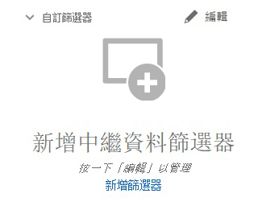

# 搜尋 [!DNL Assets Essentials] 中的資產 {#search-assets}

[!DNL Assets Essentials] 的預設功能即提供有效的搜尋。由於是全文檢索搜尋，因此十分全面。強大的搜尋功能可讓您快速探索合適的資產，協助您改善內容速度。[!DNL Assets Essentials] 提供全文檢索搜尋，甚至還透過如智慧型標記、標題、建立的日期和版本等中繼資料進行搜尋。

若要搜尋資產，

* 按一下頁面頂部的搜尋方塊。預設為在您目前瀏覽的資料夾內進行搜尋。執行下列任一項作業：

   

   * 使用關鍵字進行搜尋，並選擇變更資料夾。按下「Return」。

   * 開始直接搜尋最近檢視的資產，然後使用該資產。在搜尋方塊中按一下，然後從建議中選取最近檢視的資產。

## 篩選搜尋結果 {#refine-search-results}

您可以根據以下參數來篩選搜尋結果。

*圖：請根據各種參數篩選已搜尋的資產。*

* 資產狀態：使用 `Approved` 或 `Rejected` 資產狀態。

* 檔案類型：依照支援的檔案類型篩選搜尋結果，也就是 `Images`、`Documents` 和 `Videos`。
* MIME 類型：篩選一個或更多支援的檔案格式。<!-- TBD:  [supported file formats](/help/supported-file-formats.md). -->
* 影像大小：提供一個或更多最小和最大尺寸，以篩選影像。以尺寸 (像素) 提供大小，而非影像的檔案大小。
* 建立日期：資產的建立日期如中繼資料中所提供。使用的標準日期格式為 `yyyy-mm-dd`。
* 修改日期：上次修改資產的日期。使用的標準日期格式為 `yyyy-mm-dd`。

您可以依照 `Name`、`Relevancy`、`Size`、`Modified` 和 `Created` 的遞增或遞減順序排序搜尋的資產。

## 管理自定義篩選器 {#custom-filters}

**所需權限：**  `Can Edit`。 `Owner`或管理員。

Assets Essentials還允許您向用戶介面添加自定義篩選器。 然後，除了 [標準篩選器](#refine-search-results) 來優化搜索結果。

Assets Essentials提供以下自定義篩選器：

<table>
    <tbody>
     <tr>
      <th><strong>自定義篩選器名稱</strong></th>
      <th><strong>說明</strong></th>
     </tr>
     <tr>
      <td>標題</td>
      <td>使用資產標題篩選資產。 在區分大小寫的搜索標準中指定的標題必須與要在結果中顯示的資產的確切標題匹配。</td>
     </tr>
     <tr>
      <td>名稱</td>
      <td>使用資產檔案名篩選資產。 在區分大小寫的搜索條件中指定的名稱必須與要在結果中顯示的資產的確切檔案名相匹配。</td>
     </tr>
     <tr>
      <td>資產大小</td>
      <td>通過在搜索標準中定義要在結果中顯示的資產的大小範圍（以位元組為單位）來篩選資產。</td>
     </tr>
     <tr>
      <td>預測標籤</td>
      <td>使用資產智慧標籤篩選資產。 在區分大小寫的搜索條件中指定的智慧標籤名稱必須與要在結果中顯示的資產的確切智慧標籤名稱相匹配。 在搜索條件中不能指定多個智慧標籤。</td>
     </tr>    
    </tbody>
   </table>

### 添加自定義篩選器 {#add-custom-filters}

要添加自定義篩選器：

1. 按一下 **[!UICONTROL 篩選器]**。

1. 在 **[!UICONTROL 自定義篩選器]** ，按一下 **[!UICONTROL 編輯]** 或 **[!UICONTROL 添加篩選器]**。

   

1. 在 **[!UICONTROL 自定義篩選器管理]** 對話框，選擇需要添加到現有篩選器清單的篩選器。 選擇 **[!UICONTROL 自定義篩選器]** 的子菜單。

1. 按一下 **[!UICONTROL 確認]** 的子菜單。

### 刪除自定義篩選器 {#remove-custom-filters}

要刪除自定義篩選器：

1. 按一下 **[!UICONTROL 篩選器]**。

1. 在 **[!UICONTROL 自定義篩選器]** ，按一下 **[!UICONTROL 編輯]**。

1. 在 **[!UICONTROL 自定義篩選器管理]** 對話框，取消選擇從現有篩選器清單中刪除的篩選器。

1. 按一下 **[!UICONTROL 確認]** 從用戶介面中刪除篩選器。

## 已儲存搜尋 {#saved-search}

搜尋功能可以在 [!DNL Assets Essentials] 中輕鬆使用。您不僅可以從搜尋方塊中輸入關鍵字然後按下「Return」來查看結果，也可按一下快速再次搜尋最近搜尋的關鍵字。

您也可以根據資產的中繼資料和類型的特定條件，來篩選搜尋結果。對於常用的篩選條件，若要改善搜尋體驗，[!DNL Assets Essentials] 可讓您儲存搜尋參數。您稍後可以選取已儲存搜尋，按一下即可搜尋並套用篩選器。

若要建立已儲存搜尋，請搜尋某個資產、套用一個或更多篩選條件，然後按一下「[!UICONTROL 篩選器]」面板中的「[!UICONTROL 儲存搜尋]」。

<!-- TBD: Search behavior. Full-text search. Ranking and rank boosts. Hidden assets.
Report poor UX that users can only save a filtered search and not a simple search.
.
Are other supported files fully indexed and support full-text search? Eg. audio/videos files can at best have metadata indexed.
Anything about ranking of assets displayed in search results?

What about temporarily hiding an asset (suspending search on it) from the search results? If an asset is undergoing review collaboration, should it be used by others? Should it be hidden in search?

When userA is searching and userB add an asset that matches search results, will the asset display in search as soon as userA refreshes the page? Assuming indexing is near real-time. May not be so for bulk uploads.
-->
