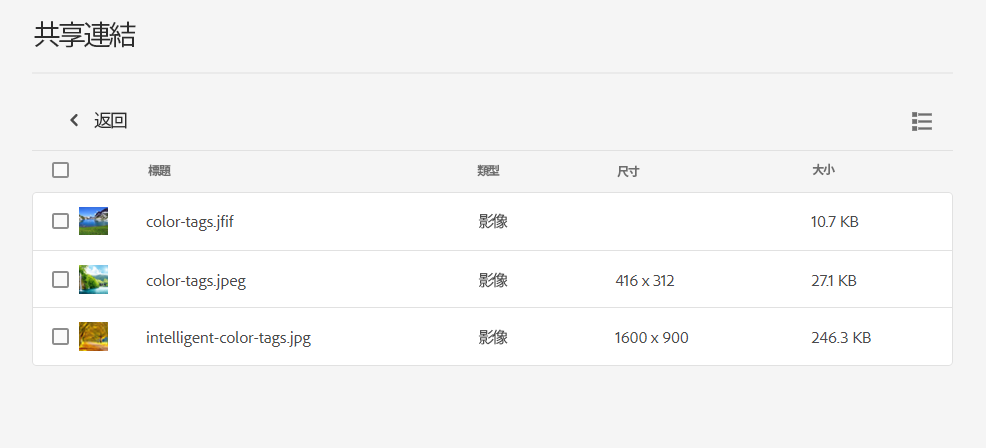

# 共用資產的連結 {#share-links-assets}

[!DNL Assets Essentials] 可讓您產生連結，並和沒有 [!DNL Assets Essentials] 應用程式的外部利益關係人共用資產。您可以定義連結的到期日，然後使用您喜歡的通訊方式 (如電子郵件或簡訊服務) 與他人共用。連結的收件者可預覽和下載資產。

## 產生資產的連結 {#generate-link-for-assets}

若要產生資產或包含資產的檔案夾的連結：

1. 請選取資產和/或包含資產的檔案夾，並按一下&#x200B;**[!UICONTROL 共用連結]**。

1. 如果您要進行調整，可按一下「行事曆」圖示，以使用&#x200B;**[!UICONTROL 到期日]**&#x200B;欄位定義連結的到期日。您還可以直接以「`yyyy-mm-dd`」格式指定日期。預設的連結到期日設為共用日期起的 2 週。

1. 按一下&#x200B;**[!UICONTROL 產生連結]**。

1. 按一下&#x200B;**[!UICONTROL 複製連結]**，即可複製連結。您還可以從&#x200B;**[!UICONTROL 共用連結]**&#x200B;欄位複製連結。

   

1. 按一下&#x200B;**[!UICONTROL 關閉]**&#x200B;並利用電子郵件或其他共同作業工具來共用連結。

## 存取已共用的資產 {#access-shared-assets}

共用資產的公用連結後，收件人可按一下該連結，即可在網路瀏覽器中預覽或下載該共用資產，而無需登入 [!DNL Assets Essentials]。

按一下連結、按一下檔案夾，即可瀏覽至該資產，然後按一下資產進行預覽。您可以選擇在「清單檢視」或「卡片檢視」中檢視共用的資產。

您可以將滑鼠停留在共用資產或共用資產檔案夾上，即可選取資產或將其下載。

您還可以選取多個資產並按一下&#x200B;**[!UICONTROL 下載]**。 [!DNL Assets Essentials] 會將所選取的資產下載為一個 zip 檔。[!DNL Assets Essentials] 會在父 zip 檔中建立一個子檔案夾，對您選取來下載的每個資產使用和該資產相同的名稱。

若要同時下載所有資產，請切換至&#x200B;**[!UICONTROL 清單檢視]**，按一下&#x200B;**[!UICONTROL 全部選取]**，然後按一下&#x200B;**[!UICONTROL 下載]**。

## 後續步驟 {#next-steps}

* [觀看在 Assets Essentials 中分享資產連結的相關影片](https://experienceleague.adobe.com/docs/experience-manager-learn/assets-essentials/basics/link-sharing.html)

* 使用 Assets Essentials 使用者介面中所提供的[!UICONTROL 意見回饋]選項提供產品意見回饋

* 若要提供文件意見回饋，請使用右側邊欄提供的[!UICONTROL 編輯此頁面]或[!UICONTROL 記錄問題]

* 連絡[客戶服務](https://experienceleague.adobe.com/?support-solution=General#support)
