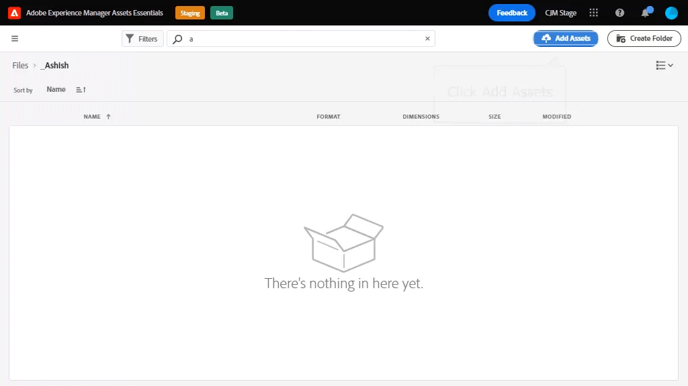
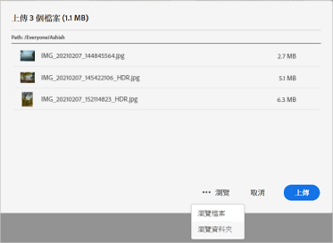
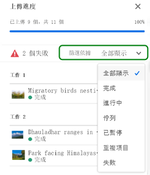
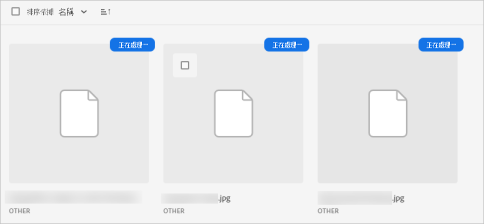
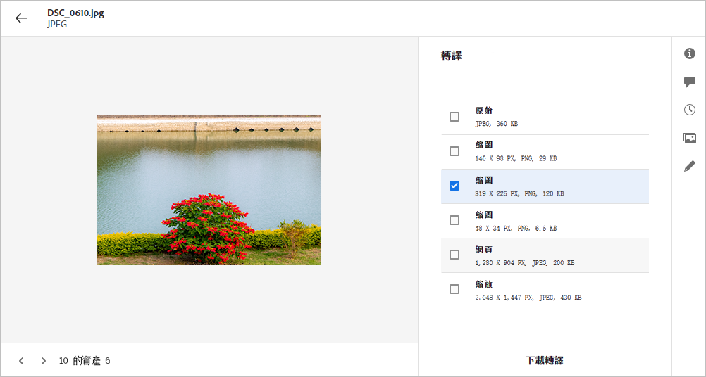
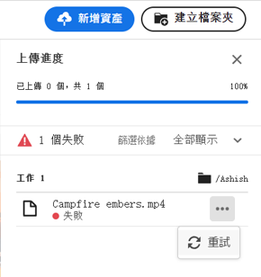
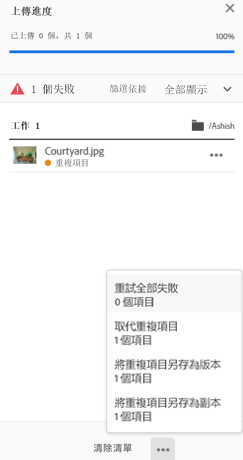

# 上傳資產 {#add-assets}

若要新增要使用的新資產，請從您的本機檔案系統上傳一些資產。<!-- TBD: Many of the [common file formats are supported](/help/using/supported-file-formats.md). -->

您可以使用以下方法上傳一個或更多資產，或包含資產的一個資料夾：

* 在使用者介面上拖曳資產或資料夾，然後依照螢幕上的指示進行。
* 從工具列按一下「**[!UICONTROL 新增資產]**」選項，然後將部分檔案新增到上傳對話方塊。

<!-- TBD: Update this GIF
 -->

您可以在建立資料夾後使用任一方法上傳資產。若要建立空的資料夾，請從工具列按一下「**[!UICONTROL 建立資料夾]**」。雖然 [!DNL Assets Essentials] 提供強大的全文檢索搜尋功能，但您也可以使用資料夾更妥善組織您的資產。

選取檔案後，即會出現確認對話方塊，以便新增更多檔案或移除已選取的檔案。若要新增更多檔案到選取項目，請按一下「**[!UICONTROL 瀏覽]**」，然後選取「**[!UICONTROL 瀏覽檔案]**」或「**[!UICONTROL 瀏覽資料夾]**」。從相同或不同的資料夾新增更多檔案或資料夾。

將所有檔案排入佇列後，請按一下「**[!UICONTROL 上傳]**」。

*圖：上傳選取的資產前，您可以從佇列新增或移除資產。*

>[!TIP]
>
>如果您將資料夾結構上傳到 Assets Essentials，則無需建立具有該資料夾結構的 .ZIP 檔案，您可以直接上傳資料夾結構。上傳到 Assets Essentials 的 .ZIP 檔案會儲存為一個 ZIP 資產，上傳後也不會自動解壓縮。

## 檢視上傳進度和狀態 {#upload-progress}

上傳許多資產或巢狀資料夾到 [!DNL Assets Essentials] 時，部分資產會因各種原因 (如重複的資產和網路問題) 而無法上傳。

若要追蹤上傳進度，請按一下工具列上的「**[!UICONTROL 上傳進度]**」選項。面板會顯示所有資產的上傳進度。

若要根據上傳進度或狀態檢視資產的子集合，請在「**[!UICONTROL 上傳進度]**」側邊欄中使用篩選器。各種篩選條件用於顯示所有資產、完整的上傳、進行中的上傳、排入要上傳佇列的資產、暫停的上傳、重複資產，以及無法上傳的資產。

*圖：根據上傳狀態或上傳進度篩選您嘗試上傳的資產。*

上傳資產後，[!DNL Assets Essentials] 便會立即處理資產，以產生縮圖並處理中繼資料。許多資產都需要一些處理時間。如果您未看到縮圖並在預留位置縮圖上看到處理訊息，請在數分鐘後再次查看資料夾。處理時，除其他外，[!DNL Assets Essentials] 會產生轉譯、新增智慧型標記，並編製資產詳細資訊的索引，以便進行搜尋。

*圖：上傳的資產會在處理資產的標題上顯示處理。*

## 資產轉譯 {#renditions}

[!DNL Assets Essentials] 會近乎即時處理上傳的資產，並對許多支援的檔案類型產生轉譯。為影像建立的轉譯是上傳影像調整大小的版本。您不僅可以下載資產，也可以下載轉譯，以使用合適的版本。[預覽資產](/help/using/navigate-view.md#preview-assets)時，您可以檢視資產的所有轉譯。

*圖：檢視和下載轉譯。*

## 管理失敗的上傳 {#resolve-upload-fails}

如果支援的資產因某項原因而無法上傳，請從「[!UICONTROL 上傳進度]」窗格按一下「**[!UICONTROL 重試]**」。

*圖：如果支援的檔案因某項原因而無法上傳，請重試。*

如果您嘗試上傳重複的資產，則不會上傳該資產，直到您明確確認上傳為止。重複的資產最初會標示為失敗的上傳。若要解決問題，您可以僅建立一個版本、刪除和取代現有資產，或重新命名資產以建立重複的複本。您可以一次一個資產解決此類失敗作業，或一次對所有失敗的重複項目大量解決。

*圖：對於預設無法上傳的重複資產，一次一個資產解決問題。*

*圖：對於預設無法上傳的重複資產，一次解決所有資產的問題。*

>[!TIP]
>
>您可以從您的 [!DNL Creative Cloud] 桌面應用程式內直接將資產上傳到 DAM 存放庫。了解 [[!DNL Assets Essentials] 如何與 [!DNL Adobe Asset Link]](/help/using/integration.md)整合。

## 刪除資產或資料夾 {#delete-assets}

使用者可以刪除不再需要的個別資產或資料夾。若要刪除資產或資料夾，請執行下列其中一個動作：

* 使用資產或資料夾縮圖上可用的選項。

  

  *圖：在資產或資料夾圖磚上可用的檔案和資料夾動作。*

* 選取資產或資料夾，然後按一下工具列中的「**[!UICONTROL 刪除]**」。

## 後續步驟 {#next-steps}

* [觀看在 Assets Essentials 中上傳資產的相關影片](https://experienceleague.adobe.com/docs/experience-manager-learn/assets-essentials/basics/creating.html)

* 使用 Assets Essentials 使用者介面中所提供的[!UICONTROL 意見回饋]選項提供產品意見回饋

* 若要提供文件意見回饋，請使用右側邊欄提供的[!UICONTROL 編輯此頁面]或[!UICONTROL 記錄問題]

* 聯絡[客戶服務](https://experienceleague.adobe.com/?support-solution=General#support)
