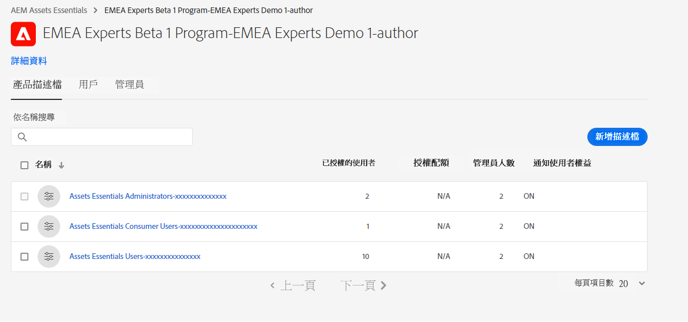

# 管理 Experience Manager Assets Essentials {#administer-assets-essentials}

## 目標

* **對象**：Assets Essentials 管理員

* **目標**：使用 Admin Console 設定對 Assets Essentials 應用程式的存取，然後管理登入 Assets Essentials 應用程式後可以執行的工作。

## 概觀 {#overview}

[!DNL Adobe Experience Manager Assets Essentials] 由 Adobe 為其客戶佈建。佈建作業的一部分為在 [!DNL Adobe Admin Console] 中將 [!DNL Assets Essentials] 新增到客戶的組織。管理員使用 [!DNL Admin Console] 管理 [!DNL Assets Essentials] 解決方案的使用者權益，並指派應用程式管理員，以便在 [!DNL Assets Essentials] 中設定權限和中繼資料表單。

以下資料流程圖說明管理員為了設定和管理 Assets Essentials 所必須執行的一系列工作：

## 存取 Admin Console {#access-admin-console}

佈建 Assets Essentials 解決方案後，管理員便會從 Adobe 接收電子郵件。電子郵件包含歡迎訊息和開始使用的連結。此外，Adobe 會自動開始部署 Assets Essentials 的程序。部署程序需要一小時的時間完成。

從電子郵件中的連結，存取和登入 [Admin Console](https://adminconsole.adobe.com)。如果您擁有一個以上的組織帳戶的管理員存取權，請選取合適的組織，或使用[組織選擇器](https://helpx.adobe.com/tw/enterprise/using/admin-console.html)切換至該組織。自動部署程序完成後，[!DNL AEM Assets Essentials] 的產品卡會在 [!DNL Admin Console] 中顯示。

## 管理 Admin Console 工作 {#manage-admin-console-tasks}

在 Admin Console 中執行下列工作：

* [將使用者新增至產品設定檔](#add-users-to-product-profiles)

* [新增使用者群組](#add-user-groups)

* [新增使用者至群組](#add-users-to-user-groups)

### 將使用者新增至產品設定檔 {#add-users-to-product-profiles}

將使用者新增至產品設定檔，可讓使用者存取 Assets Essentials 應用程式。

若要將使用者新增至產品設定檔：

1. 存取您組織的 [Admin Console](https://adminconsole.adobe.com)，按一下頂端列中的「**[!UICONTROL 產品]**」、按一下「**[!UICONTROL AEM Assets Essentials]**」，然後按一下 [!DNL Assets Essentials] 的執行個體。執行個體的名稱可能與下面的螢幕擷圖不同。
   >[!NOTE]
   >
   >[!DNL Cloud Manager] 執行個體僅供特殊管理員使用，例如檢查服務狀態和存取服務日誌，不能用於將使用者新增到產品中。如需詳細資訊，請參閱[管理員指南](deploy-administer.md#view-service-status-and-access-logs-view-logs)。

   

    [!DNL Assets Essentials] 擁有三種產品設定檔，代表管理員、一般和消費者使用者的存取權。

   

1. 若要新增使用者到產品，請按一下三個 Assets Essentials 產品設定檔之一、選取「**[!UICONTROL 新增使用者]**」、提供使用者詳細資訊，然後按一下「**[!UICONTROL 儲存]**」。

   

   新增使用者時，使用者會收到開始使用的電子郵件邀請。您可以在 [!DNL Admin Console] 中的產品設定檔設定中關閉電子郵件邀請。

1. 若要從群組移除使用者，請按一下該群組、選取現有使用者，然後選取&#x200B;**[!UICONTROL 移除使用者]**。

   >[!NOTE]
   >
   >您必須將使用者新增到 Admin Console 中的管理員 Assets Essentials 產品設定檔，他們才能在 Assets Essentials 應用程式中執行管理工作。這些工作包括[建立檔案夾結構](#create-folder-structure)、[管理檔案夾權限](#manage-permissions-for-folders)和[設定中繼資料表單](#metadata-forms)。

### 新增使用者群組 {#add-user-groups}

建立使用者群組，然後將使用者指派至使用者群組。這些使用者群組可用於在 Assets Essentials 應用程式中設定檔案夾的權限。

您可以將使用者新增到使用者群組 (1) 以及[將使用者新增到 Assets Essentials 產品設定檔 (2)](#add-admin-users)。但您無法將使用者群組直接新增到 Assets Essentials 產品設定檔 (3)。

如需有關如何管理使用者群組的資訊，請參閱 `Create user groups` 和 `Edit user groups` (可在[管理使用者群組](https://helpx.adobe.com/tw/enterprise/using/user-groups.html)中取得)。

>[!NOTE]
>
>如果您的 Admin Console 設定為利用外部系統來管理使用者/群組分配，例如 Azure 或 Google 連接器、使用者同步工具或 User Management Rest API，則您的群組和使用者指派會自動設定。如需詳細資訊，請參閱 [Adobe Admin Console 使用者](https://helpx.adobe.com/tw/enterprise/using/users.html)。

### 新增使用者至群組 {#add-users-to-user-groups}

建立使用者群組後，您可以開始將使用者新增至使用者群組。

如需有關如何管理新增使用者至使用者群組的資訊，請參閱 `Add users to groups` (可在[管理使用者群組](https://helpx.adobe.com/tw/enterprise/using/user-groups.html#add-users-to-groups)中取得)。

## 管理 Assets Essentials 管理工作 {#manage-assets-essentials-tasks}

執行 Admin Console 工作後，您現在可以在 Assets Essentials 應用程式中執行以下管理工作：

* [建立檔案夾結構](#create-folder-structure)

* [管理檔案夾的權限](#manage-permissions-for-folders)

* [設定中繼資料表單](#metadata-forms)

>[!NOTE]
>
>為了能夠管理這些工作，尤其是管理權限，您的使用者必須具有應用程式管理權限 - 需要將其新增到[管理員 Assets Essentials 產品設定檔](#add-users-to-product-profiles)中。

### 建立檔案夾結構 {#create-folder-structure}

您可以使用下列方法在 Assets Essentials 存放庫中建立檔案夾結構：

* 按一下工具列中的&#x200B;**[!UICONTROL 建立檔案夾]**&#x200B;選項，即可建立空的檔案夾。

* 按一下工具列中的&#x200B;**[!UICONTROL 新增資產]**&#x200B;選項，即可[上傳本機中現有的檔案夾結構](add-delete.md)。

建立一個適合組織業務目標的檔案夾結構。如果您要將現有的檔案夾結構上傳到 Assets Essentials 存放庫，則應查看該結構。如需詳細資訊，請參閱[有效權限管理的最佳實務](permission-management-best-practices.md)。

當您開始計畫在 Assets Essentials 存放庫中建立檔案夾結構時，請考慮以下幾點：

* 未來的控管：由管理員控管的檔案夾以及[將擁有者權限委派給其他使用者的檔案夾](manage-permissions.md##manage-permissions-folders)。

* 可擴充性：檔案夾結構應符合您組織的未來需求，並且應易於擴充。

* 大小：一個檔案夾不能包含太多資產。這可能會導致可用性問題並可能變得難以管理。

* 直覺性：檔案夾結構應易於瀏覽，並且一般使用者能以直覺的方式操作。使用者應該能夠輕鬆識別在檔案夾結構中上傳新資產的位置。

您可以為您的組織使用多種可能的檔案夾結構類型。以下是一些典型的檔案夾結構範例：

### 管理檔案夾的權限 {#manage-permissions-for-folders}

Assets Essentials 可讓管理員管理存放庫中檔案夾的存取層級。 身為管理員，您可建立使用者群組並指派權限給這些群組，以管理存取層級。您還可以將權限管理權委派給檔案夾層級的使用者群組。

>[!VIDEO](https://video.tv.adobe.com/v/341104)

如需詳細資訊，請參閱[管理檔案夾的權限](manage-permissions.md)。

### 設定中繼資料表單 {#metadata-forms}

Assets Essentials 預設為提供許多標準中繼資料欄位。組織擁有其他中繼資料需求，並需要更多中繼資料欄位以新增特定企業中繼資料。中繼資料表單可讓企業將自訂中繼資料欄位新增到資產的[!UICONTROL 詳細資訊]頁面。特定企業中繼資料能夠改善其資產的控管和探索。您可以從頭開始建立表單，或改變現有表單的用途。

您可以為不同的資產類型 (不同的 MIME 類型) 設定中繼資料表單。使用與檔案的 MIME 類型相同的表單名稱。Essentials 會自動比對上傳的資產 MIME 類型與表單的名稱，並根據表單欄位更新已上傳資產的中繼資料。

例如，如果存在名稱為 `PDF` 或 `pdf` 的中繼資料表單，則上傳的 PDF 文件會包含如表單中定義的中繼資料欄位。

Assets Essentials 使用以下順序搜尋現有中繼資料表單名稱，以將中繼資料欄位套用至特定類型的已上傳資產：

MIME 子類型 > MIME 類型 > `default` 表單 > 現成可用的表單

例如，如果存在名稱為 `PDF` 或 `pdf` 的中繼資料表單，上傳的 PDF 文件則包含如表單中定義的中繼資料欄位。如果不存在名稱為 `PDF` 或 `pdf` 的中繼資料表單，則 Assets Essentials 會比對是否存在名稱為 `application` 的中繼資料表單。如果存在名稱為 `application` 的中繼資料表單，則上傳的 PDF 文件會包含如表單中定義的中繼資料欄位。如果 Assets Essentials 仍找不到符合的中繼資料表單，則會搜尋 `default` 中繼資料表單以將表單中定義的中繼資料欄位套用至上傳的 PDF 文件。如果上述任何步驟都無法運作，則 Assets Essentials 會將現成可用表單中定義的中繼資料欄位套用至所有上傳的 PDF 文件。

>[!IMPORTANT]
>
>特定檔案類型的新中繼資料表單會完成取代 [!DNL Assets Essentials] 所提供的預設中繼資料表單。如果您刪除或重新命名中繼資料表單，新資產便可再次使用預設中繼資料欄位。

>[!VIDEO](https://video.tv.adobe.com/v/341275)

如需中繼資料表單的詳細資訊，請參閱[Assets Essentials 中的中繼資料表單](metadata.md#metadata-forms)。

## 下一步

現在您已設定好和管理 Assets Essentials 應用程式，接著請[將 Creative Cloud 應用程式與 Experience Manager Assets Essentials 應用程式整合](integrate-assets-essentials-creative-cloud.md)。
