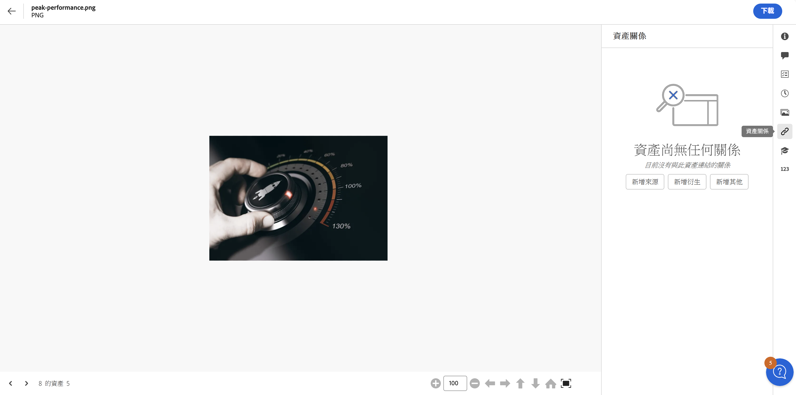
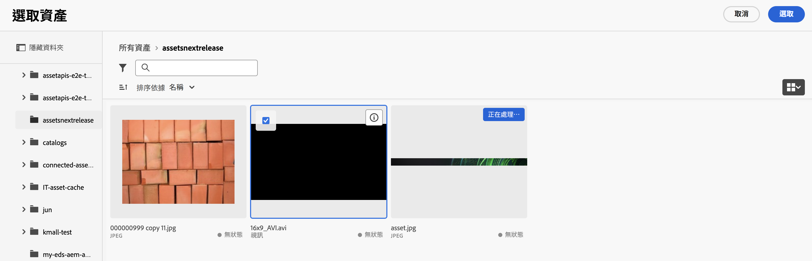
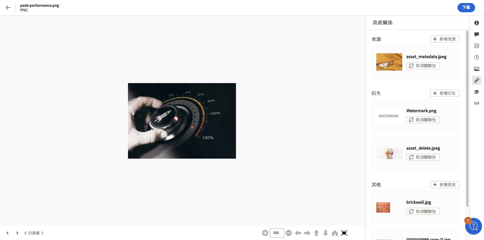

# 資產關聯 {#related-assets}

您可以透過 [!DNL Adobe Experience Manager Assets] 使用相關資產功能，根據組織的需求手動建立資產關聯。 例如，您可以將授權檔案與類似主題的資產或影像/影片建立關聯。 您可以將具有特定通用屬性的資產建立關聯。 您也可以使用此功能來建立資產之間的來源/衍生關係。 例如，如果您有一個從 INDD 檔案產生的 PDF 檔案，您可以將 PDF 檔案與其來源 INDD 檔案相關聯。

使用此功能，您可以彈性地與供應商或機構共用低解析度的 PDF 檔案或 JPG 檔案，並僅在對方提出要求時提供高解析度的 INDD 檔案。

>[!NOTE]
>
>唯有具有資產之編輯權限的使用者才能建立資產的關聯或取消其關聯。

## 建立資產關聯的步驟 {#steps-to-relate-assets}

1. 於 [!DNL Experience Manager] 介面，開啟要建立關聯之資產的「**[!UICONTROL 屬性]**」頁面。

   

1. 若要將另一項資產與您選取的資產建立關聯，請按一下「**[!UICONTROL 資產關聯]**」。
1. 執行下列任一項作業：

   * 若要關聯資產的來源檔案，請從清單中選取「**[!UICONTROL 新增來源]**」。 您只能將一項資產視為來源進行關聯。
   * 若要關聯衍生檔案，請從清單中選取「**[!UICONTROL 新增衍生檔案]**」。 您可以在此類別中關聯多個資產。
   * 若要在資產之間建立雙向關係，請從清單中選取「**[!UICONTROL 新增其他]**」。 您可以在此類別中關聯多個資產。

1. 於「**[!UICONTROL 選取資產]**」畫面中，導覽至您要建立關聯之資產的位置，然後選取該資產。 您選取單一資產，或是在點按時同時按住 Shift 鍵一次選取多個資產，其中可能包含任何一種 [Assets 視圖支援的檔案格式](supported-file-formats.md)。

   

1. 按一下「**[!UICONTROL 選取]**」。 根據您在步驟 3 中選擇的關係而定，已關聯資產會列在「**[!UICONTROL 資產關聯]**」區段的適當類別下。 例如，如果您關聯的資產是目前資產的來源檔案，則會列在「**[!UICONTROL 來源]**」之下。

   

1. 對每個區段 (「[!UICONTROL 來源]」、「[!UICONTROL 衍生]」和「[!UICONTROL 其他]」) 中的所有已關聯資產按一下「**[!UICONTROL 取消關聯]**」，以便將資產取消關聯。

## 翻譯已關聯資產 {#translating-related-assets}

使用關聯資產功能在資產之間建立來源/衍生關係，對於翻譯工作流程也很有幫助。 當您在衍生資產上執行翻譯工作流程時，[!DNL Experience Manager Assets] 會自動擷取來源檔案參照的任何資產，並將其加入翻譯中。 如此一來，來源資產所參照的資產會與來源和衍生資產一併翻譯。 如果來源檔案與另一個資產關聯，[!DNL Experience Manager Assets] 會擷取所參照的資產並將其加入翻譯中。

請參閱[翻譯 AEM 中的資產](https://experienceleague.adobe.com/zh-hant/docs/experience-manager-cloud-service/content/assets/admin/translate-assets)。

## 後續步驟 {#next-steps}

* 使用資產檢視使用者介面所提供的[!UICONTROL 意見回饋]選項提供產品意見回饋

* 若要提供文件意見回饋，請使用右側邊欄提供的[!UICONTROL 編輯此頁面]或[!UICONTROL 記錄問題]

* 聯絡[客戶服務](https://experienceleague.adobe.com/zh-hant?support-solution=General#support)

>[!MORELIKETHIS]
>
>* [檢視資產的版本](manage-organize.md#view-versions)
>* [翻譯 AEM 中的資產](https://experienceleague.adobe.com/zh-hant/docs/experience-manager-cloud-service/content/assets/admin/translate-assets)
>* [Assets 視圖中支援的檔案格式](supported-file-formats.md)。
