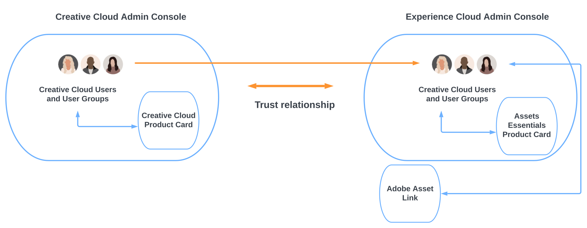

# 適用於 Creative Cloud Pro 的 Assets Essentials 搭配工作管理解決方案 {#creative-cloud-enterprise-user-journeys}

## 簡介 {#introduction}

適用於企業的 Creative Cloud Pro 搭配工作管理解決方案整合了創意、內容和工作管理工具，可提高您製作創意內容和快速實現業務目標的能力。解決方法包含下列元件：

* Creative Cloud Pro

* Adobe Workfront

* Experience Manager Assets Essentials

本教學課程介紹啟用 Assets Essentials 應用程式以將 Creative Cloud 桌面應用程式與 Adobe Workfront 應用程式整合的管理員歷程。Creative Cloud 桌面應用程式包括 Adobe Photoshop、Adobe Illustrator、Adobe InDesign 和 Adobe XD。

## 部署類型 {#deployment-types}

由於解決方案包含來自 Creative Cloud 和 Adobe Experience Cloud 的應用程式和服務，因此它們可能會部署在您公司的一個或兩個 Adobe Admin Console 中。

如果部署到兩個 Admin Console，則需要額外的設定步驟：

* Creative Cloud 服務和應用程式 (適用於企業的 Creative Cloud Pro 和選用模組) 在[適用於 Creative Cloud 部署的 Adobe Admin Console](https://helpix.adobe.com/content/help/en/enterprise/admin-guide.html) 中進行管理。

* Adobe Workfront 和 Adobe Experience Manager Assets Essentials 在[適用於 Experience Cloud 解決方案的 Adobe Admin Console](https://experienceleague.adobe.com/docs/core-services/interface/administration/admin-getting-started.html) 中進行管理。

若要整合 Creative Cloud 與 Assets Essentials 應用程式，適用於 Creative Cloud 的 Admin Console 中可用的使用者也必須在適用於 Experience Cloud 的 Admin Console 中設為可用。若要讓使用者可用於 Experience Cloud Admin Console，請建立一個目錄以在兩個 Admin Console 之間建立[目錄託管](https://helpx.adobe.com/tw/enterprise/using/set-up-identity.html#directory-trusting)。

如圖所示，根據兩個控制台之間的信任關係，Creative Cloud 使用者在 Experience Cloud Admin Console 中自動可用。然後，您可以將使用者新增到 Assets Essentials 產品設定檔。因此，Creative Cloud 使用者可以存取能與 Assets Essentials 存放庫互動的 Adobe Asset Link 應用程式。如需詳細資訊，請參閱[將 Assets Essentials 與 Creative Cloud 應用程式整合](integrate-with-creative-cloud.md)。

## Experience Manager 文件歷程 {#documentation-journeys}

文件歷程提供敘述來協助剛開始使用 Assets Essentials 的讀者，讓他們能從頭到尾理解和解決業務問題，同時將採用的先前主題或 Assets Essentials 知識降至最低，藉以連結許多不同且複雜的主題和功能。

文件歷程是根據最佳實務原則所設計，其中包含 Adobe 的最新研究、Adobe 顧問的成熟實作經驗，以及來自客戶專案的意見回饋。

## 必備條件

* [存取適用於 Experience Cloud 解決方案的 Adobe Admin Console](https://experienceleague.adobe.com/docs/core-services/interface/administration/admin-getting-started.html)

* [存取適用於企業的 Creative Cloud 部署的 Adobe Admin Console](https://helpx.adobe.com/enterprise/admin-guide.html)

## 管理 Experience Manager Assets Essentials {#administer-assets-essentials}

Adobe Experience Manager Assets Essentials 是 Adobe Experience Manager Assets 的輕量級新版本。Assets Essentials 透過簡化過的一致使用者介面，提供統一的資產管理和共同作業。使用方便，因此可讓更多創意和行銷團隊儲存、探索和散發數位資產。

Adobe Experience Manager Assets Essentials 由 Adobe 為其客戶佈建。在佈建作業中會將 Assets Essentials 新增到 Adobe Admin Console 的客戶組織中。

管理員使用 Admin Console 來管理使用者對 Assets Essentials 產品的權益：

* 新增使用者群組

* 將使用者新增至使用者群組

* 將使用者新增到 Assets Essentials 產品設定檔

在 Admin Console 中管理使用者權限後，管理員可以使用 Assets Essentials 應用程式執行以下操作：

* 建立檔案夾結構以最理想的方式支援組織的需求

* 管理檔案夾結構的權限

* 設定中繼資料表單

現在您已完成 Assets Essentials 應用程式的設定和管理，接著請[將 Creative Cloud 應用程式與 Experience Manager Assets Essentials 應用程式整合](integrate-with-creative-cloud.md)。

## 將 Creative Cloud 應用程式與 Experience Manager Assets Essentials 整合 {#administer-creative-cloud-applications}

[Adobe Asset Link 應用程式內面板](https://www.adobe.com/tw/creativecloud/business/enterprise/adobe-asset-link.html)可讓專業創意人員從支援的 [!DNL Adobe Creative Cloud] 桌面應用程式內連線到 [!DNL Assets Essentials] 存放庫。面板可供 [!DNL Adobe Photoshop]、[!DNL Adobe Illustrator]、[!DNL Adobe InDesign] 和 [!DNL Adobe XD] 使用。 它會簡化資產的存取，進而提高內容速度。

本教學課程引導您將 [!DNL Adobe Photoshop]、[!DNL Adobe Illustrator]、[!DNL Adobe InDesign] 和 [!DNL Adobe XD] 應用程式與 Experience Manager Assets Essentials 整合。

目標：

* 在 Creative Cloud 和 Experience Cloud Admin Console 之間建立目錄託管

* 將 Creative Cloud 使用者新增到 Assets Essentials 產品設定檔

* 安裝 Adobe Asset Link

* 使用 Adobe Asset Link

現在您已將 Creative Cloud 應用程式與 Assets Essentials 整合，接著請[將 Adobe Workfront 與 Experience Manager Assets Essentials 整合](integrate-with-workfront.md)。

## 將 Adobe Workfront 與 Experience Manager Assets Essentials 整合 {#administer-adobe-workfront}

[[!DNL Adobe Workfront]](https://www.workfront.com/) 是工作管理應用程式，協助您在一個地方管理整個工作生命週期。[!DNL Adobe Workfront] 與 [!DNL Assets Essentials] 的原生整合可讓組織在本質上連接工作和資產管理，藉以改善內容速度和上市時間。就管理其工作而言，使用者可以存取在同一解決方案中的所需文件和影像。

本教學課程引導您管理 Adobe Workfront，然後將其與 Experience Manager Assets Essentials 整合。

目標：

* 將使用者新增至 Workfront 產品設定檔

* 將使用者新增到 Assets Essentials 產品設定檔

* 設定 Experience Manager Assets Essentials 整合

