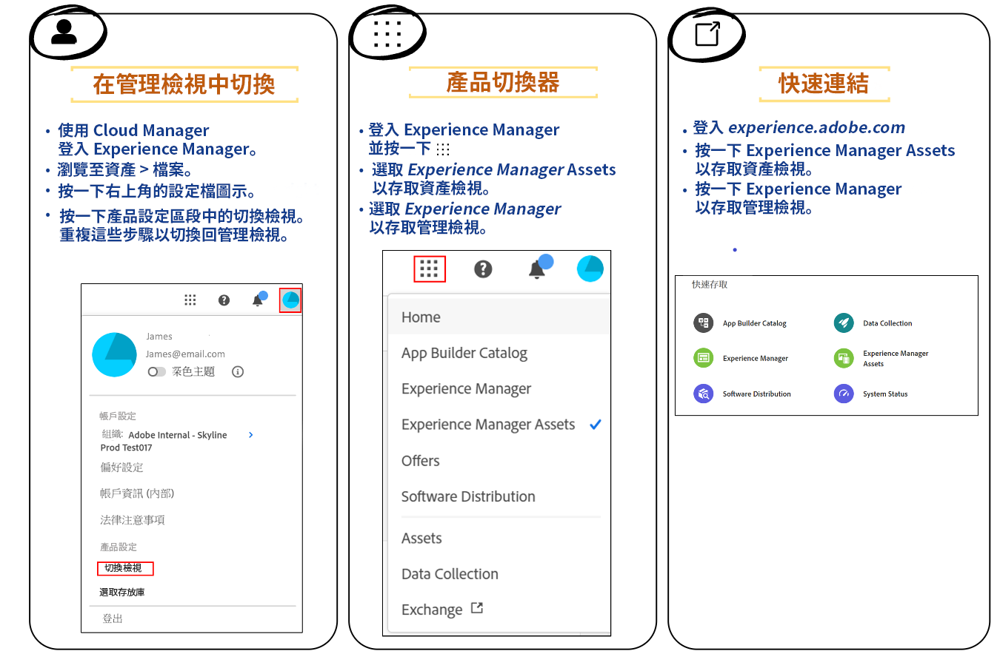

# 資產視圖簡介 {#assets-view}

在現今步調速迅的數位優先環境中，即時的內容創作和傳遞實屬不可或缺，針對下游行銷速度所設計的數位資產管理 (DAM) 體驗至關重要。Adobe運用其行銷和創意專業人員的專業能力，推出改變遊戲規則的新使用者體驗。 此工作流程優先的方法革新了企業處理動態數位資產的方式，讓行銷人員有能力在尋找、共同作業、個人化與傳遞資產方面，將效率提升到極致。這些簡化的工作流程加快內容速度，並將行銷作業推升到新的高度。

## 如何存取資產視圖？ {#access-assets-view}

您可以透過以下方式存取資產視圖：

<!--

* **Toggle in Admin view**

    * Log into [!DNL Experience Manager] using Cloud Manager.
    * Navigate to **[!UICONTROL Assets]** > **[!UICONTROL Files]**.
    * Click the profile icon on the top right corner.
    * Click **[!UICONTROL Switch View]** from the **[!UICONTROL Profile Settings]** section.
    Repeat these steps to switch back to the Admin view.

* **Product Switcher**
    * Log into [!DNL Experience Manager] and click .
    * Select **[!UICONTROL Experience Manager Assets]** to access the Assets view.
    * Select **[!UICONTROL Experience Manager]** to access the Admin view.

* **Quick Links** 
    * Log into experience.adobe.com.
    * Click **[!UICONTROL Experience Manager Assets]** to access the Assets view.
    * Click **[!UICONTROL Experience Manager Assets]** to access the Assets view.

    -->

## 為什麼要使用資產視圖？

資產視圖提供了以下管理員視圖中所沒有的主要優點：

* [我的工作區儀表板提供簡化的體驗](#my-workspace-for-streamlined-experience)
* [搜尋優先方法可提高效率](#search-first)
* [做出資訊導向決策的深入解析](#insights-data)
* [Adobe Photoshop Express 整合可以加速共同作業](#accelerate-collaboration)
* [資料夾上傳以設定組織的階層式結構](#folder-uploads)
* [訂閱存放庫內容以進行高效率的資產管理](#subscribe-content)
* [軟刪除資產，為管理員提供更好的控制](#soft-delete-assets)

### 我的工作區儀表板提供簡化的體驗 {#my-workspace-for-streamlined-experience}

我們推出了明白各種組織角色不同需求的數位資產管理解決方案。時尚的新資產檢視以易用性和速度為優先考量，迎合行銷人員對視覺吸引力和簡潔工作區的偏好。 透過可自訂的使用者特定「我的工作區」儀表板，行銷人員能夠以驚人的效率迅速尋找、預覽、編輯、管理和傳遞資產。無須再耗費無窮盡的時間搜尋特定資產，迎接簡化的體驗，讓您的一切所需皆觸手可及。

### 做出資訊導向決策的深入解析 {#insights-data}

為了搭配內容更新速度，可操作分析實屬不可或缺。全新的資產檢視體驗在「我的工作區」中提供進階深入分析，提供關於資產效能、對象使用情況和參與的寶貴資料。 行銷人員可以做出資料導向的決策、最佳化內容策略，以及調整下游傳遞以達到最佳的成果。企業若能存取有意義的深入解析，就可以在遙遙領先同業的競爭，並取得卓越的成果。

### Adobe Photoshop Express 整合可以加速共同作業 {#accelerate-collaboration}

新的體驗提供了一組強大的共同作業功能，包括使用內建的 Adobe Photoshop 功能、版本控制和註解工具進行即時編輯。這讓設計、創意、品牌化和行銷團隊之間能夠天衣無縫地共同作業，使他們能夠克服瓶頸並加速行銷營運流程。行銷人員現在可以隨心所欲使用強大的工具，加速專案的傳遞與提高整體的生產力。

觀看此視片以了解資源視圖整合 Adobe Photoshop Express 的強大功能：

>[!VIDEO](https://video.tv.adobe.com/v/3420922)

即將發佈的版本也包括[透過 Adobe Express 整合 Adobe Firefly](https://firefly.adobe.com/?gclid=EAIaIQobChMIlZeKuNfj_wIVeyCtBh3e5g2cEAAYASAAEgL56_D_BwE&amp;sdid=JM4FW6VL&amp;mv=search&amp;mv2=paidsearch&amp;ef_id=EAIaIQobChMIlZeKuNfj_wIVeyCtBh3e5g2cEAAYASAAEgL56_D_BwE:G:s&amp;s_kwcid=AL!3085!3!652077237594!e!!g!!adobe%20firefly!19870733758!148140507838)。

### 資料夾上傳以設定組織的階層式結構 {#folder-uploads}

透過上傳本機檔案系統上的資料夾，使用資產視圖迅速設定組織的資料夾結構。維護邏輯階層式結構時，您無需在根資料夾之下建立資料夾，然後手動將資產上傳到這些資料夾。根資料夾下的所有資料夾和資產都會自動上傳到 Experience Manager Assets。

### 搜尋優先方法可提高效率 {#search-first}

利用具有先進功能的搜尋，發揮組織數位資產庫的潛力。告別手動篩選無數檔案和資料夾的麻煩。任何使用者都可以立即找到所需的完美圖像、影片或文件，用來創作令人讚嘆的行銷活動、引人入勝的簡報和動人的內容。我們的搜尋優先引擎讓您無需知道確切的關鍵字，就可以輕鬆瀏覽資產類型、中繼資料、智慧型標記，甚至是內容本身。透過我們的搜尋優先迎接 DAM 的未來，並盡情發揮數位資產庫的全部潛力。

### 訂閱存放庫內容以進行高效率的資產管理 {#subscribe-content}

資產視圖能夠提供監視對存放庫中可用資產、資料夾或集合等所執行的操作。您需要選擇並訂閱將通知傳送給您的內容。您也可以配置事件類型，例如刪除已訂閱內容、修改已訂閱內容等。然後，僅針對這些事件類型發送通知給您。

### 軟刪除資產，為管理員提供更好的控制 {#soft-delete-assets}

資產視圖中的垃圾桶資料夾列出了從根資產資料夾刪除的資產。您可以從「垃圾桶」資料夾中選取資產，將其還原到原始位置或永久刪除。您也可以指定關鍵字或套用標準或自訂篩選條件，以搜尋「垃圾桶」資料夾中的適當資產。

除了這些功能之外，資產視圖也讓您能夠執行管理員視圖中所沒有的以下功能：

* 將具有不同名稱的新版本資產，從本機檔案系統上傳到資產存放庫。上傳的資產將以名稱與原始資產相同的新版本提供。

* 重新命名存放庫中可用的資產和資料夾。

## 結論 {#conclusion}

數位優先的時代已經來臨，是該要轉換我們的行銷工具以支援不斷變化的商業環境了。新的Adobe Experience Manager資產檢視經過量身打造，可簡化工作流程、促進共同作業並加速資產交付。 透過擁抱內容速度，行銷人員可以發揮數位資產的全部潛力，並以前所未有的方式釋放創造力。準備好利用Adobe新的資產檢視體驗的強大功能，並在您的行銷活動中推動卓越的成效。 是該擁抱 DAM 的未來並推動業務向前發展的時候了。

