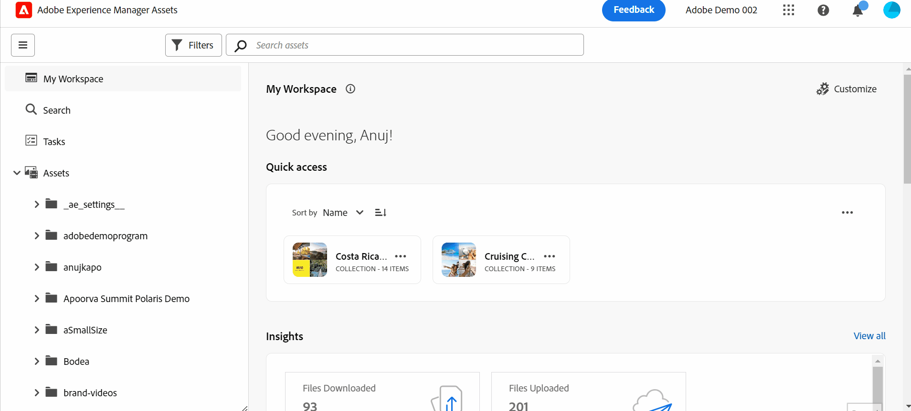

# 資產檢視簡介 {#assets-view}

在當今快節奏的數位優先環境中，即時內容的建立和交付至關重要，專為下遊行銷速度設計的數位資產管理(DAM)體驗至關重要。 Adobe運用其行銷和創意專業人員的專業能力，推出改變遊戲規則的全新「資產檢視」使用者體驗。 此工作流程優先的方法革新了企業處理動態數位資產的方式，讓行銷人員能夠最大限度地提高尋找、合作、個人化和提供資產的效率。 這些簡化的工作流程可加快內容速度，並將您的行銷工作推進到新的高度。

## 如何存取資產檢視？ {#access-assets-view}

您可以透過下列方式存取「資產」檢視：

* **在管理員檢視中切換**

   * 登入 [!DNL Experience Manager] 使用Cloud Manager。
   * 導覽至 **[!UICONTROL 資產]** > **[!UICONTROL 檔案]**.
   * 按一下右上角的設定檔圖示。
   * 按一下 **[!UICONTROL 切換檢視]** 從 **[!UICONTROL 設定檔設定]** 區段。
重複這些步驟以切換回「管理員」檢視。

* **產品切換器**
   * 登入 [!DNL Experience Manager] 並按一下
   * 選取 **[!UICONTROL Experience Manager Assets]** 以存取「資產」檢視。
   * 選取 **[!UICONTROL Experience Manager]** 以存取「管理員」檢視。

* **快速連結**
   * 登入experience.adobe.com。
   * 按一下 **[!UICONTROL Experience Manager Assets]** 以存取「資產」檢視。
   * 按一下 **[!UICONTROL Experience Manager Assets]** 以存取「資產」檢視。

## 我的Workspace控制面板提供簡化的體驗

請向數位資產管理解決方案問好，瞭解不同組織角色的各種需求。 時尚的全新Assets View以易用性和速度為優先考量，滿足行銷人員對視覺吸引力和簡潔工作區的偏好。 透過可自訂的使用者專屬My Workspace儀表板，行銷人員可以快速找到、預覽、編輯、管理和提供資產，並享有絕佳的效率。 告別花費在搜尋特定資產上的無窮無盡的時間，歡迎提供精簡的體驗，讓所有需要的事情觸手可及。

