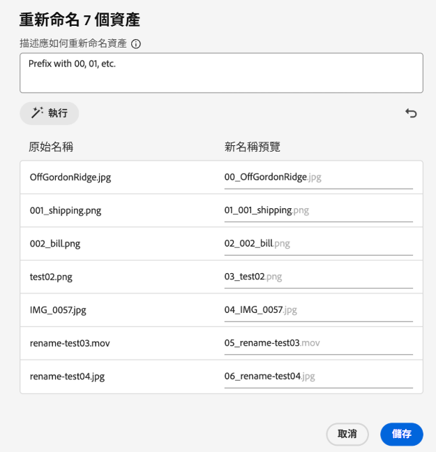

# 在 [!DNL Assets Essentials] 中重新命名資產或資料夾 {#rename-single-asset-or-folder}

重新命名可以改善資產的組織、分類和識別方式，但是不會變更其內容或位置。 您也可以透過 [!DNL Assets Essentials] 將所選資產或資料夾重新命名。

執行以下步驟，將資產或資料夾重新命名：

1. 找到您要重新命名的資產或資料夾。

1. 採取下列其中一種方式，將資產或資料夾重新命名：

   * 選取資產或資料夾，然後在上方選單中按一下「**[!UICONTROL 重新命名]**」。
   * 按一下資產或資料夾上的更多選項「`...`」，然後選取「**[!UICONTROL 重新命名]**」。
   * 按一下資產或資料夾的標題，將其重新命名。 在&#x200B;**重新命名資產**&#x200B;文字方塊中提及新文字，然後按一下&#x200B;**儲存**。 此功能可在格線、圖庫、瀑布和清單等檢視中使用。

## AI 驅動的資產大量重新命名 {#rename-bulk-assets-using-ai}

您可以利用 [!DNL Assets Essentials] 的 AI 功能同時將多個資產重新命名。 AI 大量重新命名功能只能套用至檔案，不能套用至資料夾。 您可以同時選取多個檔案，然後全部一起重新命名。

依照下列步驟，使用 AI 產生的提示同時將大量資產重新命名：

1. 選取多項資產，然後在上方選單中按一下「**[!UICONTROL 大量重新命名]**」。

1. 新增提示，說明您要如何將所選資產重新命名。 請參閱[說明 AI 大量重新命名功能的範例](#examples-ai-bulk-rename)。

1. 按一下「**[!UICONTROL 執行]**」，允許 AI 將提示中提到的資產重新命名。

1. [選用]按一下以還原或取消您執行的上一個動作。

1. 在「[!UICONTROL 新名稱預覽]」欄位中確認您的變更內容，然後按一下「**[!UICONTROL 儲存]**」。

   

## 說明 AI 大量重新命名功能的範例 {#examples-ai-bulk-rename}

以下是使用 AI 並根據 AI 提示將大量資產重新命名的一些範例：

* 前置詞為 00、01 等，後綴為今天的日期。
* 將所有檔案變更為「my-file」，並附加一個遞增的數字。
* 移除前置詞和後綴，只保留名稱的中間部分。
* 在檔案前面加上 001、002 等前置詞，並翻譯成英文。

>[!VIDEO](https://video.tv.adobe.com/v/3440975)

>[!NOTE]
>
> * 您無法將表情符號轉換成文字。
> * 將資產重新命名時使用唯一名稱，可避免出現警告訊息。 不過您可以使用新的名稱再試一次。
> * 您也可以將 Unicode 或非英數字元轉換為文字。

## 後續步驟 {#next-steps}

* [觀看影片以了解如何在 Assets Essentials 中管理後設資料表單](https://experienceleague.adobe.com/docs/experience-manager-learn/assets-essentials/configuring/metadata-forms.html?lang=zh-Hant)

* 使用 Assets Essentials 使用者介面中所提供的[!UICONTROL 意見回饋]選項提供產品意見回饋

* 若要提供文件意見回饋，請使用右側邊欄提供的[!UICONTROL 編輯此頁面]或[!UICONTROL 記錄問題]

* 聯絡[客戶服務](https://experienceleague.adobe.com/zh-hant?support-solution=General#support)

