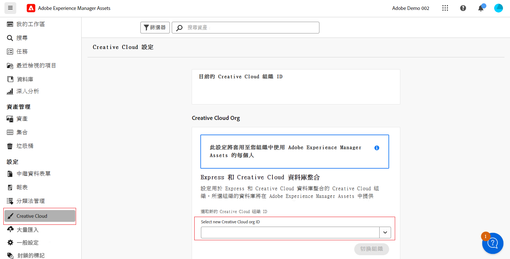

# Creative Cloud 整合的跨組織權利  {#cross-org-entitlements}

Experience Manager Assets 能夠連接到佈建給不同 IMS 組織的 Creative Cloud 權利，以便輕鬆使用 AEM Assets 中最新的 Creative Cloud 整合，包括 Express 和 Creative Cloud Libraries。

如果您的 Creative Cloud 產品和 AEM Assets 佈建給單獨的 IMS 組織，您可以連接到不同的 Creative Cloud 組織，以便能夠在兩個解決方案之間執行整合工作流程。

## 先決條件 {#prerequisites}

* Experience Manager Assets 的管理員權限

* 使用在 Creative Cloud 和 Experience Manager 中使用的同一個使用者識別碼取得 Creative Cloud 的有效權利。個人識別碼和聯合識別碼 (即便具有相同的電子郵件地址) 的權利視為不同的使用者識別碼。

## 連結到新的 Creative Cloud 組織 {#connect-to-creative-cloud-org}

若要連接到新的 Creative Cloud 組織，請執行以下步驟：

1. 瀏覽至「**[!UICONTROL 設定]**」>「**[!UICONTROL Creative Cloud]**」。

1. 使用「**[!UICONTROL 選取新的 Creative Cloud 組織識別碼]**」下拉式清單選取新的 Creative Cloud 組織。此清單會顯示您有權存取的所有組織。選取具有有效 Creative Cloud 權利的組織。

1. 點選「**[!UICONTROL 切換組織]**」以切換到新的組織。

   

## 限制 {#limitations}

* AEM Assets 一次只能連接到一個 Creative Cloud 組織。不支援一次連接到多個 Creative Cloud 組織。

* 您在 AEM Assets 中連接到的 Creative Cloud 組織適用於您組織內的所有使用者。
