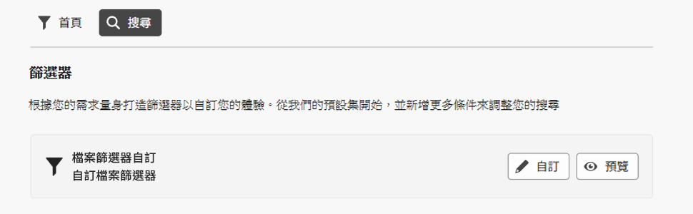
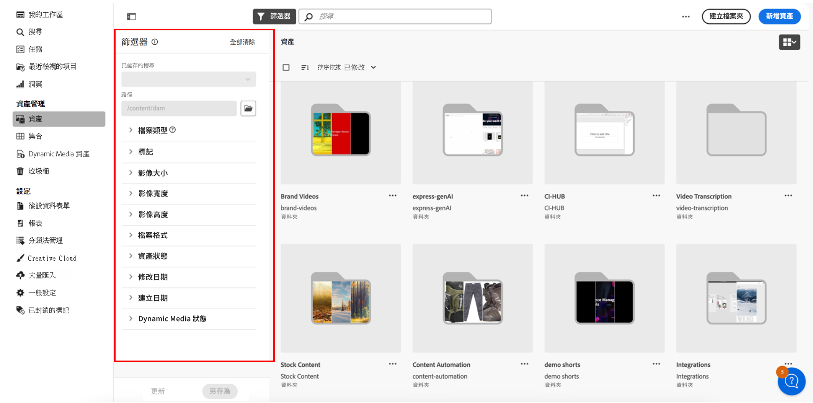

<table>
    <tr>
        <td>
            
            <a href="https://experienceleague.adobe.com/zh-hant/docs/experience-manager-cloud-service/content/assets/dynamicmedia/dm-prime-ultimate"><b>Dynamic Media Prime 與 Ultimate</b></a>
        </td>
        <td>
            
            <a href="https://experienceleague.adobe.com/zh-hant/docs/experience-manager-cloud-service/content/assets/assets-ultimate-overview"><b>AEM Assets Ultimate</b></a>
        </td>
        <td>
            
            <a href="http://experienceleague.adobe.com/en/docs/experience-manager-cloud-service/content/assets/integrate-aem-assets-edge-delivery-services"><b>AEM Assets 與 Edge Delivery Services 整合</b></a>
        </td>
        <td>
            
            <a href="https://experienceleague.adobe.com/zh-hant/docs/experience-manager-cloud-service/content/assets/assets-view/aem-assets-view-ui-extensibility"><b>UI 擴充性</b></a>
        </td>
          <td>
            
            <a href="https://experienceleague.adobe.com/zh-hant/docs/experience-manager-cloud-service/content/assets/dynamicmedia/dm-prime-ultimate"><b>啟用 Dynamic Media Prime 與 Ultimate</b></a>
        </td>
    </tr>
    <tr>
        <td>
            <a href="https://experienceleague.adobe.com/zh-hant/docs/experience-manager-cloud-service/content/assets/best-practices/search-best-practices"><b>搜尋最佳實務</b></a>
        </td>
        <td>
            <a href="https://experienceleague.adobe.com/zh-hant/docs/experience-manager-cloud-service/content/assets/best-practices/metadata-best-practices"><b>中繼資料最佳實務</b></a>
        </td>
        <td>
            <a href="https://experienceleague.adobe.com/zh-hant/docs/experience-manager-cloud-service/content/assets/content-hub/product-overview"><b>Content Hub</b></a>
        </td>
        <td>
            <a href="https://experienceleague.adobe.com/zh-hant/docs/experience-manager-assets-essentials/help/custom-search-filters"><b>具有 OpenAPI 功能的 Dynamic Media</b></a>
        </td>
        <td>
            <a href="https://developer.adobe.com/experience-cloud/experience-manager-apis/"><b>AEM Assets 開發人員文件</b></a>
        </td>
    </tr>
</table>

# 自訂搜尋篩選器 {#customize-search-filters}

您可以利用搜尋篩選器，根據各種參數 (例如日期、檔案類型、標記和相關性) 縮小搜尋結果，進而提高搜尋查詢的精準度。 藉由套用篩選器，您可以快速篩選出最相關的結果。 這不僅可節省時間，還能根據特定偏好和需求量身打造搜尋結果，提升整體搜尋體驗。
檢視關於「[搜尋](search.md)」的更多資訊。

自訂搜尋篩選器：AEM Assets 只能對應至您的可搜尋屬性索引中的條目。 設定自訂篩選器體驗之前，請確定包含任何自訂後設資料。 [!DNL Assets Essentials] 協助自訂搜尋篩選器，簡化搜尋過程。 若要自訂 AEM Assets 自訂搜尋篩選器，請執行以下步驟：

1. 瀏覽至「**[!UICONTROL 設定]**」>「**[!UICONTROL 一般設定]**」。
1. 前往「**[!UICONTROL 搜尋]**」標籤。 按一下「**[!UICONTROL 自訂]**」以設定您的搜尋表單。

   

1. 接著出現「[!UICONTROL 設定篩選器]」表單。 請確認您已進入編輯模式，方能在範本中進行修改。 您可以切換至「[!UICONTROL 預覽模式]」，預覽現有的搜尋表單。
1. 將來自[自訂篩選器](#available-custom-filters)的篩選器元素拖放到畫布上。 您可以視需要拖放元件進行重新排序。

   >[!VIDEO](https://video.tv.adobe.com/v/3443080)

1. 按一下「**[!UICONTROL 預覽模式]**」以審閱變更。
1. 按一下「**[!UICONTROL 確認]**」以儲存內容。

## 可用的自訂篩選器 {#available-custom-filters}

Assets Essentials 提供以下可依需求重新設定的自訂篩選器：

* [篩選器元素](#filter-elements)
* [預先設定的篩選器](#preconfigured-filters)

### 篩選器元素 {#filter-elements}

自訂篩選器：AEM Assets 讓您在自訂搜尋篩選器畫布上使用一系列的篩選器元素。 這些元素會根據搜尋屬性的可用性來重新設定。 不過，您可以根據自己的需求自訂[篩選器屬性](#filter-properties)。 [!DNL Assets Essentials] 中提供以下篩選器元素：

<table>
    <tr>
        <th>篩選器元素</th>
        <th>說明</th>
        <th>屬性</th>
    </tr>
    <tr>
        <td>文字</td>
        <td>文字欄位為輸入區域，您可以在其中輸入與篩選器相關的資訊。</td>
        <td>
            <ul>
                <li>標籤
                <li>後設資料
                <li>值
                <li>說明
            </ul>
        </td>
    </tr>
    <tr>
        <td>選項</td>
        <td>選項是指從清單中選取偏好項目的可用替代方案。</td>
        <td>
            <ul>
                <li>標籤
                <li>後設資料
                <li>值
                <li>選項
                <li>說明
            </ul>
        </td>
    </tr>
    <tr>
        <td>布林值</td>
        <td>布林值代表一個 True 值。 當您想要從多個選項中特別選擇其中一項時，便可以使用布林值。</td>
        <td>
            <ul>
                <li>標籤
                <li>後設資料
                <li>說明
            </ul>
        </td>
    </tr>
    <tr>
        <td>數字</td>
        <td>使用此篩選器元素來表示數值。</td>
        <td>
            <ul>
                <li>標籤
                <li>後設資料
                <li>所選項目類型
                <li>步進器
                <li>步進器值
                <li>說明
            </ul>
        </td>
    </tr>
    <tr>
        <td>下拉式清單</td>
        <td>在選項清單內所顯示的各種選項中進行選擇。</td>
        <td>
            <ul>
                <li>標籤
                <li>後設資料
                <li>選項
                <li>值
                <li>說明
            </ul>
        </td>
    </tr>
    <tr>
        <td>日期</td>
        <td>用於指定日期。</td>
        <td>
            <ul>
                <li>標籤
                <li>後設資料
                <li>所選項目類型
                <li>說明
            </ul>
        </td>
    </tr>
    <tr>
        <td>路徑瀏覽器</td>
        <td>用於瀏覽 Experience Manager 存放庫中的檔案或資料夾。</td>
        <td>
            <ul>
                <li>標籤
                <li>後設資料
                <li>路徑總管
                <li>說明
            </ul>
        </td>
    </tr>
    <tr>
        <td>標記</td>
        <td>用於從可用選項中選取標記。 標記可提供關於資產的更具體資訊，並增強其可搜尋性。 「<b>屬性</b>」面板中會顯示已套用至所選資產的標記。 如果您將標記儲存在自訂後設資料屬性上，並使用根路徑將其限制於階層，則可以在搜尋篩選器中利用相同的設定。 如果未找到相關標記，請建立這些標記，並將其指派給所選資產。 如需關於建立標記及將其指派至資產的詳細資訊，請參閱<a href = "/help/using/tagging-management.md">管理 Assets Essentials 中的標記</a>。</td>
        <td>
            <ul>
                <li>標籤
                <li>後設資料
                <li>標記選擇器
                <li>說明
            </ul>
        </td>
    </tr>
    <tr>
        <td>使用者</td>
        <td>用於將使用者指定為管理員、一般和消費者使用者。</td>
        <td>
            <ul>
                <li>標籤
                <li>後設資料
                <li>說明
            </ul>
        </td>
    </tr>
</table>

### 預先設定的篩選器 {#preconfigured-filters}

預先設定的篩選器為預設集設定，可以直接在畫布上使用。 不過，您可以根據自己的需求自訂[篩選器屬性](#filter-properties)。 [!DNL Assets Essentials] 中預先設定的篩選器如下所示：

<table>
    <tr>
        <th>預先設定的篩選器</th>
        <th>說明</th>
        <th>屬性</th>
    </tr>
    <tr>
        <td>檔案類型</td>
        <td>依照支援的檔案類型篩選搜尋結果，也就是「影像」、「文件」和「影片」。</td>
        <td>
            <ul>
                <li>標籤
                <li>後設資料
                <li>所選項目類型
                <li>選項
                <li>值
                <li>說明
            </ul>
        </td>
    </tr>
    <tr>
        <td>檔案格式</td>
        <td>Assets Essentials 的基本服務包括儲存、上傳、複製、移動、刪除和新增後設資料，支援任何二進位檔案格式。</td>
        <td>
            <ul>
                <li>標籤
                <li>後設資料
                <li>所選項目類型
                <li>說明
            </ul>
        </td>
    </tr>
    <tr>
        <td>影像大小</td>
        <td>提供一個或多個用於篩選影像的最小和最大維度。 以尺寸 (像素) 提供大小，而非影像的檔案大小。</td>
        <td>
            <ul>
                <li>標籤
                <li>後設資料
                <li>所選項目類型
                <li>步進器
                <li>步進器值
                <li>說明
            </ul>
        </td>
    </tr>
    <tr>
        <td>影像寬度</td>
        <td>影像的垂直維度。</td>
        <td>
            <ul>
                <li>標籤
                <li>後設資料
                <li>所選項目類型
                <li>步進器
                <li>步進器值
                <li>說明
            </ul>
        </td>
    </tr>
    <tr>
        <td>影像高度</td>
        <td>影像的水平維度。</td>
        <td>
            <ul>
                <li>標籤
                <li>後設資料
                <li>所選項目類型
                <li>步進器
                <li>步進器值
                <li>說明
            </ul>
        </td>
    </tr>
    <tr>
        <td>建立日期</td>
        <td>資產建立的日期範圍。</td>
        <td>
            <ul>
                <li>標籤
                <li>後設資料
                <li>所選項目類型
                <li>說明
            </ul>
        </td>
    </tr>
    <tr>
        <td>修改日期</td>
        <td>資產修改的日期範圍。</td>
        <td>
            <ul>
                <li>標籤
                <li>後設資料
                <li>所選項目類型
                <li>說明
            </ul>
        </td>
    </tr>
    <tr>
        <td>資產狀態</td>
        <td>您可以透過 Assets Essentials 設定存放庫中可用資產的狀態。 設定資產狀態，以便加強數位資產下游消費的治理與管理。 選擇<b>「已核准」、「已拒絕」或「無狀態」</b>。</td>
        <td>
            <ul>
                <li>標籤
                <li>後設資料
                <li>所選項目類型
                <li>說明
            </ul>
        </td>
    </tr>
    <tr>
        <td>智慧標記</td>
        <td>使用 Experience Manager 存放庫中新增的智慧標記篩選資產。</td>
        <td>
            <ul>
                <li>標籤
                <li>後設資料
                <li>所選項目類型
                <li>分隔符號支援
                <li>說明
            </ul>
        </td>
    </tr>
    <tr>
        <td>Dynamic Media 狀態</td>
        <td>選擇資產狀態為已發佈或未發佈。</td>
        <td>
            <ul>
                <li>標籤
                <li>後設資料
                <li>所選項目類型
                <li>選項
                <li>值
                <li>說明
            </ul>
        </td>
    </tr>
    <tr>
        <td>到期日</td>
        <td>篩選資產，指定資產不再有效或系統不再需要資產的日期範圍。 </td>
        <td>
            <ul>
                <li>標籤
                <li>後設資料
                <li>所選項目類型
                <li>說明
            </ul>
        </td>
    </tr>
    <tr>
        <td>標記 (分類法)</td>
        <td>此為一種利用標記將數位資產進行組織和分類的系統，基本上是建立一個關鍵字的階層式結構，讓使用者對每個資產套用特定標記，以便輕鬆搜尋並找到相關內容。 </td>
        <td>
            <ul>
                <li>標籤
                <li>後設資料
                <li>標記選擇器
                <li>說明
            </ul>
        </td>
    </tr>
</table>

#### 篩選器屬性 {#filter-properties}

每個篩選器元素都與一組屬性相關聯。 AEM Assets 自訂搜尋篩選器在篩選器和預先設定的元素中使用以下屬性：

<table>
    <tr>
        <th>屬性</th>
        <th>值</th>
        <th>說明</th>
    </tr>
    <tr>
        <td>標籤</td>
        <td>文字</td>
        <td>這是您使用之篩選器的識別碼。</td>
    </tr>
    <tr>
        <td>後設資料</td>
        <td>下拉式清單</td>
        <td>後設資料屬性可用來對應來自 Adobe Experience Manager Assets 存放庫的已核准後設資料。 您可以從下拉式選單中選擇需要與篩選器元素對應的後設資料值。 </td>
    </tr>
    <tr>
        <td>所選項目類型</td> 
        <td>單項、多項、精確或範圍 </td>
        <td>
            <ul>
                <li><b>單選</b>是指一次選擇一個項目，適合提供截然不同選項的情境。
                <li><b>多選</b>是指可以同時選擇多個項目，非常適合要選取多個選項的情境。 
                <li><b>精確選取</b>是指可以從各種選項中精確選取單一項目。
                <li><b>範圍選取</b>是指可以在指定範圍內選擇一組連續數值，適合選取日期或數值範圍的情境使用。
            </ul>
        </td>   
    </tr>
    <tr>
        <td>選項</td>
        <td>手動、JSON 路徑或 CSV 上傳</td>
        <td>
            <ul>
                <li>若要手動新增選項，請選擇「<b>手動</b>」。 
                <li>若要新增來自 JSON 檔案的選項，請選擇「<b>JSON 路徑</b>」。 
                <li>若要匯入 CSV 檔案且其中包含要新增至選項中的值，請選擇「<b>CSV 上傳</b>」。
            </ul>
        </td>
    </tr>
    <tr>
       <td>值</td>
        <td>新增或編輯</td>
        <td>
        <ul>
        <li>按一下「<b>新增</b>」以新增值。 
        <li>按一下✎以編輯標籤。 
        <li>按一下??以刪除選項值。 
        <li>按一下「<b>編輯</b>」以修改編輯選項。 
        <li>您也可以長按選項來變更其順序。
        </td>
    </tr>
    <tr>
        <td>分隔符號支援</td>
        <td>啟用或停用</td>
        <td>分隔符號是用於分隔文字中不同元素的符號。 例如逗號、空格或分號。</td>
    </tr>
    <tr>
        <td>步進器</td>
        <td>值</td>
        <td>於數字欄位啟用步進器按鈕，在每一次點按時讓值遞增或遞減。 </td>
    </tr>
    <tr>
        <td>步進器值 </td>
        <td>數字</td>
        <td>表示使用步進器按鈕時的遞增/遞減值。 啟用步進器時便會顯示。</td>
    </tr>
    <tr>
        <td>說明</td>
        <td>文字</td>
        <td>新增詳細說明，提供關於篩選器元素的其他資訊。</td>
    </tr>
</table>

## 刪除篩選器元素 {#delete-a-filter-element}

若要刪除搜尋篩選器，請依照下列步驟執行：

1. 瀏覽至「**[!UICONTROL 設定]**」>「**[!UICONTROL 一般設定]**」。
1. 前往「**[!UICONTROL 搜尋]**」標籤。 按一下「**[!UICONTROL 自訂]**」以設定您的搜尋表單。
1. 接著出現「[!UICONTROL 設定篩選器]」表單。 請確認您已進入編輯模式，方能在範本中進行修改。
1. 選取您要刪除的篩選器元素。 例如，選取「**[!UICONTROL 影像高度]**」。
1. 按一下「**[!UICONTROL 刪除類別]**」以刪除篩選器元素。 已從畫布移除「**[!UICONTROL 影像高度]**」元素。
1. 按一下「**[!UICONTROL 確認]**」以儲存表單。

## 使用自訂搜尋篩選器{#using-custom-search-filters}

設定搜尋篩選器後，您可以使用篩選器在存放庫中搜尋資產。

>[!MORELIKETHIS]
>
>* [搜尋資產](/help/using/search.md)
