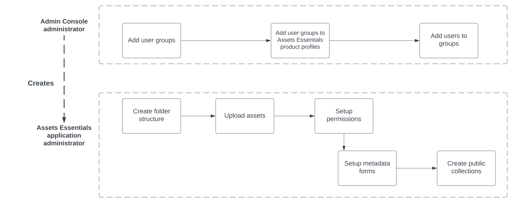

# 管理員[!DNL Assets Essentials]和新增使用者 {#administer}

[!DNL Adobe Experience Manager Assets Essentials] 由 Adobe 為其客戶佈建。佈建作業的一部分為在 [!DNL Adobe Admin Console] 中將 [!DNL Assets Essentials] 新增到客戶的組織。管理員使用 [!DNL Admin Console] 管理 [!DNL Assets Essentials] 解決方案的使用者權益，並指派應用程式管理員，以便在 [!DNL Assets Essentials] 中設定權限和中繼資料表單。

以下資料流程圖說明管理員為了設定和管理 Assets Essentials 所必須執行的一系列工作：

## 存取 Admin Console {#access-admin-console}

佈建 Assets Essentials 解決方案後，管理員便會從 Adobe 接收電子郵件。電子郵件包含歡迎訊息和開始使用的連結。此外，Adobe 會自動開始部署 Assets Essentials 的程序。部署程序需要一小時的時間完成。

從電子郵件中的連結，存取和登入 [Admin Console](https://adminconsole.adobe.com)。如果您擁有一個以上的組織帳戶的管理員存取權，請選取合適的組織，或使用[組織選擇器](https://helpx.adobe.com/tw/enterprise/using/admin-console.html)切換至該組織。自動部署程序完成後，[!DNL AEM Assets Essentials] 的產品卡會在 [!DNL Admin Console] 中顯示。

使用 Admin Console 執行以下使用者授權工作：

* [建立 Assets Essentials 應用程式管理員](#create-assets-essentials-administrator)

* [新增使用者群組](#add-user-groups)

* [將使用者群組新增至產品設定檔](#add-users-to-product-profiles)

### 建立 Assets Essentials 應用程式管理員 {#create-assets-essentials-administrator}

Admin Console 管理員必須將 Assets Essentials 管理員產品設定檔新增到使用者而不是使用者群組。Assets Essentials 應用程式管理員就可以管理工作，例如建立資料夾結構、上傳資產、設定權限、設定中繼資料表單和建立公開收藏集。有關如何將 Assets Essentials 應用程式管理員設定檔指派到使用者的資訊，請參閱[將產品設定檔使新增到使用者群組](#add-product-profiles-to-user-groups)。

### 新增使用者群組 {#add-user-groups}

建立使用者群組，然後將使用者指派至使用者群組。這些使用者群組可用於在 Assets Essentials 應用程式中設定檔案夾的權限。

如需有關如何管理使用者群組的資訊，請參閱 `Create user groups` 和 `Edit user groups` (可在[管理使用者群組](https://helpx.adobe.com/tw/enterprise/using/user-groups.html)中取得)。

>[!NOTE]
>
>如果您的 Admin Console 設定為利用外部系統來管理使用者/群組分配，例如 Azure 或 Google 連接器、使用者同步工具或 User Management Rest API，則您的群組和使用者指派會自動設定。如需詳細資訊，請參閱 [Adobe Admin Console 使用者](https://helpx.adobe.com/tw/enterprise/using/users.html)。

如需有關如何管理新增使用者至使用者群組的資訊，請參閱 `Add users to groups` (可在[管理使用者群組](https://helpx.adobe.com/tw/enterprise/using/user-groups.html#add-users-to-groups)中取得)。

### 將產品設定檔新增至使用者群組 {#add-product-profiles-to-user-groups}

將產品設定檔新增至使用者群組，讓使用者能存取 Assets Essentials 應用程式。

若要將產品設定檔新增至使用者群組：

1. 存取您組織的 [Admin Console](https://adminconsole.adobe.com)，按一下頂端列中的「**[!UICONTROL 產品]**」、按一下「**[!UICONTROL AEM Assets Essentials]**」，然後按一下 [!DNL Assets Essentials] 的執行個體。執行個體的名稱可能與下面的螢幕擷圖不同。
   >[!NOTE]
   >
   >[!DNL Cloud Manager] 執行個體僅供特殊管理員使用，例如檢查服務狀態和存取服務日誌，不能用於將使用者新增到產品中。

   

    [!DNL Assets Essentials] 擁有三種產品設定檔，代表管理員、一般和消費者使用者的存取權。

   * **[!DNL Assets Essentials]管理員**&#x200B;具備該應用程式的管理存取權。除了所有一般使用者功能外，該群組中的應用程式管理員還可以管理整個應用程式存放庫中任何檔案夾和群組/使用者的權限。

   * **[!DNL Assets Essentials]使用者**&#x200B;擁有完整使用者介面的存取權。這些使用者可以上傳、組織、標記和尋找數位資產。

   * **[!DNL Assets Essentials]消費者使用者**可以在 Assets Essentials 中執行尋找、預覽和下載操作。他們還可以在 Adobe Journey Optimizer 中尋找和選取資產，並尋找和選取要在 Workfront 中使用的資產。
如需詳細資訊，請參閱[與其他解決方案的整合](integration.md)。

   

1. 若要將使用者群組新增到產品，請按一下三個 Assets Essentials 產品設定檔之一、選取「**[!UICONTROL 新增使用者]**」、提供使用者群組詳細資料，然後按一下「**[!UICONTROL 儲存]**」。

   

   新增使用者時，使用者會收到開始使用的電子郵件邀請。您可以在 [!DNL Admin Console] 中的產品設定檔設定中關閉電子郵件邀請。

   >[!NOTE]
   >
   >您必須將使用者新增到 Admin Console 中的管理員 Assets Essentials 產品設定檔，他們才能在 Assets Essentials 應用程式中執行管理工作。這些工作包括[建立檔案夾結構](#create-folder-structure)、[管理檔案夾權限](#manage-permissions-for-folders)和[設定中繼資料表單](#metadata-forms)。

## 存取 Assets Essentials 應用程式 {#access-assets-essentials-application}

在 Admin Console 中執行使用者授權後，您可以存取 Assets Essentials 應用程式以執行以下工作：

* [建立檔案夾結構](#create-folder-structure)

* [上傳資產](#upload-assets)

* [管理檔案夾的權限](#manage-permissions-for-folders)

* [設定中繼資料表單](#metadata-forms)

* [建立公開收藏集](#create-public-collections)

### 建立檔案夾結構 {#create-folder-structure}

您可以使用下列方法在 Assets Essentials 存放庫中建立檔案夾結構：

* 按一下工具列中的&#x200B;**[!UICONTROL 建立檔案夾]**&#x200B;選項，即可建立空的檔案夾。

* 按一下工具列中的&#x200B;**[!UICONTROL 新增資產]**&#x200B;選項，即可[上傳本機中現有的檔案夾結構](add-delete.md)。

建立一個適合組織業務目標的檔案夾結構。如果您要將現有的檔案夾結構上傳到 Assets Essentials 存放庫，則應查看該結構。如需詳細資訊，請參閱[有效權限管理的最佳檔案夾結構實務](permission-management-best-practices.md##folder-structure-assets-essentials)。

您可以為您的組織使用多種可能的檔案夾結構類型。以下是一些典型的檔案夾結構範例：

>[!NOTE]
>
>為了能夠管理這些工作，尤其是管理權限，您的使用者必須具有應用程式管理權限 - 需要將其新增到[管理員 Assets Essentials 產品設定檔](#add-users-to-product-profiles)中。

### 上傳資產 {#upload-assets}

若要新增要使用的新資產，請從您的本機檔案系統上傳一些資產。您可以在使用者介面上拖放資產或檔案夾並按照畫面上的指示進行操作，或者點擊工具列中的「**[!UICONTROL 新增資產]**」選項並將一些檔案新增到上傳對話框。雖然 [!DNL Assets Essentials] 提供強大的全文搜尋功能，但您也可以使用檔案夾更妥善組織您的資產。如需詳細資訊，請參閱 [上傳資產](add-delete.md)。

### 管理檔案夾的權限 {#manage-permissions-for-folders}

Assets Essentials 可讓管理員管理存放庫中檔案夾的存取層級。 身為管理員，您可建立使用者群組並指派權限給這些群組，以管理存取層級。您還可以將權限管理權委派給檔案夾層級的使用者群組。

>[!VIDEO](https://video.tv.adobe.com/v/341104)

如需詳細資訊，請參閱[管理檔案夾的權限](manage-permissions.md)。

### 設定中繼資料表單 (選用) {#metadata-forms}

Assets Essentials 預設為提供許多標準中繼資料欄位。組織擁有其他中繼資料需求，並需要更多中繼資料欄位以新增特定企業中繼資料。中繼資料表單可讓企業將自訂中繼資料欄位新增到資產的[!UICONTROL 詳細資訊]頁面。特定企業中繼資料能夠改善其資產的控管和探索。您可以從頭開始建立表單，或改變現有表單的用途。

您可以為不同的資產類型 (不同的 MIME 類型) 設定中繼資料表單。使用與檔案的 MIME 類型相同的表單名稱。Essentials 會自動比對上傳的資產 MIME 類型與表單的名稱，並根據表單欄位更新已上傳資產的中繼資料。

例如，如果存在名稱為 `PDF` 或 `pdf` 的中繼資料表單，則上傳的 PDF 文件會包含如表單中定義的中繼資料欄位。

如需詳細資訊，請參閱 [中繼資料表單](metadata.md#metadata-forms)。

>[!VIDEO](https://video.tv.adobe.com/v/341275)

如需中繼資料表單的詳細資訊，請參閱 [Assets Essentials 中的中繼資料表單](metadata.md#metadata-forms)。

### 建立公開收藏集 (選用) {#create-public-collections}

收藏集是 Experience Manager Assets Essentials 中的一組資產。使用收藏集在使用者之間共用資產。

和檔案夾不同，收藏集可包含來自不同位置的資產。您可以和使用者共用多個收藏集。每個收藏集都包含資產的參考資料。資產的參考完整性會跨越收藏集來維護。如需詳細資訊，請參閱 [管理收藏集](manage-collections.md)。

## 後續步驟 {#next-steps}

<!-- THIS URL IS A 404 ERROR; NO REDIRECT WAS PUT IN PLACE * [Watch a video to deploy Assets Essentials](https://experienceleague.adobe.com/docs/experience-manager-learn/assets-essentials/provisioning.html?lang=en) -->

* 使用 Assets Essentials 使用者介面中所提供的[!UICONTROL 意見回饋]選項提供產品意見回饋

* 若要提供文件意見回饋，請使用右側邊欄提供的[!UICONTROL 編輯此頁面]或[!UICONTROL 記錄問題]

* 連絡[客戶服務](https://experienceleague.adobe.com/?support-solution=General#support)

>[!MORELIKETHIS]
>
>* [[!DNL Admin Console] 說明](https://helpx.adobe.com/tw/enterprise/using/admin-console.html)
>* [[!DNL Cloud Manager] 說明](https://experienceleague.adobe.com/docs/experience-manager-cloud-manager/using/introduction-to-cloud-manager.html?lang=zh-Hant)
>* [Adobe Journey Optimizer 文件](https://experienceleague.adobe.com/docs/journey-optimizer/using/ajo-home.html?lang=zh-Hant)
>* [發行說明](release-notes.md)
>* [開始使用 [!DNL Assets Essentials]](get-started.md)
