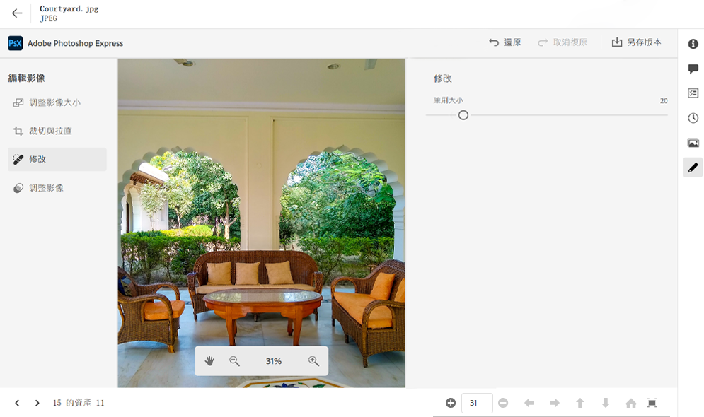
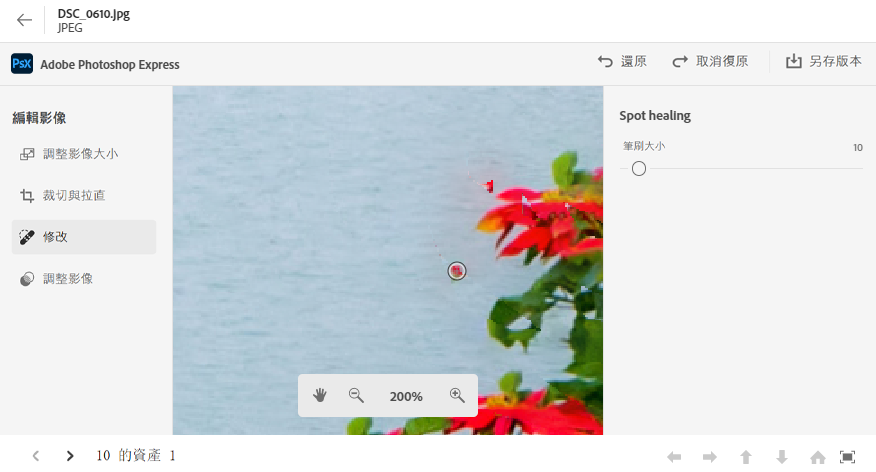
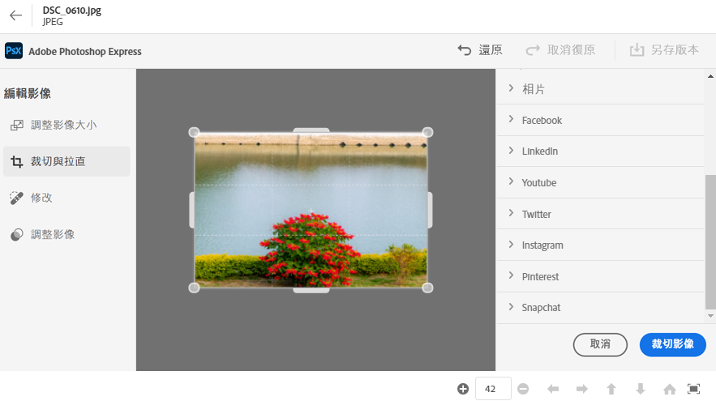
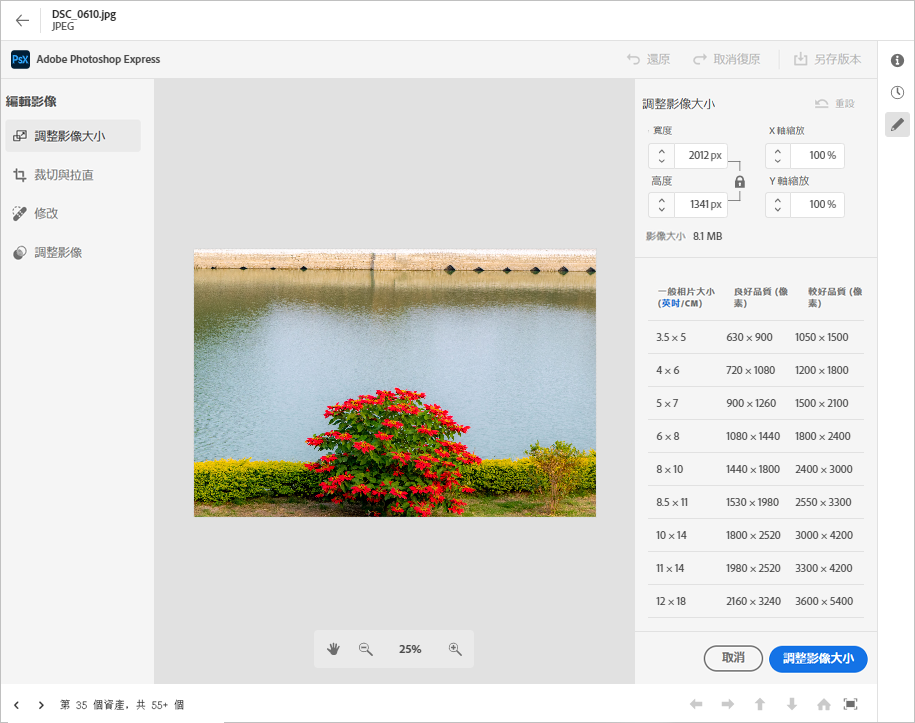
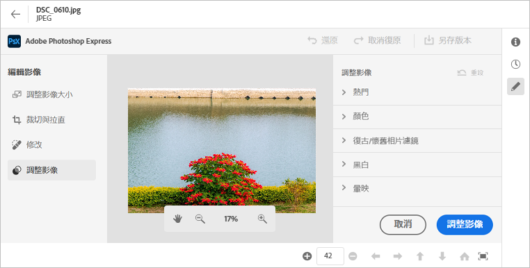

# 在 [!DNL Assets Essentials] 中編輯影像 {#edit-images-in-assets-essentials}

Assets Essentials UI可讓您編輯基本影像，包括調整大小、移除背景、裁切，以及在JPEG和PNG格式之間轉換。 此外，它可透過與 Adobe Express 的整合，進行進階編輯。編輯影像後，即可將新影像另存新版。版本設定功能有助於您稍後在必要時還原成原始資產。要編輯影像，[開啟其預覽](https://experienceleague.adobe.com/tw/docs/experience-manager-assets-essentials/help/navigate-view#preview-assets)，然後按一下「**編輯影像**」。

>[!NOTE]
>
>您可以使用 Adobe Express 編輯 PNG 和 JPEG 檔案類型的影像。

<!--The editing actions that are available are Spot healing, Crop and straighten, Resize image, and Adjust image.-->

## 編輯影像 {#edit-images}

登陸Assets Essentials UI，使用連結 —  [ASSETS ESSENTIALS UI](https://experience.adobe.com/#/assets) 並選取正確的存放庫。 若要獲得存取權，請聯絡您組織的管理員。
如需其他參考資訊，請參閱 —  [開始使用Adobe Experience Manager Assets Essentials](https://experienceleague.adobe.com/tw/docs/experience-manager-assets-essentials/help/get-started)， [瞭解使用者介面](https://experienceleague.adobe.com/tw/docs/experience-manager-assets-essentials/help/navigate-view)， [Assets essentials使用案例](https://experienceleague.adobe.com/tw/docs/experience-manager-assets-essentials/help/get-started#use-cases) 和 [已知問題](https://experienceleague.adobe.com/tw/docs/experience-manager-assets-essentials/help/release-notes).
<!--
>[!CONTEXTUALHELP]
>id="assets_express_integration"
>title="Adobe Express Integration"
>abstract="Easy and intuitive image-editing tools powered by Adobe Express available directly within AEM Assets to increase content reuse and accelerate content velocity."-->

### 使用 Adobe Express 在 Essentials UI 上編輯影像 {#edit-image-on-essentials-ui-using-adobe-express}

登陸 Essentials UI 後，按一下&#x200B;**資產**，選取一個影像，然後按一下頂部邊欄中的&#x200B;**編輯**。新畫面顯示可用的編輯選項，包括調整大小、背景移除、裁切，以及 JPEG 和 PNG 格式之間的轉換。

#### 調整影像大小 {#resize-image-using-express}

熱門的使用案例是將影像調整成特定大小。Assets Essentials 可讓您快速調整影像大小，為特定相片大小提供預先計算好的新解析度，以符合常見的相片大小。若要使用 Assets Essentials 調整影像大小，請按照以下步驟操作：

1. 按一下左窗格中的&#x200B;**調整影像大小**。
2. 從「調整大小」下拉清單選取適當的社交媒體平台，然後從顯示的選項中選擇影像大小。
3. 如果需要，使用「**影像比例**」欄位來縮放影像。
4. 按一下「**套用**」以套用您的變更。
   

   您已編輯的影像可供下載。您可以將編輯後的資產另存為同一資產的新版本，也可以將其另存為新資產。
   

#### 移除背景 {#remove-background-using-express}

您可以依照下方所述步驟移除影像中的背景：

1. 按一下左窗格中的&#x200B;**移除背景**。Experience Manager Assets 會顯示沒有背景的影像。
2. 按一下「**[!UICONTROL 套用]**」以套用您的變更。
   

   您編輯的影像可供下載。您可以將編輯後的資產另存為同一資產的新版本，也可以將其另存為新資產。

#### 裁切影像 {#crop-image-using-express}

使用嵌入式 [!DNL Adobe Express] 快速動作可簡單地將影像轉換為完美大小。

1. 按一下左窗格中的&#x200B;**[!UICONTROL 裁切影像]**。
2. 拖曳影像角落上的控點，建立所要的裁切大小。
3. 按一下「**[!UICONTROL 套用]**」。
   
裁切後的影像可供下載。您可以將編輯後的資產另存為同一資產的新版本，也可以將其另存為新資產。

#### 在影像檔案類型之間轉換 {#convert-image-types-using-express}

您可以使用 Adobe Express 在 JPEG 和 PNG 影像格式之間快速轉換。執行以下步驟：

1. 按一下左窗格中的&#x200B;**將 JPEG 轉換為 PNG** 或&#x200B;**將 PNG 轉換為 JPEG**。
   
2. 按一下「**[!UICONTROL 下載]**」。

#### 限制 {#limitations-adobe-express}

* 支援的影像解析度：最小 - 每維度 50 像素，最大 - 每維度 6000 像素。
* 支援的檔案大小上限：17 MB。

### 在 Adobe Express 嵌入式編輯器中編輯影像 {#edit-images-in-adobe-express-embedded-editor}

擁有 Express 權益的使用者可以使用 Assets Essentials UI 中的嵌入式 Express 編輯器輕鬆編輯內容，並使用 Adobe Firefly 的 GenAI 建立新內容。這讓使用者更能重複使用內容，並加快建立內容的速度。您還可以使用預先定義的元素賦予資源令人驚嘆的效果，或者只需點擊幾下即可執行快速動作來編輯影像。

若要使用 Adobe Express 嵌入式編輯器編輯影像，請依照下列步驟操作：

1. 透過連結登入AEM Assets Essentials UI - [AEM Assets Essentials UI](https://experience.adobe.com/#/assets) 並選取正確的存放庫。
1. 按一下&#x200B;**資產**，進入資料夾，然後選取影像。
1. 按一下「**在 Adobe Express 中開啟**」。影像在 Express 畫布上開啟。
1. 對影像進行所需的編輯。
1. 如果您的專案需要您新增更多頁面，請按一下 **新增**，選取資產，輸入資料夾，選取要帶入畫布頁面的影像，然後對影像執行所需的編輯。
1. 若要儲存影像，按一下「**儲存**」。儲存對話框隨即顯示。

   >[!NOTE]
   >
   > **1. 對於單頁**
   >
   > **另存新版本：**此功能僅支援儲存單一資產。選取此選項可將影像匯出為新版本 (保留原始格式)，並將其儲存在同一資料夾中。
   > **另存為新資產：**&#x200B;選取此選項能以非原始格式將資產匯出，並將其做為新資產儲存在任何資料夾中。
   >  
   > **2. 對於多頁**
   >
   > **另存新版本：**&#x200B;此功能僅支援儲存單一資產。如果您想要儲存多個頁面中的單一頁面，請選取此選項以其原始格式和位置儲存資產。\
   > **另存為新資產：**&#x200B;使用此選項，您可以將多個資產或單一資產匯出到任何資料夾，並使用原始檔案格式或不同的檔案格式，將其另存為新資產。

1. 在「儲存」對話框中：
   1. 在&#x200B;**另存新檔**&#x200B;欄位中輸入檔案名稱。
   1. 選取目的地資料夾。
   1. 選擇性：提供專案或行銷活動名稱、關鍵字、管道、時間範圍和區域等詳細資訊。
1. 按一下&#x200B;**另存新版本**&#x200B;或&#x200B;**另存為新資產**&#x200B;以儲存資產。

#### 在 Express 編輯器中編輯影像的限制 {#limitations-of-editing-images-in-the-express-editor}

* 支援的檔案類型：JPEG 或 PNG。
* 支援的檔案大小上限：40 MB。
* 支援的寬度和高度範圍：50 到 8000 像素之間。
* 重新載入頁面即可查看來源資料夾中最新儲存的新資產。

### 使用 Adobe Express 建立新資產 {#create-new-assets-using-embedded-editor}

Assets Essentials 可讓您使用 Adobe Express 嵌入式編輯器從頭開始建立新範本。若要使用 Adobe Express 建立新資產，請執行以下步驟：

1. 瀏覽到「**我的工作區**」，然後在 Adobe Express 橫幅中按一下「**建立**」，該橫幅顯示在 Adobe Express 上方。Adobe Express 空白畫布會顯示在 Assets Essentials 使用者介面中。
1. 使用「[範本](https://helpx.adobe.com/tw/express/using/work-with-templates.html)」建立您的內容。否則，請瀏覽至「您的資料」以修改現有內容。
1. 完成編輯後，按一下「**儲存**」。
1. 為建立的資產指定目的地路徑，然後按一下「**另存為新資產**」。

#### 限制 {#limitations}

* 您只能修改 `JPEG` 和 `PNG` 格式類型的影像。
* 資產大小必須小於 40 MB。
* 您可以將影像儲存為 `PDF`、`JPEG` 或 `PNG` 格式。

<!--
## Edit images using [!DNL Adobe Photoshop Express] {#edit-using-photoshop-express}

<!--
After editing an image, you can save the new image as a new version. Versioning helps you to revert to the original asset later, if needed. To edit an image, [open its preview](/help/using/navigate-view.md#preview-assets) and click **[!UICONTROL Edit Image]**  from the rail on the right.

*Figure: The options to edit images are powered by [!DNL Adobe Photoshop Express].*
-->
<!--
### Spot heal images {#spot-heal-images-using-photoshop-express}

If there are minor spots or small objects on an image, you can edit and remove the spots using the spot healing feature provided by Adobe Photoshop.

The brush samples the retouched area and makes the repaired pixels blend seamlessly into the rest of the image. Use a brush size that is only slightly larger than the spot you want to fix.

<!-- 
TBD: See if we should give backlinks to PS docs for these concepts.
For more information about how Spot Healing works in Photoshop, see [retouching and repairing photos](https://helpx.adobe.com/photoshop/using/retouching-repairing-images.html). 
-->
<!--
### Crop and straighten images {#crop-straighten-images-using-photoshop-express}

Using the crop and straighten option that you can do basic cropping, rotate image, flip it horizontally or vertically, and crop it to dimensions suitable for popular social media websites.

To save your edits, click **[!UICONTROL Crop Image]**. After editing, you can save the new image as a version.

Many default options let you crop your image to the best proportions that fit various social media profiles and posts.

### Resize image {#resize-image-using-photoshop-express}

You can view the common photo sizes in centimeters or inches to know the dimensions. By default, the resizing method retains the aspect ratio. To manually override the aspect ratio, click .

Enter the dimensions and click **[!UICONTROL Resize Image]** to resize the image. Before you save the changes as a version, you can either undo all the changes done before saving by clicking [!UICONTROL Undo] or you can change the specific step in the editing process by clicking [!UICONTROL Revert].

### Adjust image {#adjust-image-using-photoshop-express}

[!DNL Assets Essentials] lets you adjust the color, tone, contrast, and more, with just a few clicks. Click **[!UICONTROL Adjust image]** in the edit window. The following options are available in the right sidebar:

* **Popular**: [!UICONTROL High Contrast & Detail], [!UICONTROL Desaturated Contrast], [!UICONTROL Aged Photo], [!UICONTROL B&W Soft], and [!UICONTROL B&W Sepia Tone].
* **Color**: [!UICONTROL Natural], [!UICONTROL Bright], [!UICONTROL High Contrast], [!UICONTROL High Contrast & Detail], [!UICONTROL Vivid], and [!UICONTROL Matte].
* **Creative**: [!UICONTROL Desaturated Contrast], [!UICONTROL Cool Light], [!UICONTROL Turquoise & Red], [!UICONTROL Soft Mist], [!UICONTROL Vintage Instant], [!UICONTROL Warm Contrast], [!UICONTROL Flat & Green], [!UICONTROL Red Lift Matte], [!UICONTROL Warm Shadows], and [!UICONTROL Aged Photo].
* **B&W**: [!UICONTROL B&W Landscape], [!UICONTROL B&W High Contrast], [!UICONTROL B&W Punch], [!UICONTROL B&W Low Contrast], [!UICONTROL B&W Flat], [!UICONTROL B&W Soft], [!UICONTROL B&W Infrared], [!UICONTROL B&W Selenium Tone], [!UICONTROL B&W Sepia Tone], and [!UICONTROL B&W Split Tone].
* **Vignetting**: [!UICONTROL None], [!UICONTROL Light], [!UICONTROL Medium], and [!UICONTROL Heavy].

<!--
TBD: Insert a video of the available social media options.
-->

### 後續步驟 {#next-steps}

* 使用 Assets Essentials 使用者介面中所提供的[!UICONTROL 意見回饋]選項提供產品意見回饋

* 若要提供文件意見回饋，請使用右側邊欄提供的[!UICONTROL 編輯此頁面]或[!UICONTROL 記錄問題]

* 連絡[客戶服務](https://experienceleague.adobe.com/?support-solution=General#support)

>[!MORELIKETHIS]
>
>* [檢視資產的版本記錄](/help/using/navigate-view.md)
