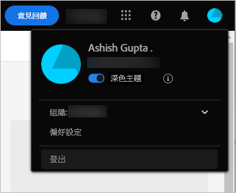
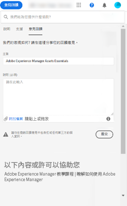

# 開始使用 [!DNL Adobe Experience Manager Assets Essentials] {#assets-essentials-get-started}

<!-- TBD: Make links for these steps. -->

僅需三個簡易步驟，即可使用 [!DNL Assets Essentials] 管理數位資產：

* **步驟 1**：[上傳](/help/using/add-delete.md)和[檢視](/help/using/navigate-view.md)資產。
* **步驟 2**：[搜尋](/help/using/search.md)和[下載](/help/using/manage-organize.md#download)資產。
* **步驟 3**：[管理和組織](/help/using/manage-organize.md)資產。

若要使用 [!DNL Assets Essentials]，請在 [https://experience.adobe.com/#/assets](https://experience.adobe.com/#/assets) 登入。登入時，選取「`Company or School Account`」。若要獲得存取權，請聯絡您組織的管理員。

此外，更多實用的參考資訊為[了解使用者介面](/help/using/navigate-view.md)、[使用案例清單](#use-cases)<!-- TBD: [supported file types](/help/using/supported-file-formats.md), -->和[已知問題](/help/using/release-notes.md#known-issues)。

## 獲得 [!DNL Assets Essentials] 的存取權 {#get-access}

Adobe 提供解決方案並將您組織的指定人員新增為管理員。管理員可以使用 [[!DNL Admin Console]](https://helpx.adobe.com/tw/enterprise/using/admin-console.html) 提供存取權給組織的各種使用者。若是存取權的相關請求，請聯絡您組織的管理員。

登入時，在提供認證後，[!DNL Assets Essentials] 會提示您選取一個帳戶。在此情況下，請選取「`Company or School Account`」以繼續進行。

## 設定 [!DNL Assets Essentials] {#configuration}

若要開啟偏好設定，請按一下使用者介面右上角的顯示圖片。您可以切換解決方案偏好設定中的淺色和深色主題。

如果您是不同組織的一部分，您也可以變更組織並橫跨各種組織存取您的帳戶。

若要變更您的 [!UICONTROL Experience Cloud 偏好設定]，請按一下[!UICONTROL 偏好設定]。

## [!DNL Assets Essentials] 使用案例 {#use-cases}

以下為您可以使用 [!DNL Assets Essentials] 完成的各種數位資產管理 (DAM) 任務。

| 使用者任務 | 功能和操作說明資訊 |
|-----|------|
| 瀏覽和檢視資產 | <ul> <li>[瀏覽存放庫](/help/using/navigate-view.md#view-assets-and-details) </li> <li> [預覽資產](/help/using/navigate-view.md#preview-assets) <li> [檢視資產的轉譯](/help/using/add-delete.md#renditions) </li> <li>[檢視資產的版本](/help/using/manage-organize.md#view-versions)</li></ul> |
| 新增新資產 | <ul> <li>[上傳新資產和資料夾](/help/using/add-delete.md#add-assets)</li> <li>[監視上傳進度和管理上傳](/help/using/add-delete.md#upload-progress)</li> <li>[解除重複項目](/help/using/add-delete.md#resolve-upload-fails)</li> </ul> |
| 更新資產或相關資訊 | <ul> <li>[編輯影像](/help/using/edit-images.md)</li> <li>[建立版本](/help/using/manage-organize.md#create-versions)和[檢視版本](/help/using/manage-organize.md#view-versions)</li> <li>[編輯影像](/help/using/edit-images.md)</li> </ul> |
| 編輯資產 | <ul> <li>[使用 Adobe Photoshop Express 在瀏覽器內進行編輯](/help/using/edit-images.md)</li> <li>[裁切以供社交媒體基本資料使用](/help/using/edit-images.md#crop-straighten-images)</li> <li>[檢視和管理版本](/help/using/manage-organize.md#view-versions)</li> <li>[使用 [!DNL Adobe Asset Link]](/help/using/integration.md#integrations)</ul></ul> |
| 在存放庫中搜尋資產 | <ul> <li>[在特定資料夾中搜尋](/help/using/search.md#refine-search-results)</li> <li>[已儲存搜尋](/help/using/search.md#saved-search)</li> <li>[搜尋最近檢視的資產](/help/using/search.md)</li> <li>[全文檢索搜尋](/help/using/search.md) |
| 下載資產 | <ul> <li> [預覽資產](/help/using/navigate-view.md#preview-assets) </li> <li> [下載資產](/help/using/manage-organize.md#download) <li> [下載轉譯](/help/using/add-delete.md#renditions) </li></ul> |
| 中繼資料作業 | <ul> <li>[檢視詳細的中繼資料](/help/using/metadata.md) </li> <li> [更新中繼資料](/help/using/metadata.md#update-metadata)</li> <li> [建立新的中繼資料表單](/help/using/metadata.md#metadata-forms) </li> </ul> |
| 與其他解決方案的整合 | <ul> <li>[使用  [!DNL Adobe Journey Optimizer]](/help/using/integration.md) 中的資產選擇器</li> <li>[[!DNL Adobe Asset Link] 的 [!DNL Creative Cloud]](/help/using/integration.md)</li> <li>[ 與  [!DNL Adobe Workfront]](/help/using/integration.md) 整合</li> </ul> |

## 後續步驟 {#next-steps}

* [觀看開始使用 Assets Essentials 的相關影片](https://experienceleague.adobe.com/docs/experience-manager-learn/assets-essentials/getting-started.html?lang=zh-Hant)

* 使用 Assets Essentials 使用者介面中所提供的[!UICONTROL 意見回饋]選項提供產品意見回饋

* 若要提供文件意見回饋，請使用右側邊欄提供的[!UICONTROL 編輯此頁面]或[!UICONTROL 記錄問題]

* 連絡[客戶服務](https://experienceleague.adobe.com/zh-hant?support-solution=General#support)

<!--TBD: Merge the below rows in the table when the use cases are documented/available.

| How do I delete assets? | <ul> <li>[Delete assets](/help/using/manage-organize.md)</li> <li>Recover deleted assets</li> <li>Permanently delete assets</li> </ul> |
| How do I share assets or find shared assets? | <ul> <li>Shared by me</li> <li>Shared with me</li> <li>Share for comments and review</li> <li>Unshare assets</li> </ul> |
| How do I collaborate with others and get my assets reviewed | <ul> <li>Share for review</li> <li>Provide comments. Resolve and filter comments</li> <li>Annotations on images</li> <li>Assign tasks to specific users and prioritize</li> </ul> |

-->

<!-- 

##  Provide product feedback {#provide-feedback}

Adobe welcomes feedback about the solution. To provide feedback without even switching your working application, use the [!UICONTROL Feedback] option in the user interface. It also lets you attach files such as screenshots or video recording of an issue.

  

To provide feedback for documentation, click [!UICONTROL Edit this page]  or [!UICONTROL Log an issue]  from the right sidebar. You can do one of the following: 

* Make the content updates and submit a GitHub pull request.
* Create an issue or ticket in GitHub. Retain the automatically populated article name when creating an issue.

-->

>[!MORELIKETHIS]
>
>* [了解使用者介面](/help/using/navigate-view.md)。
>* [發行說明和已知問題](/help/using/release-notes.md)。

<!-- TBD: 
>* [Supported file types](/help/using/supported-file-formats.md).
-->
