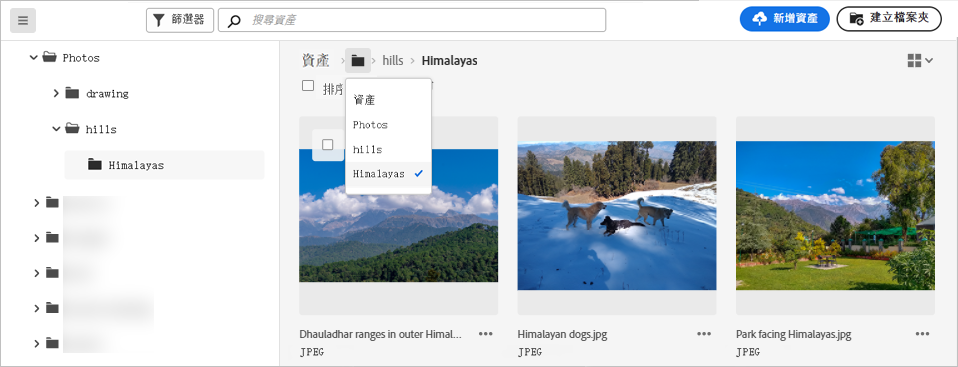
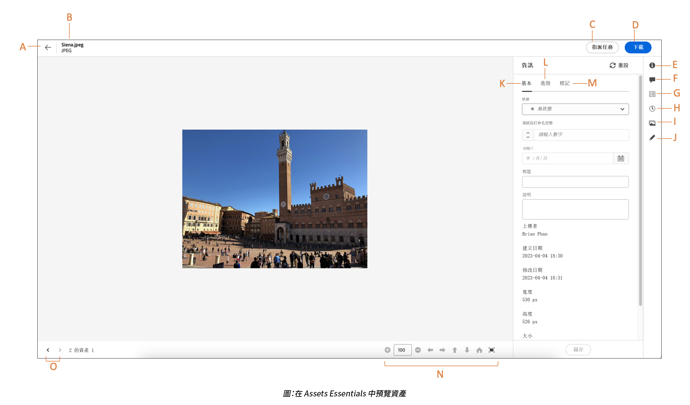

# 導覽至檔案和資料夾，並檢視資產 {#view-assets-and-details}

<!-- TBD: Give screenshots of all views with many assets. Zoom out to showcase how the thumbnails/tiles flow on the UI in different views. -->

<!-- TBD: The options in left sidebar may change. Shared with me and Shared by me are missing for now. Update this section as UI is updated. -->

## 了解 [!DNL Assets Essentials] 使用者介面 {#understand-interface-navigation}

[!DNL Assets Essentials] 提供直覺式的人性化使用者介面。清爽的介面有助於輕鬆找到並記住資產和相關資訊。

登入 [!DNL Assets Essentials] 時，您會看到以下介面。

![[!DNL Assets Essentials] 使用者介面](assets/essentials-interface.png)

*A：左側邊欄用於瀏覽存放庫並提供對其他一些選項的存取*
*B：顯示或收合左側邊欄以增加資產檢視區域*
*C：篩選搜尋結果*
*D：選取所選資料夾的所有內容*
*E：用於排序資產的選項*
*F：搜尋方塊*
*G：使用`Add Assets`按鈕上傳或拖放檔案*
*H：新建資料夾*
*I：切換不同視圖*

<!-- TBD: Need an embedded video here with narration. It has to be hosted on MPC to be embeddable. -->

## 瀏覽和檢視資產和資料夾 {#browse-repository}

您可以從主要使用者介面或左側邊欄瀏覽資料夾。瀏覽時，您可以使用介面檢視資產縮圖，以瀏覽存放庫或檢視資產詳細資訊，快速找到您想要的資產。在左側邊欄中可用的選項包括：

* [我的工作區](https://experienceleague.adobe.com/docs/experience-manager-assets-essentials/help/my-workspace.html?lang=en)：Assets 現在包含一個可自訂的工作區，提供 Widget 以方便存取資產使用者介面的關鍵區域以及與您最相關的資訊。 此頁面可用作一站式解決方案，提供工作項目的概觀並讓您快速存取關鍵工作流程。更方便地存取這些選項可以提高您的效率和內容速度。
* [任務](https://experienceleague.adobe.com/docs/experience-manager-assets-essentials/help/my-workspace.html?lang=en)：您可以在&#x200B;**我的任務**&#x200B;標籤下檢視指派給您的任務。而您建立的任務則顯示在&#x200B;**指派的任務**&#x200B;標籤下。 此外，您完成的任務位於&#x200B;**已完成的任務**&#x200B;標籤下。
* [資產](https://experienceleague.adobe.com/docs/experience-manager-assets-essentials/help/manage-organize.html?lang=en)：在樹狀目錄檢視中您可以存取的所有資料夾清單。
* **最近檢視的項目**：您最近預覽的資產清單。[!DNL Assets Essentials] 只會顯示您預覽的資產。在瀏覽存放庫檔案或資料夾時，不會顯示捲動過去的資產。
* [收藏集](https://experienceleague.adobe.com/docs/experience-manager-assets-essentials/help/manage-collections.html?lang=zh-Hant)：收藏集是 Adobe Experience Manager Assets Essentials 中一連串的資產、檔案夾或其他集合。 使用收藏集在使用者之間共用資產。和檔案夾不同，收藏集可包含來自不同位置的資產。您可以和使用者共用多個收藏集。每個收藏集都包含資產的參考資料。資產的參考完整性會跨越收藏集來維護。

* [Insights](https://experienceleague.adobe.com/docs/experience-manager-assets-essentials/help/manage-reports.html?lang=en#view-live-statistics)：在[!DNL Assets Essentials]，您可以在儀表板上檢視即時深入分析。Assets Essentials 使您能夠使用 Insights 儀表板查看 Assets Essentials 環境的即時資料。您可以查看過去 30 天或過去 12 個月的即時事件度量。
* **垃圾桶**：列出從 **[!UICONTROL Assets]** 根資料夾刪除的資產。 您可以在「垃圾桶」資料夾中選取資產，將其還原到原始位置或永久刪除。您也可以指定關鍵字或套用標準或自訂篩選條件，以搜尋「垃圾桶」資料夾中的適當資產。有關使用標準和自訂篩選條件的更多資訊，請參閱[在 Assets Essentials 中搜尋資產](search.md)。
* **設定**：您可以使用&#x200B;**設定**&#x200B;來設定 Assets Essentials 的各種選項，例如中繼資料表單、報告和分類法管理。

<!-- TBD: Not sure if we want to publish these right now. CC Libs are beta as per Greg.
* **Libraries**: Access to [!DNL Adobe Creative Cloud Team] (CCT) Libraries view. This view is visible only if the user is entitled to CCT Libraries.
-->

<!-- TBD: My Work Space shows task inbox and it is not visible on AEM Cloud Demos as of now. It is the source of truth server hence not documenting My Work Space option for now.
-->

您可以開啟或摺疊左側邊欄，以增加可用的資產檢視區域。

在 [!DNL Assets Essentials] 中，您可以在四種不同的版面類型中檢視資產、資料夾和搜尋結果。

*  [!UICONTROL 清單檢視]
*  [!UICONTROL 格點檢視]
*  [!UICONTROL 圖庫檢視]
*  [!UICONTROL 瀑布檢視]

若要找到資產，您可以依照 `Name`、`Relevancy`、`Size`、`Modified` 和 `Created` 的遞增或遞減順序排序資產。

若要導覽到資料夾，請按兩下資料夾的縮圖，或從左側邊欄選取該資料夾。若要檢視資料夾的詳細資訊，請選取該資料夾，或從頂部的工具列按一下「詳細資訊」。若要向上和向下瀏覽階層，請使用左側邊欄或頂部的階層連結。

*圖：若要瀏覽階層，請使用頂部的階層連結或左側邊欄。*

## 預覽資產 {#preview-assets}

使用、分享或下載資產前，您可以更密切地檢視資產。預覽功能不僅可讓您檢視影像，也可以檢視一些其他支援的資產類型。

若要預覽資產，請選取該資產，然後從頂部的工具列按一下「[!UICONTROL 詳細資訊]」。您不僅可以檢視資產，也可以檢視其詳細的中繼資料並採取其他動作。

*A：返回目前資料夾或存放庫中的目前搜尋結果*
*B：您正在預覽的檔案名稱和格式*
*C：指派任務*
*D：下載資產*
*E：預覽資產並查看中繼資料資訊*
*D：進階中繼資料*
*E：關鍵字和智慧型標記*
*F：註解和註釋*
*G：檢視與所選資產相關的任務*
*H：檢視和管理版本*
*I：檢視影像轉譯*
*J：編輯影像*
*K：基本中繼資料*
*L：進階中繼資料*
*M：關鍵字和智慧型標記*
*N：更仔細地預覽。 縮放、全螢幕和其他選項*
*O：繼續至目前資料夾內的上一個或下一個資產，無須返回資料夾。*

您也可以預覽影片。

如果您明確預覽資產，[!DNL Assets Essentials] 則會將該資產顯示為最近檢視的資產。

<!-- TBD: Describe the options.

Explicitly previewed assets are displayed as recently viewed assets. Give screenshot of this.
Other use cases after previewing.
-->

## 設定「資產清單」檢視的欄顯示 {#configure-columns-list-view}

您可以選取在「資產清單」檢視中顯示的欄，例如「狀態」、「格式」、「Dimension」、「大小」等：

1. 選取 **[!UICONTROL 資產]** 從左側導覽窗格，切換至資產清單檢視，然後按一下 .

1. 選取您需要在「清單」檢視中顯示的欄，然後按一下 **[!UICONTROL 確認]**.

   

## 後續步驟 {#next-steps}

* 使用 Assets Essentials 使用者介面中所提供的[!UICONTROL 意見回饋]選項提供產品意見回饋

* 若要提供文件意見回饋，請使用右側邊欄提供的[!UICONTROL 編輯此頁面]或[!UICONTROL 記錄問題]

* 連絡[客戶服務](https://experienceleague.adobe.com/?support-solution=General#support)

>[!MORELIKETHIS]
>
>* [檢視資產的版本](/help/using/manage-organize.md#view-versions)。
