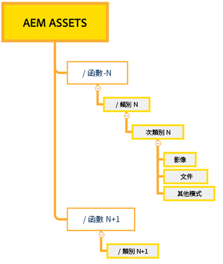
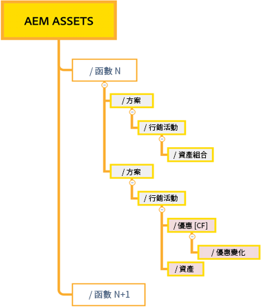
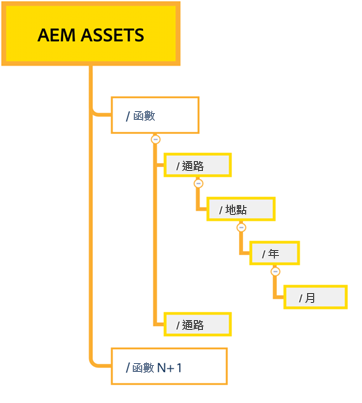

# 有效權限管理的最佳實務 {#best-practices-permissions-management}

作為管理員，在您開始管理 Assets Essentials 存放庫的檔案夾權限之前，您可以實作各種最佳實務，以便管理員和一般使用者日後在管理操作時能以直覺的方式使用基礎結構。

您可以整合這些最佳實務，同時：

* [在 Admin Console 中建立使用者群組](#admin-console-best-practices)

* [在 Assets Essentials 存放庫中建立檔案夾結構](#folder-structure-assets-essentials)

* [管理 Assets Essentials 存放庫中的權限](#folder-permissions)

## Admin Console {#admin-console-best-practices}

根據組織中的使用者群組識別存取需求。為組織規劃和建立使用者群組，並將使用者新增至這些組織。根據使用者群組而非個別使用者來管理檔案夾權限較為容易。

## Assets Essentials 存放庫中的檔案夾結構 {#folder-structure-assets-essentials}

當您開始計畫在 Assets Essentials 存放庫中建立檔案夾結構時，請考慮以下幾點：

* 未來的控管：由管理員控管的檔案夾以及[將擁有者權限委派給其他使用者的檔案夾](manage-permissions.md##manage-permissions-folders)。

* 可擴充性：檔案夾結構應符合您組織的未來需求，並且應易於擴充。

* 大小：一個檔案夾不能包含太多資產。這可能會導致可用性問題並可能變得難以管理。

* 直覺性：檔案夾結構應易於瀏覽，並且一般使用者能以直覺的方式操作。使用者應該能夠輕鬆識別在檔案夾結構中上傳新資產的位置。

您可以為您的組織使用多種可能的檔案夾結構類型。以下是一些典型的檔案夾結構範例：

* 以功能和分類為基礎

  

* 以活動為基礎

  

* 以提供位置 (或通路) 為基礎

  

## 檔案夾權限 {#folder-permissions}

在為您的組織建立使用者群組、將使用者新增到這些使用者群組並在 Assets Essentials 存放庫中選取並建立適合您組織需求的檔案夾結構後，您就能開始為您的組織管理檔案夾權限。當您開始管理檔案夾權限時，請考慮以下幾點:

* 請為使用者群組而非個別使用者套用權限。這可產生較簡單、有效率的權限結構。

* 保持權限結構盡可能簡單以提高營運效率。

* 謹慎使用「拒絕」存取權限，並對檔案夾結構優先實施正面權限 (可以編輯、可以檢視、擁有者)。

如需有關如何實現有效率且簡單的檔案夾結構的範例，請參閱[管理檔案夾權限](manage-permissions.md##manage-permissions-folders)。

## 後續步驟 {#next-steps}

* 使用 Assets Essentials 使用者介面中所提供的[!UICONTROL 意見回饋]選項提供產品意見回饋

* 若要提供文件意見回饋，請使用右側邊欄提供的[!UICONTROL 編輯此頁面]或[!UICONTROL 記錄問題]

* 聯絡[客戶服務](https://experienceleague.adobe.com/?support-solution=General#support)
