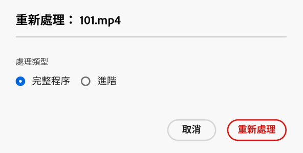
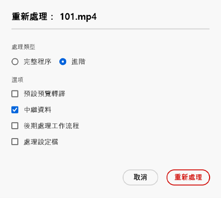
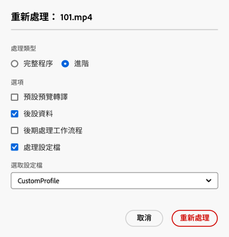

# 數位資產重新處理 {#reprocessing-digital-assets}

若資料夾中已有您後來進行變更的現有後設資料設定檔，您可以對該資料夾中的資產進行重新處理。 如果您要將新編輯的預設集重新套用至資料夾中的現有資產，則必須重新處理資料夾。 您可以視需要重新處理任意數量的資產。

如果您遇到以下兩種情境之一，請重新處理資料夾中的資產：

* 您希望對已上傳資產的現有資產資料夾執行批次處理預設集。
* 您稍後會編輯先前套用至資產資料夾的現有批次處理預設集。

## 重新處理資產 {#reprocessing-steps}

若要重新處理資料夾中的資產：

1. 在 [!DNL Assets Essentials] 中，於「Assets」頁面選取剛新增的資產，或您要重新處理的資產。
如果您選取資料夾：

   * 工作流程會以遞迴方式考量所選資料夾中的所有檔案。
   * 如果主要所選資料夾中有一個或多個子資料夾含有資產，工作流程會重新處理資料夾階層中的每個資產。
   * 最佳做法是避免在擁有超過 1000 個資產的資料夾階層上執行此工作流程。

1. 選取「**[!UICONTROL 重新處理資產]**」。 從兩個選項擇一：

   

   * **[!UICONTROL 完整處理]：**&#x200B;若您想要執行整體流程 (包括預設設定檔、自訂設定檔、動態處理 (若已設定)) 和處理後工作流程，請選取此選項。
   * **[!UICONTROL 進階]：**&#x200B;要選擇進階重新處理，請選取此選項。

     

     從下列進階選項中選取：

      * **[!UICONTROL 預設預覽轉譯]：**&#x200B;若您想要重新處理預設為預覽的轉譯，請選擇此選項。

      * **[!UICONTROL 後設資料]：**&#x200B;若您想要擷取所選資產的後設資料資訊和智慧標記，請選擇此選項。

      * **[!UICONTROL 處理設定檔]：**&#x200B;若您想要重新處理所選設定檔，請選擇此選項。 您可以選擇「**[!UICONTROL 完整處理]**」選項以納入預設處理，以及在資料夾層級指派的自訂設定檔。
        <!--When assets are uploaded to a folder, [!DNL Assets Essentials] checks the containing folder's properties for a processing profile. If none is applied, a parent folder in the hierarchy is checked for a processing profile to apply.-->

      * 「**[!UICONTROL 處理後工作流程]」：**&#x200B;如果必須使用處理設定檔才能完成額外的資產處理，請選擇此選項。 可以將其他處理後工作流程新增到設定中。 透過處理後功能，除了利用資產微服務進行可設定的處理以外，還能在其基礎上新增完全自訂的處理。

請參閱[使用資產微服務和處理設定檔](https://experienceleague.adobe.com/docs/experience-manager-cloud-service/content/assets/manage/asset-microservices-configure-and-use.html?lang=zh-Hant)，了解更多關於處理設定檔和處理後工作流程的資訊。

選取適當的選項後，按一下「**[!UICONTROL 重新處理]**」。 接著出現執行成功的訊息。

## 重新處理數位資產的情境 {#scenarios-reprocessing}

透過 [!DNL Experience Manager]，可以重新處理下列元件的數位資產。

### 智慧標記 {#reprocessing-smart-tags}

需要處理數位資產的組織，有越來越多在資產後設資料內採用以分類法控制的詞彙。 簡言之，其包含一組關鍵字清單，而員工、合作夥伴和客戶常用這些關鍵字來指稱及搜尋特定類別的數位資產。 使用以分類法控制的詞彙來標記資產，確保可輕鬆識別和檢索資產。

相較於自然語言詞彙，根據商業分類法對數位資產進行標記，有助於將其與公司的業務保持一致，並確保搜尋結果中會顯示契合度最高的資產。

關於更多關於[影片資產智慧標記](https://experienceleague.adobe.com/docs/experience-manager-cloud-service/content/assets/manage/smart-tags-video-assets.html?lang=zh-Hant)的資訊。

閱讀更多關於[重新處理數位資產管理中現有影像之顏色標記](https://experienceleague.adobe.com/docs/experience-manager-cloud-service/content/assets/manage/color-tag-images.html?lang=zh-Hant#color-tags-existing-images)的資訊。

### 智慧裁切 {#reprocessing-smart-crop}

關於更多關於 [Dynamic Media 智慧裁切](https://experienceleague.adobe.com/docs/experience-manager-cloud-service/content/assets/dynamicmedia/image-profiles.html?lang=zh-Hant)的資訊，此功能讓您將特定的裁切 (**[!UICONTROL 智慧裁切]**&#x200B;和畫素裁切) 和銳利化設定套用至已上傳的資產。

### 後設資料 {#reprocessing-metadata}

[!DNL Adobe Experience Manager Assets] 會保留每個資產的後設資料。 這樣便可以更輕鬆地完成資產分類和組織，並協助使用者尋找特定的資產。 因為能夠從上傳至 Experience Manager Assets 的檔案擷取後設資料，後設資料管理與創意工作流程因此得以整合。 藉助保留和管理資產後設資料的功能，您可以根據資產的後設資料自動組織和處理資產。

閱讀更多關於[重新處理後設資料設定檔](https://experienceleague.adobe.com/docs/experience-manager-cloud-service/content/assets/manage/metadata-profiles.html?lang=zh-Hant)的資訊。

### 重新處理資料夾中的 Dynamic Media 資產 {#reprocessing-dynamic-media}

若資料夾中已有您後來進行變更的現有 Dynamic Media 影像設定檔或 Dynamic Media 影片設定檔，您可以對該資料夾中的資產進行重新處理。 如需詳細資訊，請造訪[重新處理資料夾中的 Dynamic Media 資產。](https://experienceleague.adobe.com/docs/experience-manager-cloud-service/content/assets/admin/about-image-video-profiles.html?lang=zh-Hant)

>[!NOTE]
>
>您需要在環境中設定 [!DNL Dynamic Media]，方能啟用 Dynamic Media 對話框。
>

### 工作流程

閱讀更多關於[處理設定檔與處理後工作流程](https://experienceleague.adobe.com/docs/experience-manager-cloud-service/content/assets/manage/asset-microservices-configure-and-use.html?lang=zh-Hant)的資訊。
