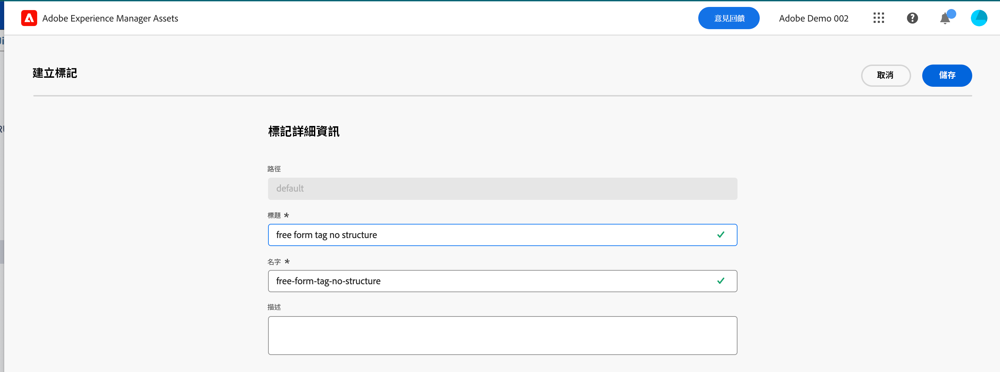
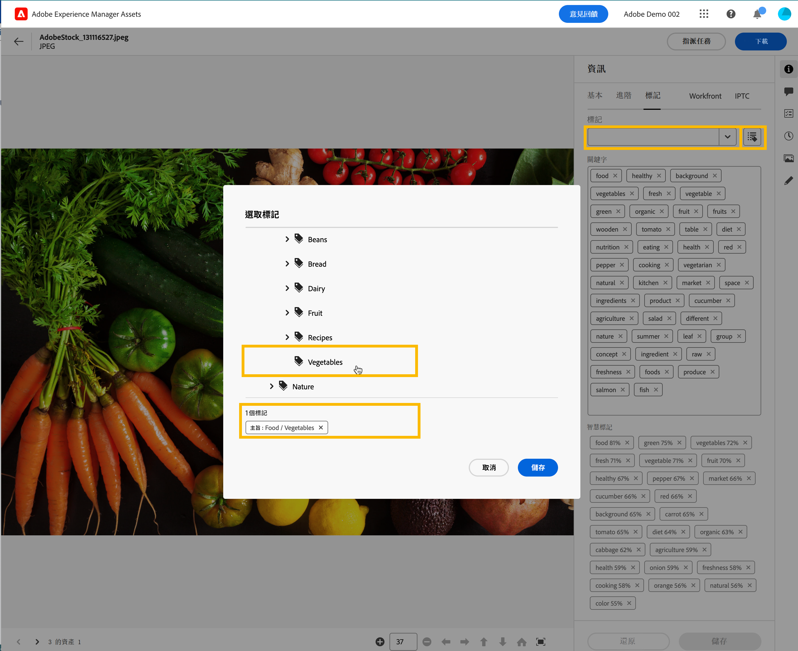

# 在「資產」檢視中管理標籤 {#view-assets-and-details}

>[!CONTEXTUALHELP]
>id="assets_taxonomy_management"
>title="管理標記"
>abstract="標記可協助您將資產分類，以便更有效地瀏覽和搜尋。管理員能夠使用標記階層結構，這有助於套用相關的中繼資料、將資產分類、支援搜尋、重複使用標記、提高易尋性等。"

標記可協助您將資產分類，以便更有效地瀏覽和搜尋。標籤有助於將適當的分類法傳播給其他使用者和工作流程。

控管辭彙的平面清單可能會隨著時間而變得無法管理。 管理員能夠使用標記階層結構，這有助於套用相關的中繼資料、將資產分類、支援搜尋、重複使用標記、提高易尋性等。

您可以在根層級建立名稱空間，並在名稱空間內建立子標籤的階層結構。 例如，您可以建立 `Activities` 根層級的名稱空間，並具有 `Cycling`， `Hiking`、和 `Running` 名稱空間中的標籤。 您可以進一步使用子標籤 `Clothing` 和 `Shoes` 範圍 `Running`.

標籤可提供許多好處，例如：

* 標籤可讓作者透過通用分類法輕鬆組織不同的資產。 作者可依通用標籤快速搜尋及組織資產。

* 階層標籤極為靈活，是以邏輯方式組織辭彙的絕佳方式。 透過名稱空間、標籤和子標籤，可以表示整個分類系統。

* 標籤可能會隨著組織的辭彙變化而不斷變化。

* 在「管理員」檢視中管理的標籤會與「資產」檢視中管理的標籤保持同步，以確保中繼資料控管和完整性。

若要將標籤套用至資產，您必須先建立名稱空間，然後建立並新增標籤。 您也可以建立標籤，並將其新增至現有的名稱空間。 您在根層級建立的任何標籤都會自動新增至標準標籤名稱空間。 然後，您可以將「標籤」欄位新增至中繼資料表單，使其顯示在「資產詳細資訊」頁面上。 在設定這些設定後，您可以開始將標籤套用至資產。

>[!NOTE]
>
>只有當您未使用預設的中繼資料表單時，才需要將「標籤」欄位新增到中繼資料表單。

除了本文所述功能以外，管理員檢視中還提供其他功能，包括合併、重新命名、當地語系化及發佈標籤。

## 建立名稱空間 {#creating-a-namespace}

名稱空間是只能存在於根層級的標籤容器。 您可以先定義「名稱空間」的邏輯名稱，以開始設定標籤的階層結構。 如果您未將標籤新增至任何現有的名稱空間，標籤會自動移至標準標籤。

執行以下步驟來建立名稱空間：

1. 前往 `Taxonomy Management` 在 `Settings` 以檢視現有名稱空間的清單。 您也可以檢視上次修改日期、修改名稱空間或其下標籤的使用者，以及標籤在資產中的使用次數。
1. 按一下 `Create Namespace`.
1. 新增 `Title`， `Name`、和 `Description` 用於名稱空間。 您在「 」中指定的輸入 `Title` 欄位會顯示在階層的頂端。 例如，在下圖中， **活動** 是指名稱空間的標題。

   

   <!--
    >[!NOTE]
    >You can use `Name` as a primary key if you are using any other metadata management tool is the source of truth for taxonomy values, you can use the name as a primary key.
    >
    -->

1. 按一下 `Save`.

## 將標籤新增至名稱空間 {#adding-tags-to-namespace}

執行以下步驟，將標籤新增至名稱空間：

1. 前往 `Taxonomy Management`.
1. 選取名稱空間並按一下 `Create` 在名稱空間下方的頂層建立標籤。 如果您需要在名稱空間中存在的標籤下建立子標籤，請選取該標籤，然後按一下 `Create`.
   

   在此範例中，左側的影像代表名稱空間正下方的標籤 `automobile-four-wheeler` 顯示在 `Path` 欄位。 右邊的影像是標籤內新增子標籤的範例，因為標簽名稱更多， `jeep` 和 `jeep-meridian`，顯示在 `Path` 名稱空間以外的欄位。
1. 指定標籤的標題、名稱和說明，然後按一下 `Save`.

   >[!NOTE]
   >
   >* 此 `Title` 和 `Name` 欄位為必填欄位，而 `Description` 欄位為選用。
   >* 依預設，工具會複製您在「標題」欄位中輸入的文字，移除空格或特殊字元(。 &amp; / \ : * ? [ ] |「 %)，並將其儲存為Name。
   >* 您可以更新 `Title` 欄位稍後，但 `Name` 欄位為唯讀。

## 將標籤新增至標準標籤 {#adding-tags-to-standard-tags}

非結構化標籤或沒有任何階層的標籤會儲存在 `Standard Tags` 名稱空間。 此外，當您想要新增其他描述性辭彙而不影響受控分類法時，可將該值儲存在 `Standard Tags`. 您可以在一段時間內將這些值移動到結構化名稱空間下。 此外，您可以使用 `Standard Tags` 名稱空間作為關鍵字的自由格式專案。

若要建立標準標籤，請按一下 `Create Tag` 根層級。 指定標題、名稱和說明，然後按一下 `Save`.

>[!NOTE]
>
>如果您刪除 `Standard Tags` 名稱空間使用管理員檢視，在根層級建立的標籤不會顯示在可用標籤清單中。

## 移動標籤 {#moving-tags}

如果您將標籤儲存在錯誤的階層下或分類會隨著時間而改變，您可以移動選取的標籤以維持資料完整性。 移動標籤時，必須考量下列條件：

* 標籤只能移動到現有名稱空間下方，或是現有標籤階層中。
* 標籤無法移至根以成為名稱空間。
* 移動父標籤也會移動儲存在階層中的所有子標籤。

執行以下步驟，將標籤從一個位置移動到另一個位置：

1. 在適當的名稱空間下選取標籤或標籤的整個階層，然後按一下 `Move`.
1. 在「移動」對話方塊中，使用選取新的目標標籤或名稱空間 `Select Tag` 區段。
1. 按一下 `Save`. 標籤會顯示在其新位置。

## 編輯標籤 {#editing-tags}

若要編輯標籤的標題，請選取標籤並按一下 `Edit`. 指定新標題並按一下 `Save`.

>[!NOTE]
>
>* 此 `Name` 無法更新標籤的。 標籤的根路徑也根據標籤的名稱。 即使您更新 `Title` 欄位。
>* 「管理員」檢視中提供其他操作，例如合併、當地語系化和發佈。

## 刪除標籤 {#deleting-tags}

您可以同時刪除多個名稱空間或標籤。 刪除操作無法復原。

執行以下步驟來刪除標籤：

1. 選取名稱空間或標籤，然後按一下 `Delete`.
1. 按一下 `Confirm`.

>[!NOTE]
>
>* 刪除父標籤或名稱空間也會刪除儲存在階層中的子標籤。 如果您需要刪除或更新父名稱空間，建議您 [移動您的標籤](#moving-tags) 至新目的地，然後再刪除父階層。
>* 刪除標籤也會從資產中刪除其所有參考。
>* 您無法刪除根層級存在的標準標籤。

## 將標籤元件新增至中繼資料表單 {#adding-tags-to-metadata-form}

標籤元件會新增至 `default` 自動建立中繼資料表單。 您可以設計 [中繼資料表單](https://experienceleague.adobe.com/docs/experience-manager-assets-essentials/help/metadata.html?lang=en#metadata-forms) 使用範本或從頭開始。 如果您未使用現有的中繼資料表單範本，則可以修改中繼資料表單並新增標籤元件。 中繼資料屬性對應會自動填入，目前無法修改。 Admin檢視中的使用者可以使用自訂名稱空間更新對應以儲存標籤值，並使用根路徑僅公開階層的子集。

觀看此快速影片，瞭解如何將Tags元件新增至中繼資料表單：

>[!VIDEO](https://video.tv.adobe.com/v/3420452)

### 新增標籤至資產 {#adding-tags-to-assets}

1. 前往資產詳細資訊頁面，並導覽至 `Tags` 中繼資料表單的區段。
1. 選取「標籤」欄位旁的標籤選擇器圖示，或開始輸入標籤名稱以檢視建議的結果。

   

1. 選取一或多個標籤。 子標籤會與父標籤或名稱空間一起自動選取。
在「資產」檢視中修改的標籤也會套用在「管理員」檢視中。

## 限制 {#limitations}

下列進階分類功能目前在「資產」檢視中無法使用，且只能透過「管理員」檢視存取：

* **本地化：** 任何本地化都必須在「管理員」檢視中進行。
* **根路徑：** 根路徑無法設定。 「分類管理」中儲存的所有名稱空間都會顯示在「資產」檢視的「標籤」屬性上。
* **標準標籤：** 「資產」檢視中會顯示「管理員」檢視中套用的標準標籤。 您不能在「資產詳細資訊」頁面的「資產」檢視中新增標準標籤。 儲存在標準標籤中的現有值會套用至「資產詳細資訊」頁面。
* **自訂名稱空間：** 標籤無法對應到自訂名稱空間。
* **檢視參照：** 管理員可能會在「資產」檢視中看到標籤使用情形。 這表示所有使用標籤的資產。 但是，管理員無法在參考中使用標籤看到個別資產。

<!--
*   Overview
*   Benefits
*   Prerequisites and Permissions
*   Configuration
*   Managing Tags
    *   Creating a Namespace
    *   Adding Tags to a Namespace
    *   Adding Tags to Standard Tags
    *   Moving Tags
    *   Editing Tags
    *   Deleting Tags
*   Applying Tags
    *   Adding Tags to the Metadata form
    *   Adding Tags to Assets
*   Limitations
-->